## Introduction

Ce challenge était un challenge de `Cracking` basé sur un bootkit disponible sur `HackTheBox`. J'ai fait ce challenge avec l'ami [0poss](https://hexag0n.fr/tags/0poss/) que je remercie pour son aide!
Mais bref, commençons, l'énoncé se présente comme ceci:
```bash
Some nodes in our data center have been producing unexpected errors and crash for a while now. When analyzing the systems offline, we couldn't find anything wrong with them. After a very throurough investigation, we think we have it nailed down to the netboot server handling the distributions on the PXE network, we suspect a bootkit is involved. Can you figure out what is happening?
```
On démarre donc avec le bootloader [PXE](https://fr.wikipedia.org/wiki/Preboot_Execution_Environment) en question nommé `convolutedboot.bin`, après avoir lancé `Binary Ninja` et rebasé le bootloader à l'adresse physique `0x7c00` qui est l'adresse physique où le `BIOS` va mapper le bootloader et où `PXE` va mapper les `boot file`.

On peut désassembler le bootloader avec le mode `x86_16`, en effet les bootloaders évoluent en [Real mode](https://wiki.osdev.org/Real_Mode), pour rappel ce mode d'exécution se caractérisent par:

  * Les adresses font 20 bits et correspodent aux adresses physiques
  * Pas de `Global Descriptor Table` donc pas de niveau de privilège au niveau du code.
  * Les registres de segments (CS,DS,ES,GS,FS,SS) ne sont donc pas des Segment selector mais bien les adresses physiques des segments en question. 
  * Les registres utilisés ont une taille par défault de 16 bits.

Pour finir les adresses utilisées sont donc des `adresses logiques` de la forme `Segment:Offset` et les adresses linéaires sont obtenues de cette manière:

```bash
Linear Address = (Segment * 16) + Offset
```

Pour pouvoir débugger ce bootloader, l'auteur du challenge est même très sympa avec nous dans le sens où il nous donne la commande `qemu` pour pouvoir débugger avec gdb:

```bash
qemu-system-i386 -boot n -device e1000,netdev=mynet0,mac=52:54:00:12:34:56 -netdev user,id=mynet0,net=192.168.76.0/24,dhcpstart=192.168.76.9,tftp=./,bootfile=convolutedboot.bin
```

En rajoutant les paramètres `-S -s`, on démarre un listener sur le port `1234` et il ne reste plus qu'à lancer gdb et faire un:

```bash
b*0x7c00
target remote :1234
```

On va break au tout début de l'exécution du bootloader, il faudra installer une extension gdb spécialisée pour le `Real Mode`, voici le [lien](https://stackoverflow.com/a/65442462/14458493) pour l'installer sans difficulté (Durant le déroulement du challenge il a été souvent nécessaire de debug le kernel une fois lancé et non pas le bootloader, dans ce cas il sera plus judicieux de switcher sur une extension adaptée).

Dès le début de l'exécution du code, le bootloader saute à l'adresse `0x7c16` sur une fonction que l'on nommera `main`.

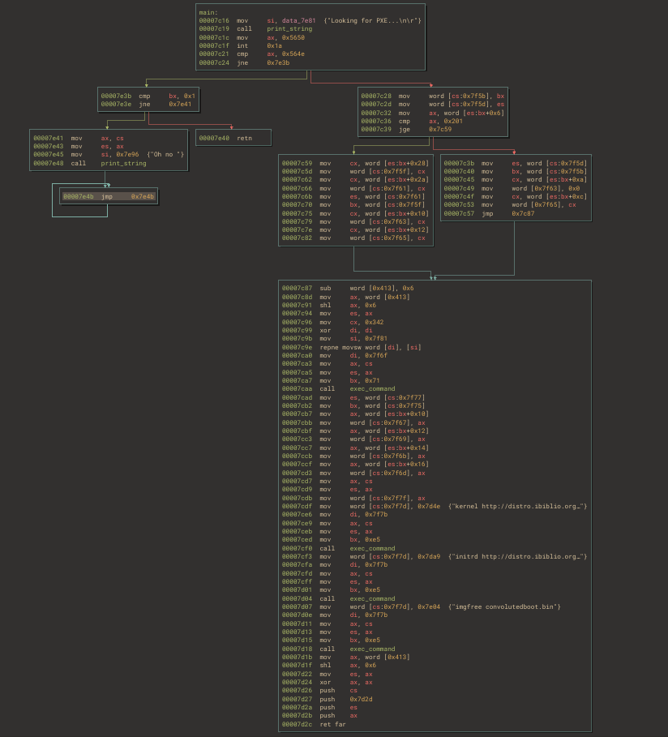

## Analyse du code

### Analyse de la fonction main

Le bootloader va afficher la chaine de caractères "Looking for PXE...\n\r" avec une fonction que l'on nommera `print_string` et qui se base sur les [interruptions du BIOS](https://en.wikipedia.org/wiki/BIOS_interrupt_call) pour afficher des caractères à l'écran. \
Le programme commence par effectuer une interruption `int 0x1a` en lui passant une constante: `0x5650`, cette procédure spécifique à `PXE` s'appelle le [installation check interrupt](http://www.pix.net/software/pxeboot/archive/pxespec.pdf) et sert, entre autre, à vérifier si une connection wifi est bien disponible. Si l'interruption renvoie une valeur de `0x564e` c'est que tous va bien. Dans notre cas si l'interruption ne s'est pas bien passée, le bootloader affiche "Oh no" avec la fonction print_string.

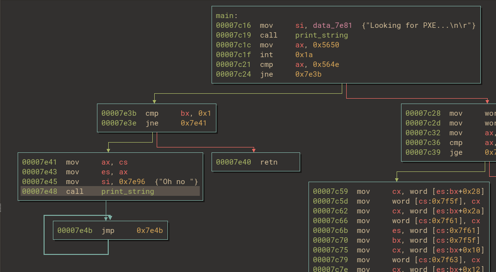

Si il arrive à se connecter au wifi, le bootloader va devoir maintenant accéder aux fonctions de l'API `iPXE`, pour ce faire le code suivant va être mis à profit:

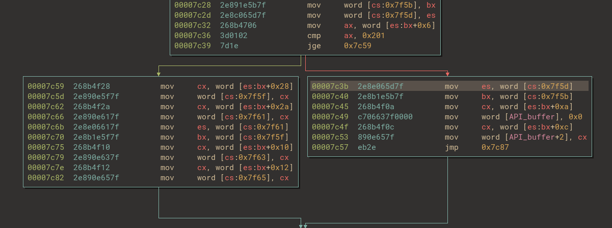

C'est assez moche mais derrière tout ca, le processus est très simple.En lisant la documentation technique de PXE,on apprend que ce dernier met à disposition deux structures pour donner accès à son API:

* **PXENV+**
* **!PXE**

Un pointeur vers la structure `PXENV+` est retourné dans `BX` après l'interruption dont nous avons précédemment parlé, on a juste à rajouter ces deux structures dans `Binary Ninja`:

```c
struct PXENV_s __packed
{
    uint8_t Signature[0x6];
    uint16_t Version;
    uint8_t Length;
    uint8_t Checksum;
    uint32_t RMEntry;
    uint32_t PMOffset;
    uint16_t PMSelector;
    uint16_t StackSeg;
    uint16_t StackSize;
    uint16_t BCCodeSeg;
    uint16_t BCCodeSize;
    uint16_t BCDataSeg;
    uint16_t BCDataSize;
    uint16_t UNDIDataSeg;
    uint16_t UNDIDataSize;
    uint16_t UNDICodeSeg;
    uint16_t UNDICodeSize;
    uint32_t PXEPtr;
};

struct PXE_s __packed
{
    uint8_t Signature[0x4];
    uint8_t Length;
    uint8_t Checksum;
    uint8_t Revision;
    uint8_t Reserved;
    uint32_t UNDIROMID;
    uint32_t BCROMID;
    uint32_t RMEntry;
    uint32_t PMEntry;
};

typedef PXENV_s PXENV;
typedef PXE_s PXE;
```

L'attribut `__packed` est ici pour dire au compilateur de ne pas rajouter de padding pour faire l'alignement entre les attributs de la structure. \
Et après avoir renommé et changé les types des variables on obtient un résultat un peu plus compréhensible mais toujours très loin d'être parfait à cause du fait que le code change explicitement de segment ce qui est assez laid à décompiler:


Comme expliqué [ici](https://wiki.osdev.org/PXE), à partir de la version `2.1` de PXE, la structure `PXENV+` est considérée comme obsolète et le bootloader devrait utiliser `!PXE` à la place. C'est pourquoi le code vérifie si l'attribut `Version` de la structure `PXENV+` est supériure à `0x201` et si c'est le cas il récupère un `Far Pointer` de la structure !PXE.

*Rappel:*
Un `Far Pointer` est une adresse constituée de l'association du segment `CS` et du registre `IP`. Cela permet de sauter ou d'appeller dans un segment de code complètement différent.

On peut voir que Binary Ninja sépare le Far Pointer vers la structure !PXE en deux variables différentes, ce qui explique un code aussi alambiqué pour une opération si simple.
Le code accède ensuite à l'attribut `RMEntry` de la structure !PXE, un autre Far Pointer vers l'entry point de l'API PXE. Il met ensuite ce Far Pointer dans la variable à `0x7f63` que l'on nommera `API_buffer`.

Mais si la version de PXE est inférieure à `2.1`, le bootloader va récupérer le pointeur vers l'entry point de l'API directement dans la structure PXENV+.

Au final cet API servira au bootloader pour exécuter des commandes propres à iPXE:

* La commande `kernel` qui télécharge le binaire `vmlinuz` correspondant au kernel compressé.

* `initrd` pour télécharger le [cpio](https://fr.wikipedia.org/wiki/Cpio) compressé `core.gz` de `TinyCore`.

* `imgfree` pour libérer l'espace pris par son image.

Et c'est à cause de cette dernière commande que le bootloader va se remapper sur un autre segment. Le code suivant va recopier le code du bootloader à partir de l'adresse `0x7f81` au début du segent `ES` à `0x9ac00`.

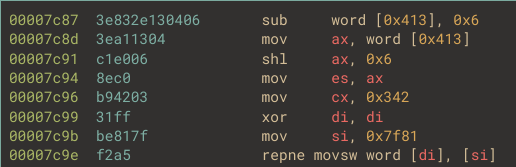

Après avoir exécuté les commandes le bootloader push le contexte `CS:IP` correspondant à une fonction que l'on nommera `boot`, chargée de lancer la procédure de boot du kernel. Mais il va ensuite push le nouveau contexte `ES:0x0` correspondant au code qu'il vient de copier. \
Le programme va donc sauter sur le code présent à l'adresse `0x9ac00` avant de retourner sur le code à `0x7d2d`.

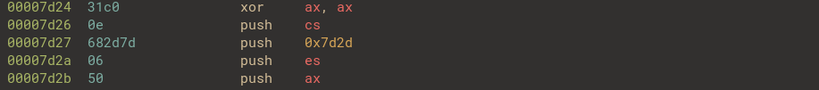

La suite du code du bootloader s'exécutera donc à partir de l'adresse `0x9ac00`.

### Analyse du code injecté sur le nouveau segment

Après avoir jeté un coup d'oeil sur le graphe de la fonction dans `Binary Ninja`, on remarque que le code s'apparente fortement à un `egg hunter`, le code utilise le registre `EDX` pour itérer sur toute la mémoire physique jusqu'à y trouver une séquence d'octets précis:


Mais avant cela, le premier `basic block` va patcher différentes zone du code du bootloader remappé en y additionnant la `base address 0x9ac00`. De cette manière les prochaines fonctions pourront fonctionner correctement. Ce système de `relocation` peut être reproduit dans `Binary Ninja` de cette manière:

```python
# Pour tous les snippets Binary Ninja qui suivront, la base adresse du bootloader sera mise à 0x7c00

def reloc(base, reloc_address):
    reloc = int.from_bytes(bv.read(reloc_address, 4), 'little') + base
    bv.write(reloc_address, reloc.to_bytes(4, 'little'))

base = 0x9ac00
reloc_0_address = 0x7f81 + 0x12c
reloc_1_address = 0x7f81 + 0x13b
patch_address = 0x7f81 + 0x12b

reloc(base, reloc_0_address)
# [...]
```

Dans la suite du `egg hunter` le programme va comparer chaque suite de 4 octets dans la mémoire jusqu'à obtenir la bonne valeur. Pour trouver cette addresse il suffit de poser un `breakpoint` à la fin de l'`egg hunter` pour trouver l'adresse qui contient cette séquence d'octets:

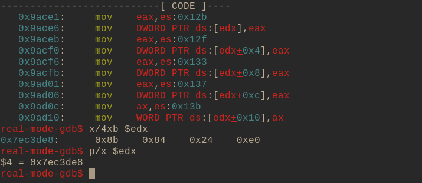

Et c'est là que ca devient intéressant! L'adresse `0x7ec3de8` appartient au kernel compressé `vmlinuz` récemment mappé cette séquence d'opcodes se trouve à la fin de la fonction `extract_kernel` qui vient d'extraire le kernel et de le charger à l'adresse physique `0x100000`. \
La dernière étape de cette fonction est de patcher l'adresse trouvée par le `egg hunter` avec les 20 octets situés à `es:0x12b`:


On applique le patch à la fonction `extract_kernel` dans `Binary Ninja` de cette manière:

```python
# Il faudra identifier la fonction extract_kernel dans Binary Ninja (en s'appuyant sur les chaines de caractères utilisées), puis la renommer
bootloader = open_view("/home/mitenka/Bureau/Reverse/rev_convolutedboot/convolutedboot.bndb")

patch_address = 0x7f81 + 0x12b
patch = bootloader.read(patch_address, 20)
extract_kernel_address = bv.get_symbols_by_name("extract_kernel")[0].address
bv.write(extract_kernel_address, patch)
```

Une fois patchée, la fin de la fonction `extract_kernel` va passer de cette forme:


à cette forme:

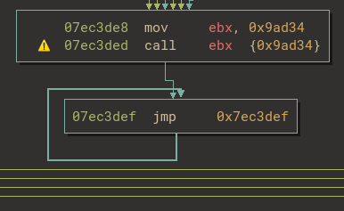

Sachant que l'adrese `0x9ad34` est l'adresse d'un bout de code du bootloader, l'objectif de la fonction `egg hunter` devient maintenant plus clair! \
Une fois cette fonction terminée, le bootloader va sauter dans la fonction `boot` qui lancera la procédure de boot et par extension l'exécution de la fonction `extract_kernel`, et re-sauter dans le bootloader mais cette fois avec le kernel chargé en mémoire! \
De grosses manigances s'annoncent...

## Syscall hooking

A ce stade là le processeur est passé en mode protected, même si du code s'exécute dans la zone mémoire réservée par le bootloader.
La fonction du bootloader présente à l'adresse `0x9ad34`, est très courte et assez explicite:


Le programme déréférence 4 valeurs dans le kernel, les stocke dans un tableau de pointeurs à l'adresse `0x9ad9e`. Et il remplace ces valeurs par des adresses appartenant à l'image du bootloader.

*Rermarque:*
Ces adresse en question ont une forme telle que `0xc00XXXXX` on peut en déduire que ce sont des adresses virtuelles, en effet l'adresse physique `0x0` va être mappé à l'adresse virtuelle `0xc0000000`. Ces pointeurs seront surement utilisés depuis le kernel une fois lancé.

On devine vite que l'objectif de cette fonction est de remplacer 4 syscalls dans la `syscall_table` par des fonctions du bootloader. \
Il va maintenant s'agir d'identifier quels sont les syscalls qui sont touchés par ce hijacking, si on ne veut pas avoir à se taper le code du kernel `TinyCore` pour chaqun des 4 syscalls il va nous falloir être méthodique. Examinons de plus près la fonction qui remplace le syscall présent à `0x70a67c`:

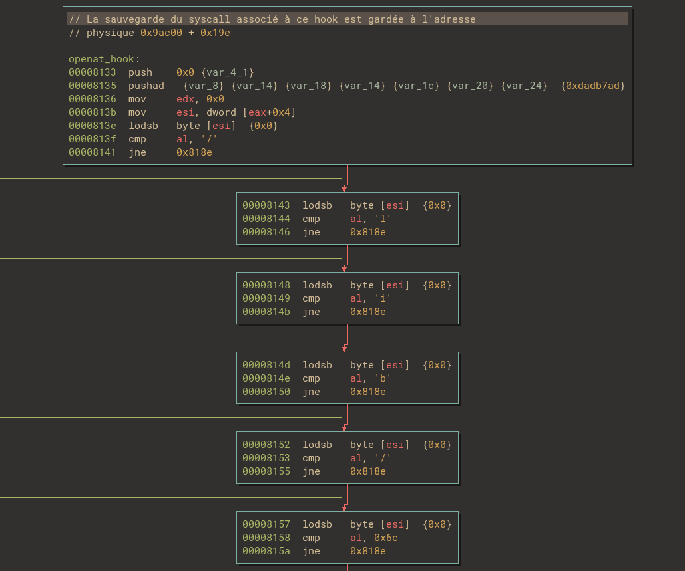

Sachant que le kernel passe les arguemnts passés dans un syscall sous forme d'un buffer dont l'adresse est contenue dans le registre `EAX` on peut en déduire que le second paramètre passé à ce syscall doit être un nom de fichier, en l'occurence le nom de fichier serait comparé à "/lib/libc.so.6". On peut réduire la liste des syscalls possibles à `openat`, `mkdonat`, `fstatat64` et autres possibilités exotiques.

Il est possible de déterminer lequel exactement car on dipsose de l'offset dans la `syscall_table` (le syscall number) de chaque syscall. \
On a cette relation:

```bash
syscall_address = syscall_table + (syscall_numer) * 4
```

Donc pour chaque syscall potentiel on peut en déduire une adresse potentielle de la `syscall_table`, et choisir la plus cohérente, si les 4 octets avant l'adresse potentielle sont nuls cela veut dire qu'on a trouvé l'adresse correcte du début de la `syscall_table`.

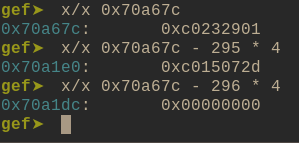

On déduit de ce raisonnmenet que le syscall présent à `0x70a67c` est `openat` de `syscall number` `295` et que l'adresse de la `syscall_table` est `0x70a1e0`. Il est maintenant trivial d'identifier les autres syscalls hijackés.


Et on remarque finalement que dans chacune des fonctions qui remplacent les syscalls, un appel au syscall originel est fait on est donc bien sur une technique de `syscall hooking`:

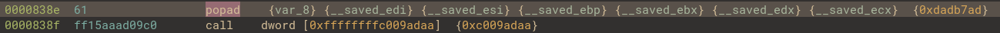

Le programme remet le contexte mis en place par l'appel au syscall et appelle la sauvegarde correspondante dans le tableau de pointeur à `0x9ad9e`.

La décompilation de `Binary Ninja` est trompeuse pour cette fonction, si vous vous souvenez bien l'appel au code mettant en place les hooks était suivi d'une boucle infinie et c'est pour ca que le code `return` directement dans la fonction appellante de `extract_kernel` avant de jump à `0x100000`, au début du code du kernel. Ci-dessous on peut voir que le code de `vmlinuz` sauter sur l'adresse du nouveau kernel dans le registre `EAX`, récemment extrait.

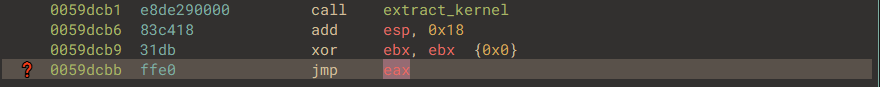

Ce bout de code correspond à ce code source ci-dessous, présent dans le code que l'on peut trouver [ici](https://github.com/torvalds/linux/blob/master/arch/x86/boot/compressed/head_64.S#L578), sur le repo officiel de Linux, dans le dossier dédié au kernel compressé.

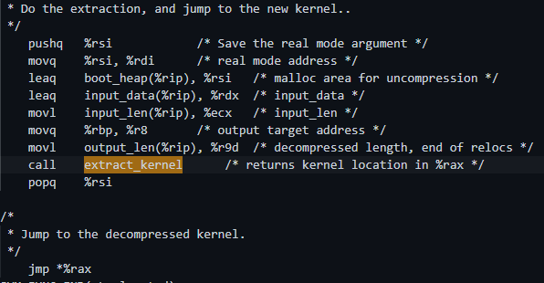

### Hooking de openat

Comme expliqué précédemment ce hook va vérifier si le fichier à ouvrir est "/lib/libc.so.6" et si c'est le cas conserver la valeur du `file descriptor` retourné au vrai syscall `openat` dans une variable globale à l'adresse virtuelle `0xc009adae`.


### Hooking de close

Cette fonction garde le même principe que le hook de `openat`, le programme vérifie si le `file descriptor` à fermer correspond à celui de "/lib/libc.so.6":

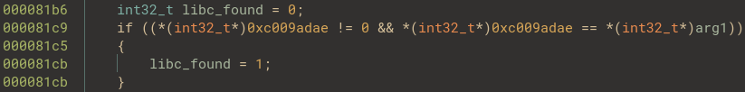

Puis il ferme le `file descriptor` et si il s'agissait bien de celui associé à la libc, il clear la variable globale:

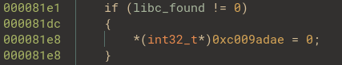

### Hooking de mmap2

Ce hook de `mmap2` commence par vérifier qu'un `file descriptor` associé à la libc est bien disponible dans la variable globale, que c'est bien ce fichier que le `mmap2` vise à mapper, et pour finir que la protection soit `PROT_READ`. Et si c'est le cas il rajoute la protection `PROT_WRITE` est rajoutée et récupère l'adreses où le `mmap2` doit se faire dans une variable que l'on nommera `addr`.

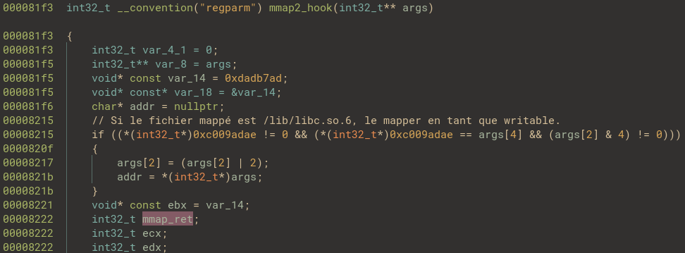

Après cela, le hook transfère les arguments au `mmap2` légitime. En résumé le hooking va faire en sorte que quand le `loader dynamique` mappe en mémoire les sections de la libc, ces dernières aient toujours la protection `Writable` en plus de `Readable`. \
Le code restant est très intéressant et se présente comme ceci:


Le programme vérifie alors deux choses:

1. Que l'adresse de mapping retournée n'est pas négative, c'est à dire si l'appel à `mmap2` s'est bien déroulé.

2. Plus énigmatique, que la valeur sur 4 octets pointée l'adresse où vient de se faire le mapping vaut `0x4b3ff`.
Le sens derrière cela est de vérifier si la suite d'opcodes b"\xff\xb3\x04" est présente à cette adresse. `Binary Ninja` trouve 3 fois cette séquence dans la libc:


Une seule de ces trois adresse est alignée et correspond à un début de section (la `.plt`) que le `loader dynamique` aurait pu choisir: `0x19000`.

Le programme va calculer une autre adresse à partir de cette dernière avec un offset de `0xc6952` et qui correspond à l'entry point de la fonction `key_decryptsession`. Le bootloader va ensuite copier une partie de son code (situé à l'adresse virtuelle `0xc009b01b`) de taille `0x57` octets à la place de la fonction `key_decryptsession`.

Après cela le programme va de nouveau patcher la libc en ajoutant la séquence b"\xe8\x47\x5f\x0c\x00" à une adresse telle que: `.plt + 0xa06` et qui fait partie de la fonction `__libc_start_main` et cette séquence d'octets correspond à un appel à la fonction `key_decryptsession`:

Le bootloader va donc patcher la fonction de la libc `key_decryptsession` et rajouter un call vers cette dernière dans la fonction `__libc_start_main`, chaque programme utilisant la libc exécutera un code injecté par le bootloader!

 Il est possible de représenter cela dans `Binary Ninja` de cette manière:

```python

bootloader = open_view("/home/mitenka/Bureau/Reverse/rev_convolutedboot/convolutedboot.bndb")

# Overwriting de la fonction key_decryptsession

source = 0x839c
func_size = 0x57
func = bootloader.read(source, func_size)

dest = bv.get_symbols_by_name("key_decryptsession")[0].address
bv.write(dest, func)

# Ajout d'un appel à key_decryptsession dans __libc_start_main

call = b"\xe8\x47\x5f\x0c\x00"
main = 0x19a06
bv.write(main, call)

```
Et voilà le résultat du patching de la libc!


*Remarque:*
Pour obtenir le fichier de la libc depuis le fichier `core.gz` utilisé lors du challenge il faut tout d'abord extraire le fichier [cpio](https://fr.wikipedia.org/wiki/Cpio) `core` de l'archive `core.gz` puis d'extraire les fichiers avec la commande:
```bash
mkdir fs && cd fs && cpio -i < ../core
```
Il est maintenant possible d'accéder au fichier `libc.so.6` ainsi qu'au binaire `busybox`, encore merci à `0poss` pour ses gentoo skils ;) ! Il est aussi bon de remarquer que l'OS utilisé est `TinyCore` utilisant notamment [Busybox](https://fr.wikipedia.org/wiki/BusyBox) et que par conséquent un grand nombre des commandes de base (`ls`, `cat`, `cd`...) seront gérés par un seul exécutable `/bin/busybox`.

### Analyse de la libc modifiée

Grâce au fait que `Binary Ninja` ait en stock la signature de plusieurs fonctions de la libc, il est beaucoup plus simple d'identifier et de comprendre le fonctionnement de la version patchée de `key_decryptsession`, voyez plutôt:


le programme va déréférencer la valeur pointée par `__progname` qui renvoie à un pointeur vers le buffer contenant le nom de base du binaire exécuté et faisant appel à la libc. La fonction compare si le binaire lancé est `cat` et si c'est le cas il fait un appel à `mprotect` pour éditer les protections mémoire à partir de l'adresse du binaire `0x804c000` et sur `0x638e0` octets et y mettre les protections `PROT_READ | PROT_WRITE | PROT_EXEC`. L'adresse `0x804c000` correspond au début du segment exécutable dans le binaire `busybox`.

En d'autres termes si la commande exécutée via `busybox` est "cat", la libc va mettre tous le segment exécutable de ce dernier en tant que `Readable`, `Writable` et `Executable`.

Après cela le programme va faire un appel au syscall de nombre `222` (`0xde`), en lui passant une constante de valeur `0xdadb7ad`.

### Hooking du syscall de nombre 222

Pour comprendre en quoi consiste cette fonction, nous allons tout d'abord nous intéresser aux opérations faites sur le premier paramètre passé en argument au syscall:


On remarque une suite de multiplication et d'addition que va subir l'input, cela est équivalent à l'évaluation par ce polynôme:

```bash
P(X) = 0x45f90000 * X^2 + 0xfd20dcb3 * X + 0xa0f27f57
```
Le résultat est mis dans une variable que l'on appellera `var_ret` et qui sera retournée par le hook peu importe la vraie valeur de retour du syscall légitime. \
Ensuite le hook va tester si les opcodes à l'adresse `0x80a4479` sont b"\x55\x57\x56\x53", et en effet dans le binaire `busybox`, la fonction à cette adresse présente ces opcodes dans son prologue:


En se basant sur les chaines de caractères utilisées dans cette fontion et sur le [code source](https://github.com/mirror/busybox/blob/24198f652f10dca5603df7c704263358ca21f5ce/networking/arp.c#L487) de `Busybox`, on identifie cette fonction en tant que `arp_main`. Donc si le prologue est toujours présent dans la fonction, ce code est exécuté:


Les `0x104` octets présents à dans le binaire `busybox` à l'adresse `0x80a4479` (l'entry point de la fonction `arp_main`) vont être `XOR`és avec ceux à l'adresse `0xc009b073` dans le bootloader. Une fois cela fait, le bootloader va éditer les octets présents à l'adresse `0x80ae28f` pour y rajouter un appel à la fonction `arp_main` récemment modifiée. En utilisant encore une fois le code source de `Busybox` cette fonction a pu être simplement identifiée comme `on open3_or_warn`.

Dans `Binary Ninja` cela peut être fait simplement comme cela:

```python

# XORage de la fonction arp_main

bootloader = open_view("/home/mitenka/Bureau/Reverse/rev_convolutedboot/convolutedboot.bndb")

source = 0x7f81 + 0x473
dest = bv.get_symbols_by_name("arp_main")[0].address
size = 0x104

source_stub = bootloader.read(source, size)
dest_stub = bv.read(dest, size)

xored = Transform["XOR"].encode(source_stub, {"key": dest_stub})
bv.write(dest, xored)

# Ajout d'un call à la fonction arp_main dans la fonction open3_or_warn

open3_address = 0x80ae28f
arp_call = b"\xe8\xe5\x61\xff\xff"
bv.write(open3_address, arp_call)
```

Ce code va donc être exécuté si le syscall est appellé pour la première fois lors de l'appel à `key_decryptsession`. \
Et le résulat est très intéressant! Car lorsque `busybox` va utiliser la fonction `open3_or_warn` pour accéder au contenu du fichier choisi, le nom du fichier va être passé dans la fonction nouvelle fonction `arp_main`. Et voici à quoi le début ressemble:

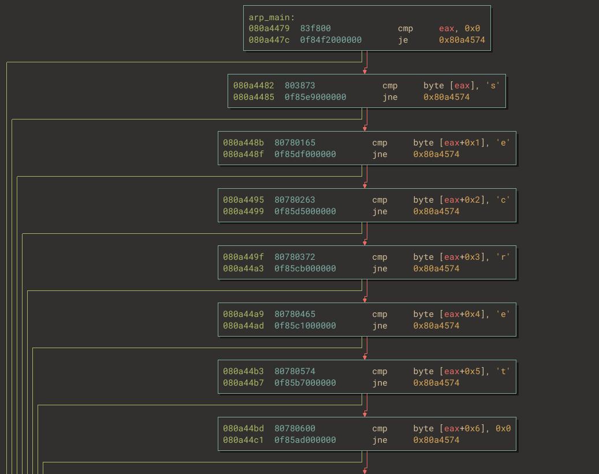

Sachant que comme expliqué précédemment le pointeur vers le nom du fichier que `cat` doit afficher se trouve dans le registre `EAX`, la fonction patchée va comparer si ce le fichier à afficher s'appelle "secret".

L'appel à `arp_main` remplace un appel à la fonction `open64` chargée d'ouvrir un fichier c'est donc en toute logique que si le fichier affiché ne s'appelle pas "secret", la fonction `arp_main` va tout simplement renvoyer un appel à la fonction `open64` pour ne pas compromettre l'exécution du programme `cat` comme nous pouvons le voir ci-desous:

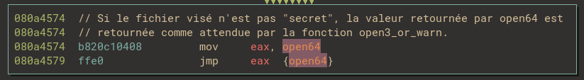

Mais si le programme s'appelle bien "secret", le programme entre dans une boucle de cette forme:

1. 4 octets sont lus dans le fichier "secret" en question.
2. Ils sont passés sous la forme d'un `int` dans une fonction telle que:
`y = x * 0xe296df0b + 0x14800841`
3. Le résultat `y` est passé en paramètre au syscall de nombre `222`.
4. Le résultat est comparé à `0x544aa692`
5. Si c'est égal, le programme met la valeur constante de 0 dans `ECX`
6. Si `ECX` vaut `7`, le programme quitte la boucle et affiche `Correct!` avec la fonction `putchar_unlocked`.
7. Si ce n'est pas égale il quitte la bouble et affiche `Wrong!`.

En voyant ca on peut se dire que le programme n'a aucune logique car le compteur dans le registre `ECX` serait toujours remis à `0`, mais que nenni car il reste encore une partie du code de hook que l'on avons pas encore analysé, si vous vous souvenez bien le hook du syscall de nombre `222` vérifie si la fonction `arp_main` a déjà été patchée et si c'est le cas voici ce qu'elle va faire:


Si la fonction `arp_main` est déjà patchée, autrement dit si l'appel au syscall se fait depuis la fonction `arp_main` elle même, on remarque ce qui pourrait s'apparenter à un `switch case` (là ce sont plus des `if/else` chainés mais bref...) en fonction de l'`uint32_t` pointée à l'adresse `0x80a4518`, dans `Binary Ninja` elle correspond à ceci:

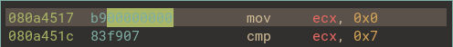

En modifiant l'`uint32_t` présent à `0x80a4518`, par exemple avec une valeur de `5`, l'instruction présente dans la boucle deviendra:


La logique apparait maintenant de manière plus claire! A chaque tour de boucle, c'est l'appel au syscall et donc au hook qui va changer la valeur mise dans le registre `ECX` avant d'être comparé à `7`!

Et en plus de modifier le conteur, la constante `0xe296df0b` servant à chiffrer les 4 octets lus dans le fichier "secret" ainsi que la constante `0x544aa692` utilisé pour la comparaison à chaque tour de boucle vont être `XOR`ées avec des valeurs différentes en fonction de l'index de la boucle. Sans cela, le contenu requis du fichier "secret" serait 4 octets répétés!

*En résumé:*

Pour obtenir le flag il va falloir déterminer quel contenu du fichier `secret` renvoie la valeur `Correct!`. Pour déterminer, les 4 premiers caractères du flag:
1. Le contenu de notre fichier `secret` est lu `4` par `4` octets, sous forme d'un `uint32_t`.
2. cet entier subit alors cette opération:
```bash
y = x * 0xe296df0b + 0x14800841
```
3. Lors de l'appel au syscall, la valeur `y` est évaluée dans un polynôme:
```bash
p(y) = 0x45f90000 * y^2 + 0xfd20dcb3 * y + 0xa0f27f57
```
4. La valeur `p(y)` est comparée à `0x544aa692`

Il s'agit d'un simple polynôme du second degré donc rien de biens méchant mais autant le fait que les valeurs résultantes des multiplications avec `imul` seront splittés entre les registres `EAX` et `EBX` rend la chose un peu plus compliqué, utilisons `z3`:

```python
from z3 import *

s = Solver()
x = BitVec('x', 32)

y = x * 0xe296df0b + 0x14800841
cons = y * y * 0x45f90000 + 0xfd20dcb3 * y + 0xa0f27f57 == 0x544aa692

s.add(cons)
s.check()
res = s.model()

print(res[x].as_long().to_bytes(4, 'little'))
```

Résultat:

```python
b'HTB{'
```

Il ne reste plus qu'à appliquer le même principe pour les octets restants du fichier en appliquant les `XOR`s respectifs pour chaque tour de boucle:

```python
from z3 import *

init_values = (0xe296df0b, 0x544aa692)
values = list(init_values)
xor_values = [
            (0xb0796ab2, 0x3b3211d),
            (0xccddf7bc, 0x7d2691d5),
            (0x16d7ead8, 0x98ad6bfb),
            (0x7289e68, 0x4a0a9a7a),
            (0xf6804ff8, 0x617e30ed),
            (0x6ea0855c, 0xc28d160b)
]

flag = str()

for index in range(7):

    s = Solver()
    x = BitVec('x', 32)
    y = x * values[0] + 0x14800841
    cons = y * y * 0x45f90000 + 0xfd20dcb3 * y + 0xa0f27f57 == values[1]

    s.add(cons)
    s.check()
    res = s.model()
    flag += (res[x].as_long().to_bytes(4, 'little')).decode("utf-8")

    if index < len(xor_values): values = [i ^ j for i,j in zip(values, xor_values[index])]

# HTB{_C0mpr0M1s3d_B00tcH41n_}
print(flag)
```

## Conclusion

Ce challenge aura été extrémement intéressant de par le fait qu'il retrace la mise en place d'un `OS TinyCore` entier, il part du bootloader pour arriver à une exécution de code pirate à l'intérieur de la libc et du binaire `busybox` en passant par un hooking de syscall. Il m'a permis de mieux comprendre comment un `bootkit` fonctionne et comment reverse un code s'exécutant en `Real Mode` et surtout m'aura fait progresser dans l'utilisation de l'API de `Binary Ninja` haha ;) !