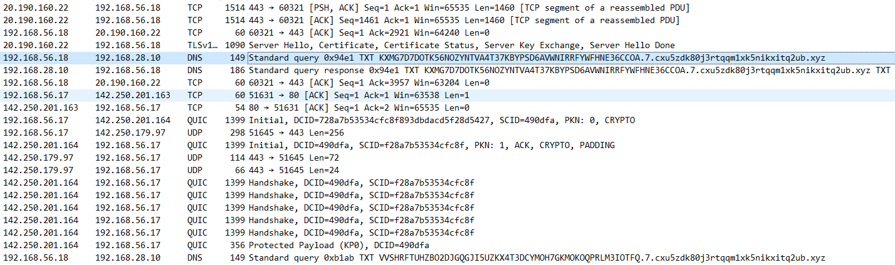
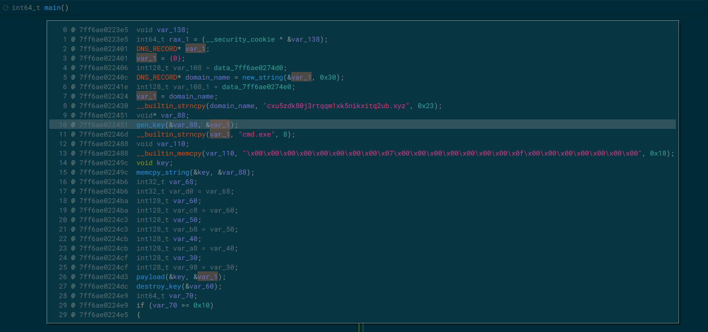
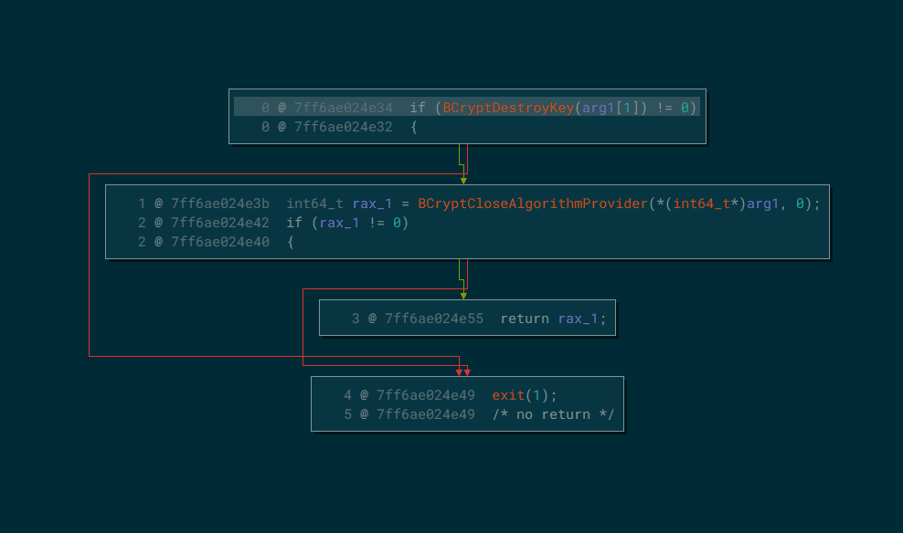
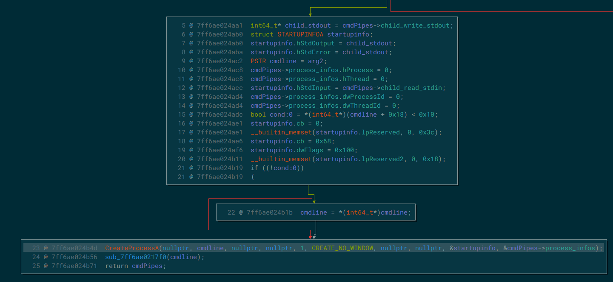
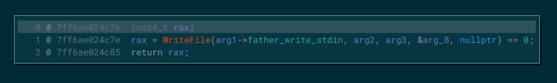
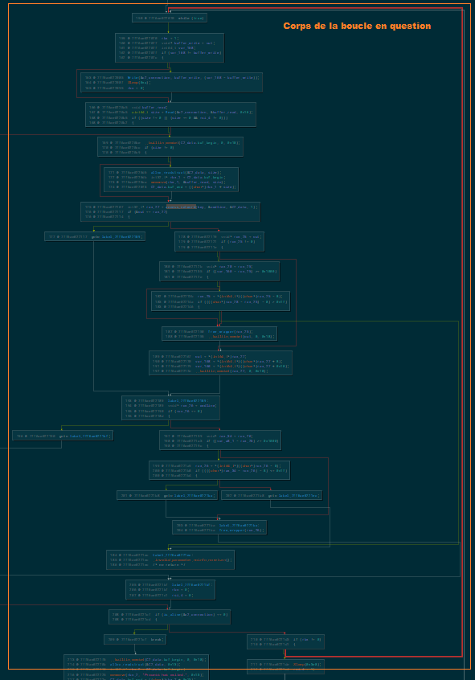
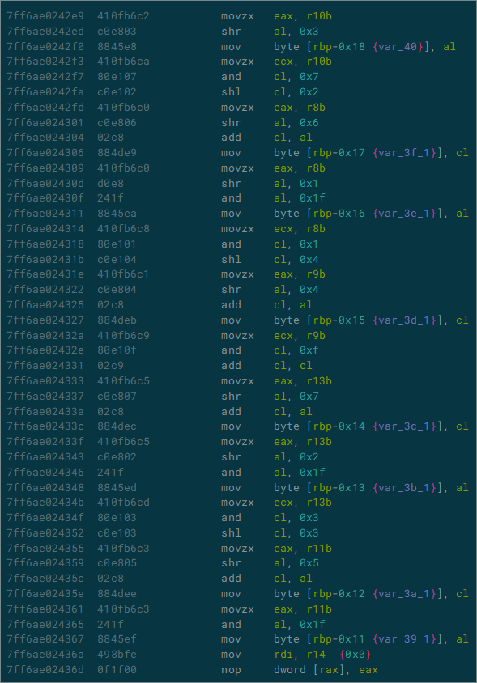
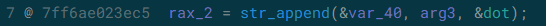
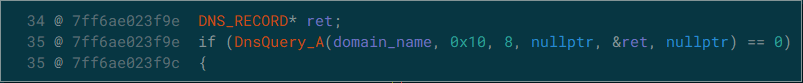
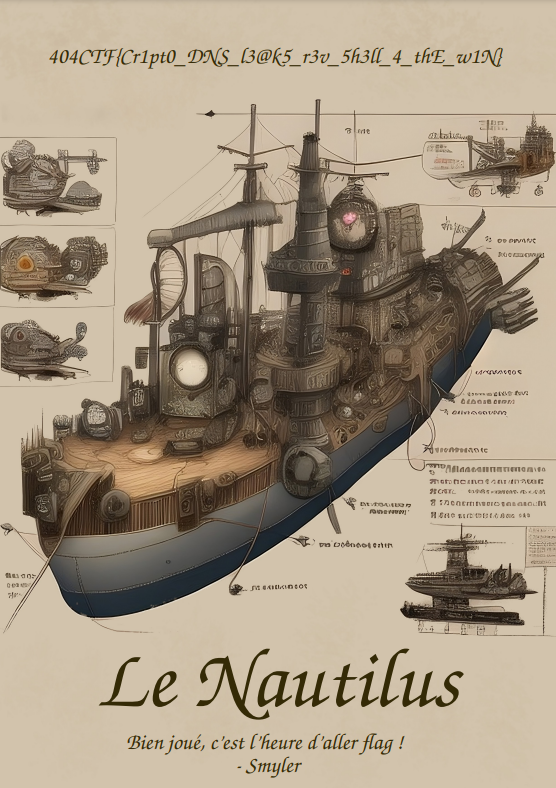

## Introduction

Hello, pour ce premier Write-Up de l'édition 2023 du `404CTf`, on commence avec un challenge de Forensics. L'énoncé se présente comme ceci:
```txt
Au milieu du café trône une table depuis laquelle un homme scrute ses semblables en engloutissant un breuvage étrange. Vous l'observez du coin de l'œil depuis plusieurs minutes déjà quand la porte du café s'ouvre avec fracas. Un homme surgit alors, criant comme si le café était tout à lui.

« Capitaine ! »

Vous comprenez immédiatement qu'il s'adresse à votre homme, qui aborde par ailleurs la plus belle casquette de marin qu'il vous ait été donné d'observer.

« Du respect matelot ! rétorque-t-il. Ne troublez pas ainsi mes hôtes !

— Mes excuses capitaine, ainsi qu'à ces messieurs et dames, mais je me dois de vous informer des évènements qui viennent de frapper le nautilus. Notre nouveau mousse a voulu profiter de notre rare escale pour utiliser internet, et je lui ai ouvert une session sur le système, mais cet inconscient s'est laissé attraper par un courriel agicheur et j'ai bien peur que le nautilus ait été compromis par un pirate !

— Comment ! s'exclame alors le capitaine Némo, dont la barbe finement taillée contient à peine la colère qui rougit ses joues. Vous ne pouvez donc vous tenir cinq minutes ! Je suppose que vous avez pris les mesures adéquates ?

— Bien sûr capitaine, j'ai pris soin de faire un dump de la machine affectée et ait entrepris de capturer le réseau passant par le routeur, nous devrions pouvoir investiguer l'affaire. Connaissez-vous quelqu'un qui pourrait mener l'analyse ? Commandez et j'irai à sa rencontre. »

Vous même féru d'analyse forensique lors de vos temps perdus, vous marmonnez alors :

« Je pourrais bien m'en charger, moi. »

Némo vous entends, et ni une, ni deux, son regard vous fusille.

« Attention, on ne parle pas en vain ici, vous allez vous y coller ! »

Le matelot vous remet alors une clé USB...

Analysez les données remises par le matelot et retrouvez précisément le document exfiltré par le Malware à son C2.
```

Et avec ceci, il nous est donné une archive contenant trois fichiers:
* *Network.png* : Le schéma de l'infrastructure réseau du nautilus
* *WS02-20230524-025804.raw* : Un fichier s'apparentant à la capture mémoire du poste infecté
* *capture.pcap* : La capture réseau effecutée par le matelot

Il va donc s'agir de retrouver ce que l'attaquant à réussi à récupérer sur le poste infecté. On va commencer par jeter un oeil au dump mémoire fourni avec le challenge.

## Analyse de la capture mémoire

Avec `Volatility3` on commence par lister les processus sur la machine comme ceci:

```bash
python3 vol.py -f cracken.raw windows.pstree.PsTree
```
Et on remarque toute de suite le processus de PID `4016`, avec un nom inhabituel lancé depuis l'explorateur de fichier et notamment parent d'un shell:

```
...
* 9056  696     LogonUI.exe     0x8584d91c70c0  0       -       1       False   2023-05-24 01:07:08.000000      2023-05-24 01:11:01.000000 
* 432   696     userinit.exe    0x8584d809b080  0       -       1       False   2023-05-24 00:45:59.000000      2023-05-24 00:46:41.000000 
** 2568 432     explorer.exe    0x8584d6bb8080  86      -       1       False   2023-05-24 00:45:59.000000      N/A
*** 3968        2568    SecurityHealth  0x8584d90e5080  1       -       1       False   2023-05-24 00:46:21.000000      N/A
*** 7976        2568    cmd.exe 0x8584d9f5c0c0  1       -       1       False   2023-05-24 02:57:32.000000      N/A
**** 11248      7976    conhost.exe     0x8584daed4080  6       -       1       False   2023-05-24 02:57:32.000000      N/A
**** 7272       7976    DumpIt.exe      0x8584d9fa00c0  3       -       1       True    2023-05-24 02:58:02.000000      N/A
*** 1264        2568    WINWORD.EXE     0x8584da4860c0  16      -       1       False   2023-05-24 00:55:55.000000      N/A
*** 4016        2568    Formation Gran  0x8584daee1080  1       -       1       False   2023-05-24 02:53:14.000000      N/A
**** 6524       4016    cmd.exe 0x8584da3e4080  1       -       1       False   2023-05-24 02:53:16.000000      N/A
***** 7656      6524    conhost.exe     0x8584da3e1080  4       -       1       False   2023-05-24 02:53:17.000000      N/A
*** 5404        2568    Notepad.exe     0x8584d9f03080  7       -       1       False   2023-05-24 00:57:14.000000      N/A
*** 1916        2568    OneDrive.exe    0x8584d950d080  25      -       1       True    2023-05-24 00:46:22.000000      N/A
6780    6704    msteams.exe     0x8584d95450c0  19      -       1       False   2023-05-24 00:46:34.000000      N/A
* 6820  6780    msedgewebview2  0x8584d99a0080  46      -       1       False   2023-05-24 00:46:38.000000      N/A
** 6688 6820    msedgewebview2  0x8584d9520080  7       -       1       False   2023-05-24 00:46:38.000000      N/A
** 7552 6820    msedgewebview2  0x8584da4c2080  9       -       1       False   2023-05-24 00:46:42.000000      N/A
** 7588 6820    msedgewebview2  0x8584da86b080  20      -       1       False   2023-05-24 00:46:42.000000      N/A
** 7500 6820    msedgewebview2  0x8584da4c0080  12      -       1       False   2023-05-24 00:46:41.000000      N/A
** 7452 6820    msedgewebview2  0x8584da48f080  17      -       1       False   2023-05-24 00:46:41.000000      N/A
6836    5388    Teams.exe       0x8584d94ec080  0       -       1       False   2023-05-24 00:46:34.000000      2023-05-24 00:48:19.000000 
5792    2936    firefox.exe     0x8584da4ca0c0  70      -       1       False   2023-05-24 00:49:04.000000      N/A
* 7296  5792    firefox.exe     0x8584d90650c0  15      -       1       False   2023-05-24 00:49:31.000000      N/A
* 8064  5792    firefox.exe     0x8584da5450c0  8       -       1       False   2023-05-24 00:49:44.000000      N/A
* 5348  5792    firefox.exe     0x8584d3f380c0  29      -       1       False   2023-05-24 00:49:09.000000      N/A
* 3272  5792    firefox.exe     0x8584d6b9c0c0  16      -       1       False   2023-05-24 01:29:41.000000      N/A
* 936   5792    firefox.exe     0x8584daecd080  18      -       1       False   2023-05-24 02:57:45.000000      N/A
...
```
Pour voir le nom de l'exécutable en entier on fait un:
```bash
python3 vol.py -f cracken.raw windows.cmdline.CmdLine | grep "4016"

4016    Formation Gran  "C:\Users\Matelot\Downloads\Formation Grand Moussaillon.exe"
```

Il s'agit probablement du malware que le matelot a téléchargé, pour en savoir plus sur le code qui a été exécuté on va dumper le binaire en question:

```bash
python3 vol.py -f cracken.raw windows.dumpfiles.DumpFiles --pid=4016 -o malware_dump
```

on retrouve dans le dossier `malware_dump`, tous les modules faisants partie de notre processus et on peut identifier facilement le module principal correspondant au programme malveillant.

## Analyse de la capture réseau

Mais avant de commencer le reverse, on va jeter un oeil à la capture réseau pour avoir une idée de comment le malware va exfiltrer les données depuis le poste infecté

<div>
    
</div>

On remarque beaucoup de requêtes DNS de type `TXT` faites sur des domaines ressemblants tous à cette forme:

```txt
<préfixe ressemblent à de la base32>.7.cxu5zdk80j3rtqqm1xk5nikxitq2ubxyz
```

Ce procédé s'apparente fortement à de l'[Exfiltration DNS](https://digital-security.quodagis.fr/ressources/ressource/exfiltration-de-donnees-les-techniques-icmp-et-dns-tunneling-855). En se fiant à la cartographie réseau fournie avec le challenge on remarque que l'IP faisant les requêtes (`192.168.56.18`) appartient au même réseau que le poste infecté, ce doit donc être ce dernier qui fait les requêtes DNS. L'IP cible correspond quant à elle au `Domain Controller` (`192.168.28.10`). Si la capture réseau montre les requêtes DNS comme destinées, dans un premier temps, au Domain Controller c'est parce que dans un `Active Directory`, au moins un des domain controller doit faire office de DNS pour tous les postes enregistrés sur son domaine.


En essayant de décoder les préfixes des noms de domaines, on obtient aucune information lisible: Un chiffrement additionel doit être utilisé.
On se résoud à se pencher sur le Reverse du malware récupéré depuis la capture mémoire pour en savoir plus sur la technique d'exfiltration.

## Reverse engineering

Une fois le binaire ouvert dans `Binary Ninja`, certains symboles sont directement détectés comme faisant partis des fonctions standards du C++. En partant du symbole `_start`, on trouve facilement une fonction qui s'apparente à la fonction `main`, après avoir renommé quelques fonctions, voilà à quoi elle ressemble:

<div>
    
</div>

On y retrouve le suffixe des noms de domains servant à l'exfiltration, on voit aussi un appel à une première fonction que j'ai appellé `gen_key` (on la traitera plus tard), puis un appel à `payload` et un appel et un appel à `destroy_key`. Cette dernière va se charger de libérer deux `HANDLEs`, celui d'une clé de chiffrement et un autre associé à un algorithme de chiffrement.

<div>
    
</div>

Cela nous donne déjà une idée de la structure utilisée par le programme pour stocker les clés de chiffrement (La structure n'est pas complète mais pour l'instant seul le début nous intéresse):

```c
struct KEY __packed
{
    uint8_t* AES_alg_handle;
    uint8_t* AES_key_handle;
    ...
    uint8_t* IV_ptr;
};
```

**Remarque:**
Étant donné que le malware est codé en C++, beaucoup de fonctions et de bouts de code ne seront pas utiles pour le Reverse mais serviront à gérer de nouveaux buffers, faire des opérations sur des zones mémoires ou sur des strings et plus précisément à gérer la [SSO](https://pvs-studio.com/en/blog/terms/6658/).

### Reverse de la fonction principale du payload

Comme expliqué précédemment, La fonction `main` va appeller une fonction que l'on nommera `payload` et qui va constituer la base du Reverse Shell. La première chose que va faire la fonction payload est de créer un nouveau processus `cmd.exe` dont les paramètres `hStdInput, hStdOutput, hStdError` sont redirigés vers des pipes auquel le programme principal aura accès.
C'est une technique très répandue qui permet de mettre en place un Reverse shell très facilement, il suffira alors au malware de faire le lien entre le C2 et le shell par l'intermédiaire des pipes.
Le programme va instancier une structure qui contiendra les `HANDLEs` qui permettront d'avoir accès aux pipes pour envoyer les commandes au processus enfant. On crée donc cette structure dans Binary Ninja:

```c
struct C2Connection __packed
{
    HANDLE child_read_stdin;
    HANDLE father_write_stdin;
    HANDLE father_read_stdout;
    HANDLE child_write_stdout;
    struct PROCESS_INFORMATION process_infos;
};
```

Et après avoir renommé et retypé toutes les variables on obtient un code assez clair:

<div>
    
</div>

On en déduit que la pipeline de transfert des commandes envoyées au reverse shell peut se représenter comme ceci:

```goat
                                    .-----+-----.     pipe_r / stdout    .--------.
  .-----------.      DNS / TXT      |           |<----------------------+          +<-.
  |     C2    +<------------------->|  IMPLANT  |     pipe_w / stdin    | cmd.exe  +   |
  '-----------'                     |           +---------------------->+          +--'
                                    '-----------'                        '--------'
```

La fonction payload va en ensuite transmettre les commandes au shell en passant par les pipes en utilisant les fonctions de la `WinAPI` `ReadFile` et `WriteFile`. par exemple, voilà la fonction `Write` qui se charge de transmettre la commande au shell:

<div>
    
</div>

Je ne vais pas aller trop dans les détails du code mais le payload va ensuite rentrer dans une boucle qui recevra les commandes, les exécuter avec un appel à `Write` et ensuite les renverra au C2 grâce à une fonction que l'on nommera `access_network`. On peut voir la boucle en question ci-dessous:

<div>
    
</div>

Mais nous, ce qui nous intéresse c'est la fonction `access_network` car c'est elle qui va nous aider à retrouver les données exfiltrées, penchons nous un peu sur celle ci.

### Reverse de la fonction de transmission des données

Cette fonction prend en premier paramètre, une structure associée à une clé `AES` (j'y reviendrai), un pointeur vers une variable où stocker la valeur de retour et le retour de la commande contenue dans une structure assez explicite, de cette forme:

```c
struct C2Chunk __packed
{
    uint8_t* buf_begin;
    uint8_t* buf_end;
};
```

**Remarque:**
Cette structure correspond surement à une structure standard du C++, je n'ai pas pris le temps de chercher mais il est très probable que le programmeur du malware ne l'ai pas définie telle quelle.

Pour chaque chunk de data, la fonction va dans un premier temps appliquer un padding de type [PKCS](https://www.ibm.com/docs/en/zos/2.4.0?topic=rules-pkcs-padding-method) et en parallèle calculer un hash du timestamp actuel en passant par cette fonction que l'on nommera `hash_timestamp`:

<div>
    
</div>

Ce hash sera ajouté avant les données réelles. Ensuite une fonction chargée de chiffrer les données va être appellée et va ajouter la taille des données à chiffrer juste avant le hash, ce qui fait que les données chiffrées seront encapsulées sous cette forme:

```goat 
.--------+-----------+---------+--------------.
| Taille | Timestamp | Données | Padding PKCS |
'--------+-----------+---------+--------------'
```

<div>
    
</div>

Et c'est là qu'il faut parler de comment la clé AES et son `Initialization vector` sont générés. Au début de la fonction main, une fonction que j'avais nommée `gen_key` est appellée et va renvoyer la structure qui contiendra, la clé et l'initialization vector qui est toujours le même et que l'on peut retrouver dans le code mais pour ce qui est de la clé cela va nous poser problème étant donné que la clé est générée aléatoirement en utilisant la fonction `BCryptGenRandom`:

<div>
    
</div>

Quoi mais comment le C2 sera au courant de la clé de chiffrement utilisée pour transmettre les données 🤔 ?
En fait la fonction `gen_key` va ensuite envoyer la clé au C2 en utilisant le même encodage mais l'ayant chiffré au préalable  dans une fonction que l'on nommera `RSA_encrypt`:

<div>
    
</div>

Et le problème c'est que cette fonction se base sur un chiffrement `RSA` et sur une clé publique hardcodée dans le binaire comme vous pouvez le constater:

<div>
    
</div>

Ici, j'ai simplement renommé et retypé quelques variables, mais la fonction va d'abord encoder la clé en `base64`, puis va importer la clé publique depuis la section `.rdata` du binaire et va ensuite la chiffrer avec l'algorithme RSA. La fonction que j'ai renommé `create_struct` et qui se retrouve à plein d'endroits dans le binaire va juste allouer l'espace mémoire nécessaire à la structure `C2Chunk`. Ici vous pouvez voir la clé publique contenue dans le programme:

<div>
    
</div>

Une fois celà fait, le code va envoyer au C2 la clé par le même procédé que les résultats des commandes.
Et ça c'est la tuile 😕! Car cela ne nous permet pas de retrouver la clé AES chiffrée et si l'on veut décoder les paquets envoyées au C2, il nous faut absolument cette clé. Après un rapide coup d'oeil il n'y pas de mauvaises utilisations des fonctions de crypto dans le code qui nous permettraient de la retrouver, il va falloir nous débrouiller autrement. Et c'est là qu'on se rappelle que la capture mémoire contient encore le processus du malware et en utilisant un programme comme `findaes` on peut essayer d'extraire les clés AES depuis l'espace mémoire du processus!
On commence donc par récupérer ce dernier et on lance ensuite findaes:

```bash
python3 vol.py -f cracken.raw windows.memmap --dump --pid 4016
...
../findaes-1.2/findaes pid.4016.dmp
Searching pid.4016.dmp
Found AES-256 key schedule at offset 0x4e4a0: 
6c bb f2 a3 9f c7 a2 a6 4e 92 17 c8 72 48 5e 41 51 ec fe f9 e3 48 e2 07 07 ec 1b d3 65 b1 12 2d 
Found AES-256 key schedule at offset 0x1374240: 
32 c5 ba 3a f0 2f 53 f0 45 21 98 86 86 42 40 42 b1 9e bb 5c f4 16 00 ed 6f 66 f6 fe 59 1f d8 7d 
Found AES-256 key schedule at offset 0x13744d0: 
de 99 c8 34 52 a4 21 7c c4 e8 03 bd b7 56 56 80 cd 23 40 5c e7 70 ec 53 4d 43 e5 01 ae 78 87 f4 
Found AES-128 key schedule at offset 0x3a8d920: 
86 12 28 25 41 20 90 c3 51 85 13 8b 20 76 ae fc 
Found AES-256 key schedule at offset 0x3b567e0: 
4a bf 8b fc e3 f4 d7 c7 f8 2d 00 41 9d 22 9a b0 83 d8 83 c9 2e 2d 5c c3 d0 2c a4 ed cf 06 97 7d 
Found AES-128 key schedule at offset 0x8f68dc0: 
e6 b7 dd 82 14 1c 5d 19 b8 f3 e3 f6 4c 19 c0 ac 
Found AES-128 key schedule at offset 0x600aecd0: 
84 c8 d6 69 51 fc 01 61 e5 ff 4a 50 bf ca 5c b5
```
Étant donné que la taille de la clé spécifiée lors de l'appel à `BCryptGenRandom` est de 256 bits, il y'a seulement 4 possibilités et il s'avèrera que la clé utilisée par le payload est `6cbbf2a39fc7a2a64e9217c872485e4151ecfef9e348e20707ec1bd365b1122d`.
Yes! On a maintenant toutes les informations qu'il nous faut pour commencer à décoder les données exfiltrées.

Juste histoire d'être sur, on peut regarder la suite du code de la fonction `access_network`, on va tomber entre autre sur une fonction dont le code s'apparente fortement à l'algorithme d'encodage en `base32` et qui va se charger d'encoder le chunk de donénes chiffrée.

<div>
    
</div>

Une autre function que l'on nommera `make_dns_query`, va commencer par ajouter le suffixe du nom de domaine ainsi qu'un point à la fin en utilisant une fonction qui s'apparente à un `strcat`:

<div>
    
</div>

Finalement, la requête est faite:

<div>
    
</div>

Ca y'est on va enfin pouvoir commencer à décoder les données récupérées par le C2. Étant donné que seuls les résultats des commandes nous intéresse, on a pas besoin de s'attaquer à comment les commandes sont envoyées au poste infecté mais seulement comment les retours sont envoyés au C2 (dans tous les cas le binaire `cmd.exe`, inclut les commandes sur la sortie standard juste avant les retours donc aucun souci à ce niveau là).

## Décodage des données
### Extraction des noms de domaines de la capture réseau

Pour retrouver les noms de domaines on va utiliser scapy pour cibler les paquets qui ont une couche `DNS` et dont le type de la requête
est `TXT`, donc qui auront une valeur `qtype` égale à 16:

```python
def extract_names():
    ret = list()
    capture = rdpcap("capture.pcap")
    for packet in capture:
        if packet.haslayer(DNSQR) and not packet.haslayer(DNSRR) and packet[DNSQR].qtype == 0x10:
            domain_name = packet[DNSQR].qname
            ret.append(domain_name.decode("utf-8"))
    return ret
...
KXMG7D7DOTK56NOZYNTVA4T37KBYPSD6AVWNIRRFYWFHNE36CCOA.7.cxu5zdk80j3rtqqm1xk5nikxitq2ub.xyz.
VVSHRFTUHZBO2DJGQGJI5UZKX4T3DCYMOH7GKMOKOQPRLM3IOTFQ.7.cxu5zdk80j3rtqqm1xk5nikxitq2ub.xyz.
GORJCILYKAR7UZ56XNDEXTEFE53CN5ERDWIH3XTHUNMO6IEAGG7A.7.cxu5zdk80j3rtqqm1xk5nikxitq2ub.xyz.
3VGPIU3WAELD2DCJUPWMT23PPXNINJCYDZHT7QSKAQR6VGZKH5KA.7.cxu5zdk80j3rtqqm1xk5nikxitq2ub.xyz.
FT4MGZXAVMD6AVYMLVFKRDWTPFL2LJ55G3UM2H5O4TD7BIM3L72A.7.cxu5zdk80j3rtqqm1xk5nikxitq2ub.xyz.
WLZ4JY76CO33B3BQOD4TWHHGPTZR3R2O5LPTFRLZ2EVATIJRDJIQ.7.cxu5zdk80j3rtqqm1xk5nikxitq2ub.xyz.
``` 

Parfait, maintenant on va déchiffrer les préfixes encodés, pour retrouver le contenu des commandes!

### Déchiffrement des commandes

J'ai remarqué que certains noms de domaines ciblés par les requêtes étaient envoyés deux fois d'affilée, il va falloir faire attention à ne pas prendre en compte les doublons sinon les données retrouvées ne seront pas correctes. De plus l'encodage en base32 appliqué par le binaire ne prend pas en compte les `=` de padding, ce sera à nous de les rajouter.

```python
def decrypt_AES(domains):
    out = open("out.bin", "wb")
    last = 0
    for i,d in enumerate(domains):
        domain = d.split(".")[0]

        last_block_width = len(domain) % 8
        if last_block_width != 0:
            domain += (8 - last_block_width) * '='

        if domain == last: continue

        cipher_text = base64.b32decode(domain)
        cipher = AES.new(KEY, AES.MODE_CBC, IV)
        plain_text = cipher.decrypt(cipher_text)
        padding = plain_text[-1]
        out.write(plain_text[9:-padding])
        last = domain
```

Et enfin, on obtient quelque chose de très prometteur:

```txt
// out.bin
C:\Users\Matelot\Downloads>whoami
nautilus\matelot

C:\Users\Matelot\Downloads>cd /

C:\>dir
 Le volume dans le lecteur C n'a pas de nom.
 Le num�ro de s�rie du volume est BACF-3566

 R�pertoire de C:\

07/05/2022  07:24    <DIR>          PerfLogs
24/05/2023  03:27    <DIR>          Program Files
23/05/2023  11:14    <DIR>          Program Files (x86)
23/05/2023  12:50    <DIR>          Users
23/05/2023  01:06    <DIR>          Windows
               0 fichier(s)                0 octets
               5 R�p(s)  53�285�601�280 octets libres

C:\>dir
 Le volume dans le lecteur C n'a pas de nom.
 Le num�ro de s�rie du volume est BACF-3566

 R�pertoire de C:\

07/05/2022  07:24    <DIR>          PerfLogs
24/05/2023  03:27    <DIR>          Program Files
23/05/2023  11:14    <DIR>          Program Files (x86)
23/05/2023  12:50    <DIR>          Users
23/05/2023  01:06    <DIR>          Windows
               0 fichier(s)                0 octets
               5 R�p(s)  53�285�601�280 octets libres

C:\>dir
 Le volume dans le lecteur C n'a pas de nom.
 Le num�ro de s�rie du volume est BACF-3566

 R�pertoire de C:\

07/05/2022  07:24    <DIR>          PerfLogs
24/05/2023  03:27    <DIR>          Program Files
23/05/2023  11:14    <DIR>          Program Files (x86)
23/05/2023  12:50    <DIR>          Users
23/05/2023  01:06    <DIR>          Windows
               0 fichier(s)                0 octets
               5 R�p(s)  53�285�605�376 octets libres

C:\>cd Users

C:\Users>dir
 Le volume dans le lecteur C n'a pas de nom.
 Le num�ro de s�rie du volume est BACF-3566

 R�pertoire de C:\Users

23/05/2023  12:50    <DIR>          .
22/05/2023  20:39    <DIR>          Capitaine
23/05/2023  11:16    <DIR>          Capitaine N�mo
23/05/2023  22:49    <DIR>          Matelot
22/05/2023  20:33    <DIR>          Public
               0 fichier(s)                0 octets
               5 R�p(s)  53�282�295�808 octets libres

C:\Users>cd Capitaine
Acc�s refus�.
```

On obtiens bien les commandes exécutées par le C2, et en cherchant un peu, une de ces dernières attire notre attention:

```txt
C:\Users\Matelot\Desktop>dir
 Le volume dans le lecteur C n'a pas de nom.
 Le num�ro de s�rie du volume est BACF-3566

 R�pertoire de C:\Users\Matelot\Desktop

24/05/2023  04:58    <DIR>          .
23/05/2023  22:49    <DIR>          ..
24/05/2023  04:56               751 acquire_w.bat
24/05/2023  04:56    <DIR>          beta_project
23/05/2023  13:00             8�284 ComptaCuisine.xlsx
24/05/2023  04:56           207�496 DumpIt.exe
21/05/2023  22:36         1�208�059 LeNautilus.pdf
23/05/2023  21:59            12�695 Manuel du r�cureur de pont.docx
23/05/2023  15:36             2�366 Microsoft Teams.lnk
24/05/2023  04:56               476 README.txt
24/05/2023  04:58                86 volatile_info_w.txt
24/05/2023  05:00     4�831�838�208 WS02-20230524-025804.raw
               9 fichier(s)    4�833�278�421 octets
               3 R�p(s)  48�436�264�960 octets libres

C:\Users\Matelot\Desktop>powershell
Windows PowerShell
Copyright (C) Microsoft Corporation. Tous droits r�serv�s.

Installez la derni�re version de PowerShell pour de nouvelles fonctionnalit�s et am�liorations�! https://aka.ms/PSWindows

PS C:\Users\Matelot\Desktop> [convert]::ToBase64String((Get-Content -Path LeNautilus.pdf -Encoding byte))
...
```
L'attaquant a trouvé un fichier nommé `Nautilus.pdf` et lance une commande powershell chargée d'en afficher une version encodée en `base64` qui a donc été affichée sur la sortie standard du shell! Il ne nous reste plus qu'à la décoder poure retrouver le fichier originel exfiltrée:

<div>
    
</div>

## Conclusion

J'ai trouvé ce challenge super intéressant pour plusieurs raisons, tout d'abord il commence avec plusieurs sources d'informations (capture réseau, capture mémoire, cartographie réseau) ce qui permet d'avoir une vraie vue d'ensemble sur le problème. Ensuite il mêle bien la partie forensics et la partie reverse (qui s'avère relativement plus exigente que ce que j'ai pu retranscrire dans ce write-up, comme expliqué précédemment le fait que beaucoup de symboles de C++ 11 ne soient pas détectés par `Binary Ninja` rend la tâche plus ardue). Et finalement il traite d'une technique d'exfiltration que l'on peut retrouver dans le wild pour ses qualités de discretion.