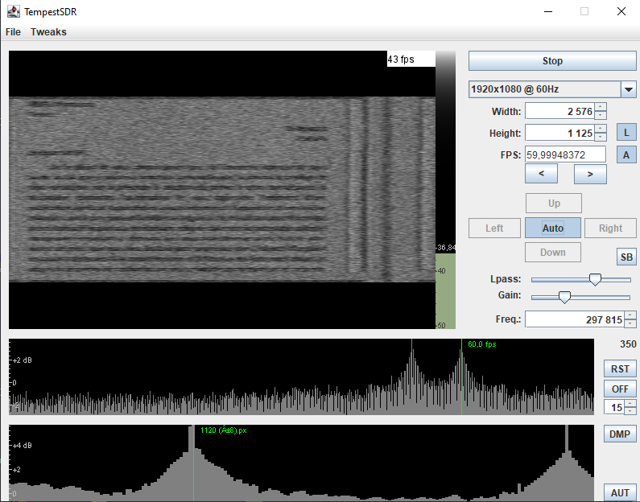
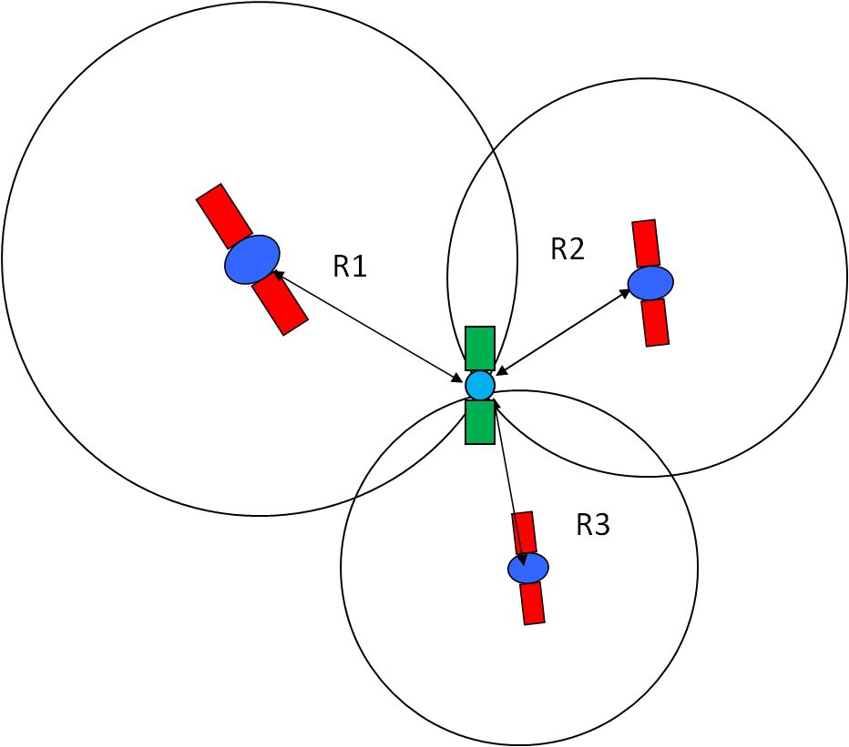

## Plombier du câble

### Introduction

Ce challenge de RF exploitait une particularité des câbles `HDMI`, l'énoncé se présentait comme ceci:

```txt
Nous y voilà. Il est encore tôt dans la matinée du 3e martis du mois Kankin. À votre table en bois d'acajou, vous retrouvez vos resplendissants compagnons Alexandre et Simone. Vous entendez la fin du récit de monsieur DUMAS sur la dernière pièce de théâtre à laquelle il a pu assister. Ce dernier développe en effet un amour tout particulier pour le théâtre depuis ces jeunes années, où il écrivit un drame historique : Henri III et sa cour.

Le temps, à l'image d'un sablier, s'écoule tranquillement.

Notre trio, autour de leur quatrième pause café de la douce matinée, ont l'air bien nerveux, mais toutefois portent un air rempli de fourberie. Ils ont enfin eu l'éclair de génie pour espionner l'infâme collègue : un plan aux aspects loufoque, mais qui attire vivement votre attention.

Simone DE BEAUVOIR est une figure d'intelligence. Son père lui disait qu'elle aurait pu faire Polytechnique si elle était un homme.

Elle vous explique le détail de l'affaire : pénétrer dans la plus grande légalité chez notre victime, déployer une antenne et écouter. Mais vu votre talent pour le moins inexistant en matière de discrétion, votre mission sera juste de traiter le signal une fois acquis.

C'est ainsi, durant cette journée dont le temps ne se manifeste guerre au beau, dans ce petit café coquet où se situe notre énergumène, situé rue de l'ancienne comédie, dans une petite ville de France, d'une superficie de 105.40 hectares, que nos deux héroïques figures représentant le combat contre la mesquinerie, Alexandre et Simone, déployèrent leur antenne directive de 10 cm, dans l'objectif d'intercepter les communications afin que VOUS les traitiez pour découvrir la sombre, tenace et inéluctable vérité.
```

le challenge fournissait avec celà deux fichiers:

* Une archive contenant le fichier du signal (`capture_plombier.raw`)
* Un fichier pdf contenant des informations supplémentaires sur notre cible

Voilà le contenu du pdf:

<div>
    
</div>

On y apprend plusieurs choses, certaines comme la fréquence d'échantillonage semblent pertinentes tandis que d'autres comme la longueur de l'antenne ou le modèle de l'écran semblent assez dérisoires (On verra plus tard que c'était pas forcément le cas 😉).

### Analyse du signal

On rentre le signal dans `GnuRadio` pour afficher la `FFT` et la `Constellation`, et on obtient ceci:

<div>
    
</div>

Une constellation qui s'apparente à du `FM`, mais non seulement la FFT ne ressemble pas du tout à un spectre FM, mais la fréquence est
de l'ordre de la centaine de kHz et pas de la centaine de MHz ce qui ne correspond pas au bandes FM traditionnelles. Après avoir tout de même tenté de démoduler avec les principaux types de modulations sans succès, il apparait que la solution doit se trouver autre part 🙁.

On se repenche donc sur l'énoncé et sur le contenu du PDF pour y trouver des indices!

Dans l'énoncé on nous parle d'un plan pour espionner que un de nos collègues à son insu en posant une antenne chez lui, ce qui a fini de me mettre sur la piste est le titre du challenge: `Plombier du câble`.

<br>

En fait, je me suis souvenu d'une technique que j'avais vu sur un super [article](https://github.com/PierreAdams/HackRF-One-French) de [Pierre Adams](https://github.com/PierreAdams) et qui consistait à capter et décoder les ondes électromagnétiques émises par un câble `HDMI`. En effet chaque câble HDMI émet ce que l'on appelle des ondes `garbage` à une fréquence qui lui est propre aux alentours de 295 kHz et oui, c'est exactement le cas de notre signal!
Et ces ondes garbage, une fois décodées, permettent d'avoir un apercu en temps réel du contenu affiché sur l'écran!

Pour extraire le contenu de l'écran il va falloir utiliser un logiciel appellé `TempestSDR` et disposer de plusieurs informations:

* Le taux de rafraichissement de l'écran
* Sa résolution
* La fréquence à laquelle sont émises les ondes garbage

Et comme expliqué précédemment, le pdf fournis en début du challenge nous donne le modéle de l'écran utilisé par notre victime: Un écran `HP 32s`. En allant chercher ce modèle on trouve toutes les informations dont nous avons besoin:

<div>
    
</div>

On télécharge TempestSDR et apres avoir rentré la bonne configuration et lancé le décodage on peut voir l'écran de notre victime, on y voit qu'elle joue à Tetris puis relis un document sur Word:

<div>
    
</div>

Et au bout d'une trentaine de secondes, on voit un QR code s'afficher à l'écran:

<div>
    
</div>

Et vous le voyez venir, une fois décodé, ce QR code nous donnait le flag 😀.

## Gestionnaire de perruche de Sparrman

### Introduction

Ce challenge était lui aussi très court mais vu le peu de write-up que j'ai vu traitant de `GPS`, je pense qu'en parler un peu ne fera pas de mal! L'énoncé commence comme ceci:

```txt
Le tonnerre continue de gronder farouchement dehors. Les ondes sonores des gouttes de pluie s'écrasant à l'extérieur stimulent vos oreilles délicates. La soif vous empare.

Heureusement, vos synapses au sein de votre gigantesque cerveau sont très réactives : d'un geste vif, vous interpellez le personnel afin d'acquérir une boisson revigorante, en espérant revoir Simone.

L'histoire n'aurait évidemment pas lieu si elle n'était pas entre les murs formant Le Procope, c'est pour cela qu'à votre plus grande joie, vous voilà face à face avec madame DE BEAUVOIR. Hélas, celle-ci semble inquiète. Vous le savez si bien dorénavant, celle-ci partage un amour poignant avec le grand Jean-Paul SAT, et ce dernier semble impliqué dans une certaine association.

L'idée est simple, et par sa simplicité, elle devient difficile. Alexandre DUMAS, par sa taille, son charisme, et son génie, viendra donc sous peu pour mettre au point la finalité d'un plan afin de voler des données confidentielles.

Pour l'heure, Simone a pu trouver une perruche, mais pas n'importe laquelle ! Une perruche de Sparrman. La particularité de ce Cyanoramphus novaezelandiae est qu'il est particulièrement familier, il est donc parfait pour suivre cet incorruptible corrupteur qu'est Jean-Paul SAT, ainsi que les personnes qu'ils fréquentent.

Pendant cette harangue, le sommeil vous gagne. À votre réveil, vous entendez les dernières paroles : « ... seulement 8 millions d'échantillonnages par seconde ! Du génie n'est-ce pas ? Pas la peine de m'applaudir, vous allez me faire rougir ! Bon par contre du fait de la taille de l'animal, du pelage inexistant, de son plumage, du ramage qui s'en rapporte, le signal sera sûrement de mauvaise qualité. Mais vous avez des talents, j'en suis certaine. Oh, et voilà Alexandre qui arrive bientôt. Dernière précision : c'est du 8 bits, en complexe. Bonne chance ! »

Elle se lève pour étreindre son honneur décoré Chevalier de la Légion d'honneur, qui n'est autre que ce très cher Alexandre DUMAS.

Vous voilà dans un état de disgrâce. Une mission de taille, très technique, et aucune information, car vous avez le sommeil facile. Vous prenez votre décaième café, et sortant votre ordinateur personnel dont le poids et la taille permettent un transport facile notamment en extérieur, vous vous lancez dans ce laborieux travail en quête d'un lieu où se trouverait le terminus du long et périlleux voyage de notre perruche de Sparrman.
```
Il va donc s'agir de retrouver un lieu en particulier. Comme pour un des autres challenges de `RF`, le titre de celui-ci est un acronyme de `GPS`, et en parcourant l'énoncé on arrive à trouver les informations minimales sur notre signal: Il est échantilloné à `8Msps` et le type de donnée est au format 8 bit complexe (`IChar` dans gnuradio, c'est le format d'enregistrement notamment utilisé par les `HackRF`). Et comme aucune fréquence ne nous est donné, on part du principe que le signal a été enregistré à la fréquence GPS civile: `1 575,42 MHz`.

### Rappel sur le GPS

Le système GPS se base sur un ensemble de 31 satellites (24 pour `GLONASS`, l'équivalent russe). Chaque satellite possède un unique code pseudo-random nommé `C/A` (`Coarse Acquisition`) qui permet au récepteur d'identifier correctement de quel satellite provient le signal qu'il reçoit, la modulation utilisée est une modulation en phase (`BPSK`) fonction du nombre `C/A`. En pratique cette modulation rend le signal complexe à décoder, si bien qu'il apparait comme proche du bruit:

<div>
    
</div>

Le positionnement GPS fonctionne grâce à au moins 3 satellites qui transmettent leurs position à chaque instant pour que le récepteur puisse en déduire sa position grâce à un calcul de `Trilatéralisation`:

<div>
    
</div>

Deux types de données sont transmises par le système GPS:

* Les `Éphémérides`, Les éphémérides GPS contiennent des informations précises sur l'orbite, la position et la vitesse de chaque satellite GPS en temps réel. Étant donné qu'elles changent d'heure en heure, les récepteurs les mettent à jour toutes les 30 minutes environ pour garantir une précision optimale dans les calculs de positionnement. Ce sont donc ces éphémérides qui permettent au récepteur de se positionner et qui sont par conséquent émises en permanence (toutes les 30 secondes).

* L'`Almanach`,  il s'agit d'un ensemble de données moins précises, mais plus générales, sur les positions orbitales et les heures de passage des satellites GPS, il contient aussi les codes pseudo-random de chaque satellite. L'almanach est transmis à une fréquence plus faible et est généralement mis à jour une fois par jour par les satellites. L'almanach peut être conservé plusieurs semaines en mémoire pour faire en sorte que le système fonctionne même en cas de perte de signal. Et il peut aussi être utilisé pour trouver les meilleurs satellites pour établir un positionnement plus rapide.

**Remarque**:
Au sol, il existe des stations de contrôle de l'US Air Force, qui surveillent les satellites, calculent et leurs transmettent leurs éphémérides exactes qu'il relayeront aux autres récepteurs GPS. Les éphémérides sont redemandées par les satellites aux stations de contrôle toutes les heures et l'almanach toutes les semaines.

### Décodage de la trame GPS

Bon maintenant, on peut en revenir au challenge 🙂! 
Pour décoder cette trame GPS on va utiliser un programme spécialisé là dedans: [GNSS-SDR](https://gnss-sdr.org), qui par ailleurs propose un excellent tutoriel pour prendre se familiariser avec le décodage GPS. `GNSS-SDR` va prendre en argument un fichier de config dans lequel nous devons mettre les caractéristiques du signal et il est même possible de traiter le signal avec divers filtres directement dans la config!
Voilà la configuration à utiliser et en dessous les explication:

```txt
[GNSS-SDR]

;######### GLOBAL OPTIONS ##################
GNSS-SDR.internal_fs_sps=2000000

;######### SIGNAL_SOURCE CONFIG ############
SignalSource.implementation=File_Signal_Source
SignalSource.filename=./brdc1210_23n.bin
SignalSource.item_type=ibyte
SignalSource.sampling_frequency=8000000
SignalSource.samples=0

;######### SIGNAL_CONDITIONER CONFIG ############
SignalConditioner.implementation=Signal_Conditioner
DataTypeAdapter.implementation=Ibyte_To_Complex
InputFilter.implementation=Pass_Through
InputFilter.item_type=gr_complex
Resampler.implementation=Direct_Resampler
Resampler.sample_freq_in=8000000
Resampler.sample_freq_out=2000000
Resampler.item_type=gr_complex

;######### CHANNELS GLOBAL CONFIG ############
Channels_1C.count=8
Channels.in_acquisition=8
Channel.signal=1C

;######### ACQUISITION GLOBAL CONFIG ############
Acquisition_1C.implementation=GPS_L1_CA_PCPS_Acquisition
Acquisition_1C.item_type=gr_complex
Acquisition_1C.pfa=0.01
Acquisition_1C.doppler_max=10000
Acquisition_1C.doppler_step=250
Acquisition_1C.blocking=true

;######### TRACKING GLOBAL CONFIG ############
Tracking_1C.implementation=GPS_L1_CA_DLL_PLL_Tracking
Tracking_1C.item_type=gr_complex
Tracking_1C.pll_bw_hz=40.0;
Tracking_1C.dll_bw_hz=4.0;

;######### TELEMETRY DECODER GPS CONFIG ############
TelemetryDecoder_1C.implementation=GPS_L1_CA_Telemetry_Decoder

;######### OBSERVABLES CONFIG ############
Observables.implementation=Hybrid_Observables

;######### PVT CONFIG ############
PVT.implementation=RTKLIB_PVT
PVT.positioning_mode=Single
PVT.output_rate_ms=100
PVT.display_rate_ms=500
PVT.iono_model=Broadcast
PVT.trop_model=Saastamoinen
PVT.flag_rtcm_server=true
PVT.flag_rtcm_tty_port=false
PVT.rtcm_dump_devname=/dev/pts/1
PVT.rtcm_tcp_port=2101
PVT.rtcm_MT1019_rate_ms=5000
PVT.rtcm_MT1077_rate_ms=1000
PVT.rinex_version=2
```

Voilà comment adapter la config à notre signal, en fonction des différents blocs:

*SIGNAL_SOURCE CONFIG:*

Il s'agit du bloc d'entrée dans lequel on va mettre les caractéristiques de base de notre signal

* **SignalSource.filename**, c'est le chemin vers le fichier contenant le signal.
* **SignalSource.item_type**, c'est le type de données utilisées par le signal, dans notre cas c'est `ibyte`.
* **SignalSource.sampling_frequency**, c'est la fréquence d'échantillonage du signal.

*SIGNAL_CONDITIONER CONFIG:*

Il s'agit du bloc dans lequel on peut apporter des modifications à notre signal. Il est constitué d'un adaptateur, d'un filtre et d'un resampler

* **DataTypeAdapter.implementation**, c'est là qu'on va spécifier la conversion de données entre notre signal et le signal attendue par le reste de la config, on met donc `Ibyte_To_Complex`.
* **InputFilter.implementation**, c'est le type de filtre que l'on veut appliquer sur notre signal, dans notre cas on ne veut pas apporter de modifications donc on met `Pass_Through`.
* **InputFilter.item_type**, le type attendu par le filtre, comme dit précédemment dans notre cas ce sera un `gr_complexe`.
* **Resampler.item_type**, idem mais pour le resampler.
* **Resampler.sample_freq_in** et **Resampler.sample_freq_out**, ce sont la fréquence d'entrée du resampler (dans notre cas 8Msps) et la fréquence attendue par GNSS-SDR (2Msps)

Et voilà! On ne touche pas au reste de la config.
On lance maintenant le programme comme ceci:

```bash
gnss-sdr --config-file=gnss.conf
```

Et au bout de 30 secondes:

```bash
Position at 2023-May-01 00:03:23.000000 UTC using 4 observations is Lat = -21.394428877 [deg], Long = 165.828917337 [deg], Height = 18.036 [m]
Velocity: East: 1.401 [m/s], North: 0.788 [m/s], Up = -0.944 [m/s]
Position at 2023-May-01 00:03:23.500000 UTC using 4 observations is Lat = -21.394405209 [deg], Long = 165.828817604 [deg], Height = 20.948 [m]
Velocity: East: 1.613 [m/s], North: 0.156 [m/s], Up = -1.256 [m/s]
Current receiver time: 3 min 43 s
New GPS NAV message received in channel 0: subframe 2 from satellite GPS PRN 28 (Block IIR)
New GPS NAV message received in channel 6: subframe 2 from satellite GPS PRN 22 (Block IIR)
New GPS NAV message received in channel 4: subframe 2 from satellite GPS PRN 31 (Block IIR-M)
New GPS NAV message received in channel 1: subframe 2 from satellite GPS PRN 21 (Block IIR)
Satellite GPS PRN 22 (Block IIR) is not healthy, not used for navigation
New GPS NAV message received in channel 2: subframe 2 from satellite GPS PRN 32 (Block IIF)
Position at 2023-May-01 00:03:24.000000 UTC using 4 observations is Lat = -21.394328048 [deg], Long = 165.828891534 [deg], Height = -8.822 [m]
Velocity: East: -0.514 [m/s], North: 0.654 [m/s], Up = -0.813 [m/s]
Position at 2023-May-01 00:03:24.500000 UTC using 4 observations is Lat = -21.394465683 [deg], Long = 165.828845733 [deg], Height = 10.952 [m]
Velocity: East: -0.399 [m/s], North: 1.080 [m/s], Up = -1.418 [m/s]
Current receiver time: 3 min 44 s
Position at 2023-May-01 00:03:25.000000 UTC using 4 observations is Lat = -21.394700811 [deg], Long = 165.828782262 [deg], Height = 74.545 [m]
Velocity: East: -2.136 [m/s], North: -2.142 [m/s], Up = 5.140 [m/s]
Position at 2023-May-01 00:03:25.500000 UTC using 4 observations is Lat = -21.394658573 [deg], Long = 165.828786711 [deg], Height = 75.674 [m]
Velocity: East: -1.080 [m/s], North: 1.703 [m/s], Up = 0.097 [m/s]
Current receiver time: 3 min 45 s
```
On a des coordonnées 😄!

En se rendant aux [coordonnées](https://www.google.com/maps/@-21.394405209,165.828817604,20.948z) sur Google Maps on tombe sur le Collège de Kouaoua en Nouvelle-Calédonie.

<div>
    
</div>

## Conclusion
Ces deux challenges de RF, bien qu'assez peu techniques, étaient vraiment intéressant. L'un parce qu'il faisait intervenir une méthode d'espionnage vraiment très originale (peu réaliste mais bon) et l'autre car il m'aura permis de revoir le système GPS 🙃.