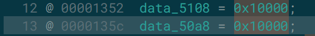
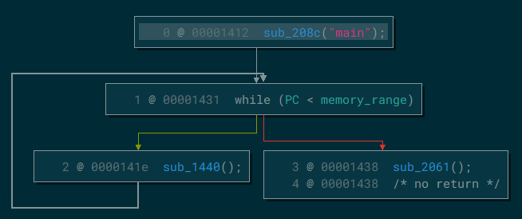
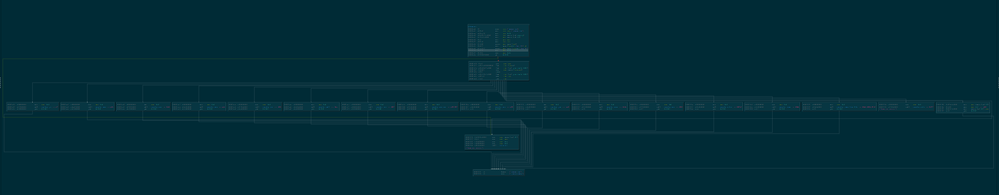
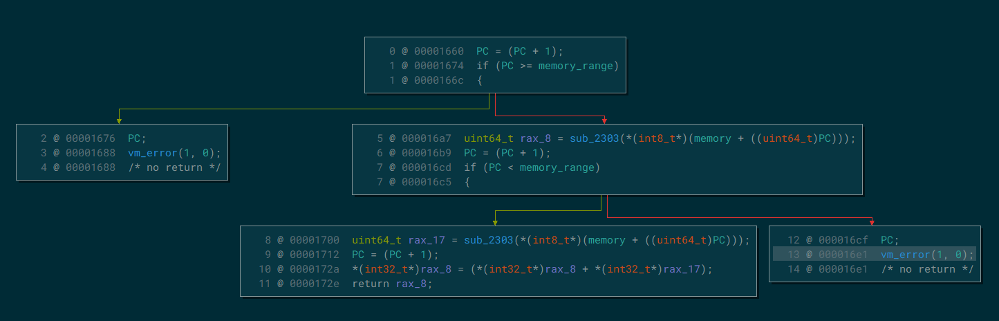
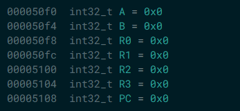
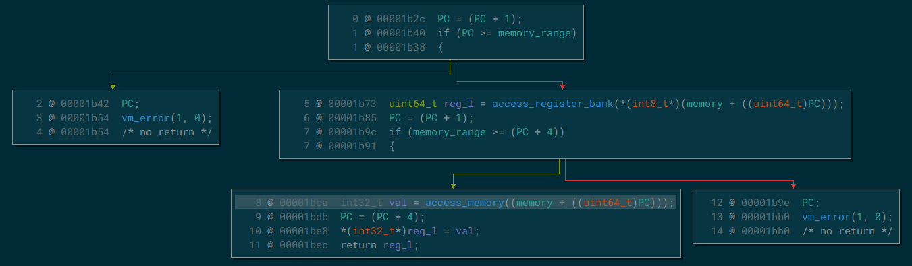
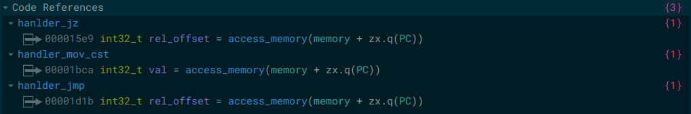

## Introduction

Ce challenge faisait partie de la catégorie Reverse, l'énoncé se présentait comme ceci:
```txt
En vagabondant dans le café, vous rencontrez le mystérieux Balzac. Il vous appelle dans un coin discret et vous tend une boîte étrange. Il vous dit que c'est une "VM", ou "Vélocipède Mécanique", une machine de fabrication étrangère qui ressemble à une machine à écrire, mais qui semble bien plus avancée.

Il vous tend également une feuille qu'il appelle un "programme". Il vous explique que si vous insérez cette feuille dans la machine, elle déclenche un comportement particulier. Vous êtes fasciné par cette mystérieuse machine et vous vous demandez ce qu'elle pourrait bien faire.

Balzac vous demande de l'étudier et d'essayer de découvrir tous ses secrets. C'est un honneur qu'il vous fasse confiance pour cette mission, mais vous ne savez pas encore par où commencer.
```
Deux fichiers étaient fournis avec ça: `vm` et `reverse_my_vm.vmr`. Il s'agit donc d'une machine virtuelle, et on a le programme qui sera exécuté par cette dernière. Par la suite on verra que cette VM implémente relativement peu d'instructions, par conséquent ca ne devrais pas être trop difficile donc autant le solve d'une manière intelligente (histoire de pouvoir quand même en tirer quelque chose de nouveau 🙂)!
<br>
C'est pourquoi au lieu de coder un simple désasembleur ou d'utiliser l'exécution symbolique on va utiliser [Qiling](https://qiling.io), un framework d'émulation basé sur `Unicorn` qui va nous permettre de récupérer une `trace` d'exécution de la VM.

Mais tout d'abord on peut lancer le programme une première fois, on doit lui fournir son script en argument:

```bash
./vm reverse_my_vm.vmr 
Please enter the key: test
Error: Function "check_key" not found
```

Ok... C'est assez bizarre mais bon, pour l'instant on va déjà voir comment faire fonctionner Qiling!🤡

## Mettre en place qiling

Une fois après avoir installé Qiling, on essaye d'émuler le programme de cette manière:

```python
def main():
    ql = Qiling([
        "/home/mitenka/Bureau/CTF_TEMP/404_CTF/RE/vm",
        "/home/mitenka/Bureau/CTF_TEMP/404_CTF/RE/reverse_my_vm.vmr"
    ],
    "qiling/examples/rootfs/x8664_linux",
    verbose=QL_VERBOSE.DEFAULT
    )

    ql.run()

if __name__ == "__main__":
    main()
```

les arguments que prennent le constructeur `Qiling` sont:

* Une liste faisant office de `argv`
* Le `rootfs` sur lequel lancer l'exécutable, qiling fournis des dossiers servant de racine pour émuler le programme.
* Des arguments supplémentaires pour spécifier la verbosité par exemple.

Ok on lance le script, et...

```bash
/home/mitenka/Bureau/CTF_TEMP/404_CTF/RE/vm: /lib/libc.so.6: version `GLIBC_2.34' not found (required by /home/mitenka/Bureau/CTF_TEMP/404_CTF/RE/vm)
[=]     writev(fd = 0x2, vec = 0x80000000d480, vlen = 0x6) = 0x96
[=]     mmap(addr = 0x0, length = 0x2000, prot = 0x3, flags = 0x22, fd = 0xffffffff, pgoffset = 0x0) = 0x7fffb81c7000
[=]     exit_group(code = 0x1) = ?
[x]     CPU Context:
[x]     ah    : 0x0
[x]     al    : 0xe7
[x]     ch    : 0x0
[x]     cl    : 0x0
[x]     dh    : 0xda
[x]     dl    : 0xc0
[x]     bh    : 0x0
[x]     bl    : 0x0
[x]     ax    : 0xe7
```
On se prend une grosse erreur, c'est du au fait que le la version proposée de la libc par le rootfs `x8664_linux`, n'est pas celle attendue par le binaire, pour régler ce problème on peut utiliser notre propre filesystem (ma libc étant la `2.35`). Et cette fois ci on se prend une erreur différente:

```bash
/lib/x86_64-linux-gnu/libc.so.6: CPU ISA level is lower than required
[=]     writev(fd = 0x2, vec = 0x80000000d490, vlen = 0x2) = 0x46
[=]     exit_group(code = 0x7f) = ?
[x]     CPU Context:
[x]     ah    : 0x0
[x]     al    : 0xe7
[x]     ch    : 0x0
[x]     cl    : 0x0
[x]     dh    : 0xd8
[x]     dl    : 0xd0
[x]     bh    : 0x0
[x]     bl    : 0x0
[x]     ax    : 0xe7
```

Étant donné que Qiling fait de l'émulation à la différence des frameworks de `DBI`, l'architecture du processeur émulé n'a pas l'air d'être considérée comme reconaissable par le linker dynamique de la `2.35`. J'ai trouvé [ici](https://github.com/qilingframework/qiling/issues/1201#issuecomment-1273779633) comment résoudre ce problème, on va hijack le code dans le linker dynamique qui effectue le check:

```python
# Patching ld-2.35.so ISA check
def by_pass_isa_check(ql: Qiling) -> None:
    ql.log.info(f"{'=-'*10}[Bypassing isa check]{'=-'*10}")
    ql.arch.regs.rip += 0x15
    pass

ld_so_base = 0x7FFFF7DD5000
ql.hook_address(by_pass_isa_check, ld_so_base + 0x2389F)
```

Et pour finir, dans cette [réponse](https://github.com/qilingframework/qiling/issues/1349#issuecomment-1556932986), un des dev de qiling parle du fait que les processeurs émulés par `Unicorn` ne supportent pas encore le `CET` (`Control-flow Enforcement Technology`) et que malheureusement le syscall `prctl` renvoie OK dans tous les cas même si le CET n'est pas supporté donc pour éviter que la libc essaye d'activer tout de même le CET on va aussi hijack le syscall prctl:

```python
# patching prctl code 0x3001 not found
def __no_cet(ql: Qiling, code: int, addr: int, retval: int):
    ql.log.info(f"{'=-'*10}[Bypassig prctl CET missing]{'=-'*10}")
     # intercept arch_prctl syscall after it exits. if code was set to ARCH_CET_STATUS,
    # then return an error value. otherwise, return the value originally returned by
    # the syscall.
    #
    # note: if -1 doesn't work, maybe should use -22 (-EINVAL) instea
    return -1 if code == 0x3001 else retval

ql.os.set_syscall('arch_prctl', __no_cet, QL_INTERCEPT.EXIT)
```

Et vu que je me prenais aussi un warning au niveau du syscall `rseq`, j'ai trouvé une solution sur un [blog chinois](https://eqqie.cn/index.php/archives/2015), je n'ai pas eu la foi d'aller chercher les raisons de ce bug ci mais il nous suffit de rajouter ceci pour que le warning disparaisse:

```python
# Patching rseq not found
def null_rseq_impl(ql: Qiling, abi: int, length: int, flags: int, sig: int) -> int:
    ql.log.info(f"{'=-'*10}[Bypassing rseq not found]{'=-'*10}")
    return 0

ql.os.set_syscall("rseq", null_rseq_impl, QL_INTERCEPT.CALL)
```

Et finalement... Ca marche! On va passer maintenant à l'analyse statique avant d'instrumenter le tout avec notre Qiling fonctionnel 😀!

## Analyse statique

le binaire est donc un ELF 64 bits, linké dynamiquement et strippé. On l'ouvre dans `Binary Ninja` et on tombe sur la fonction main, le programme semble être codé en C:

<div>
    
</div>

### Analyse de la fonction main

La fonction va vérifier qu'un argument a été fourni au programme (un nom de fichier est attendu) et si c'est le cas il en lit le contenu et le copie dans un chunk de mémoire récemment alloué. Puis il alloue une nouvelle zone de mémoire de taille `<taille du fichier> + 0x10000`. Il copie ensuite le contenu du fichier à l'adresse `<chunk alloué> + 0x10000`. De plus on peut voir ceci:

<div>
    
</div>

Si l'on part du principe que le binaire stocke les registres de la machine virtuelle dans sa `.bss`, on peut conjecturer que ces deux variables dans la .bss sont en faites le `Program Counter` et le `Stack Pointer` de la VM. Le programme en mémoire aurait donc cette forme:

```goat

                L'adressage mémoire de la VM

    Base Address .-----------------------. (located on heap)
               ^ |                       |
               | |                       |
               | |                       |
               | |         STACK         |
               | |                       |
               | |                       |
               | |                       |
               | |                       |
   +0x10000    v '-----------------------'
               ^ |                       |
               | |                       |
               | |                       |
               | |         CODE          |
               | |                       |
               | |                       |
               | |                       |
               | |                       |
               v '-----------------------'
```
On renomme en vitesse les variables:

<div>
    
</div>

On remarque que l'adresse de la mémoire de la VM (`memory`) et la taille de la mémoire (`memory_range`) sont stockées dans la `.bss`.

Ensuite la fontion main va appeller une fonction que l'on nommera `vm_start`.

### Analyse de la fonction vm_start

Cette fonction s'apparente à une boucle qui va parcourir le code de notre programme.

<div>
    
</div>

On y voit l'appel à trois fonctions:

* **sub_2061** que l'on va renommer `handler_exit` et va faire quitter la VM puis libérer sa mémoire.
* **sub_1440** que l'on va renommer `vm_run` et qui va se charger d'exécuter chaque instruction (on y reviendra).
* **sub_208c** qui prend en paramètre "main" et que l'on va analyser maintenant!

### Analyse de la fonction find_symbol

L'objectif de cette fonction va être de trouver un symbole dans le code de la VM, elle est appellé au début de l'exécution du code pour trouver la fonction `main`. Renommons les principales variables:

<div>
    
</div>

La fonction va itérer parmis le code jusqu'à trouver un certain motif qui indique le début du code associé au symbole. Par exemple pour trouver une fonction nommée `func`, le programme va chercher ce motif dans le programme de la VM:

```goat
+------+-------------+--------+------+
| \x01 | len("func") | "func" | \x02 |
+------+-------------+--------+------+
                                      ^
                                      |
                                 début du code de
                                 la fonction func
```

Une fois ce motif trouvé, la valeur de `PC` va être mise à jour avec l'offset du code suivant ce motif, voilà comment la VM va faire en sorte de gérer les procédures d'appel. Le premier appel à cette fonction est fonc fait dans l'objectif de trouver la fonction main qui se trouve logiquement au tout début du code proposé par le challenge:

```bash
00000000: 0104 6d61 696e 027c 1700 0000 506c 6561  ..main.|....Plea
00000010: 7365 2065 6e74 6572 2074 6865 206b 6579  se enter the key
```
On remarque aussi plusieurs appels à une fonction que j'ai nommé `vm_error` et qui prend en premier argument, un code associé à une erreur possible, comme par exemple si le program counter dépasse la limite de la mémoire allouée au code:

<div>
    
</div>

Maintenant on va passer à la fonction principale, cell qui va fetch chaque opcode et exécuter les différentes instructions associées.

### Analyse du dispacher de la VM

En regardant le graphe du dispacher, ce dernier s'apparente au graphe d'un switch case classique, ou chaque handler va représenter une instruction gérée par l'architecture de la VM.

<div>
    
</div>

Il y'a 17 handlers, donc chaque opcode tient sur 1 octet, les bytes suivants l'opcodes caractérisent les opérandes de l'instruction. Voilà les différentes instructions faisables par le processeur virtuel:

* **NOP**
* **JZ**: Saut conditionnel en fonction de si un registre, que l'on nommera `A`, est nul ou non.
* **MOV CST**: Met la constante passée en opérande dans le registre passé en opérande.
* **PRINT**: Affiche la chaine de caractère pointée par le registre A.
* **READ**: Lit une chaine depuis `stdin` vers la stack.
* **AND**
* **CALL**: Effectue une procédure d'appel vers une fonction trouvée dans le code via un appel à `find_symbol`.
* **RET**
* **ADD**
* **EXIT**: Fait un appel à `handler_exit` dont nous avons déjà parlé.
* **READ_FROM_FILE**: Lit le contenu d'un fichier dont la taille est contenue dans `B` et le nom dans `A`.
* **MOV**: Opérande mov classique entre deux registres virtuels.
* **POP**
* **PUSH**
* **XOR**
* **JMP**

Pour pouvoir mettre en place l'instrumentation du binaire, il va nous falloir comprendre comment chaque handler va accéder au registres et à la pile de la VM.
Penchons nous par exemple sur le handler qui va gérer l'instruction `ADD`:

<div>
    
</div>

L'addition en question a l'air de se faire à l'adresse `0x172a`, et on voit deux appels à une fonction `sub_2303`. Cette dernière, au moyen d'un autre switch case en fonction de son premier argument va renvoyer un pointeur vers une variable de 32 bits dans la .bss. Et vous le voyez venir ces variables sont nos registres virtuels. Le premier argument passé en paramètre à cette fonction étant une constante associée à un registre, après avoir fouillé dans les autres handlers, on peut renommer les registres restants et noter leurs adresses, elles nous seront utiles:

<div>
    
</div>

Et ça c'est très intéressant, on a trouvé une fonction qui va être appelé à chaque fois qu'un registre virtuel est accédé, que ce soit pour y écrire ou y lire. Renommons cette fonction en `access_register_bank`. Et en fouillant un peu plus dans les autres handlers, dans le handler associé à `MOV CST`, on remarque ceci:

<div>
    
</div>

La fonction sous le nom `access_memory` va juste se charger de déréférencer la variable 32 bit pointée par son argument. En l'occurence elle est appellé pour accéder à la variable pointée par: `<memory> + <seconde operande>`. Et comme on le remarque dans les `xrefs` de la fonction, cette dernière est appellée à chaque fois que le programme a besoin de récupérer une opérande ne faisant pas partie des registres dans son code

<div>
    
</div>

Et c'est grâce à l'usage de ces fonctions qu'on va pouvoir obtenir une trace d'exécution de notre VM:

* On peut hook chaque accès aux registres virtuels grâce à la fonction `access_register_bank`.
* On peut hook chaque accès à la mémoire du code avec la fonction `access_memory`.
* On peut hook chaque appel à une fonction grâce à `find_symbol`.

Voilà comment on va s'y prendre globalement:
On enregistre chaque accès aux registres et à la mémoire, ensuite on va hook chaque handler et voir quels opérandes viennent de lui être passées. On va aussi mettre en place une option `DEBUG` qui, en utilisant la méthode `ql.mem.read`, va nous permettre d'avoir pour chaque registre et chaque case mémoire sa valeur précise à chaque instruction!

## Tracing de la VM avec Qiling

Commençons par lister touts les registres ainsi que les instructions possibles avec leurs types d'opérandes respectifs:

```python
BASE = 0x555555554000

REGS_SYMBOLS = {
    0x50f0: "A",
    0x50f4: "B",
    0x50f8: "R0",
    0x50fc: "R1",
    0x5100: "R2",
    0x5104: "R3",
    0x5108: "PC",
    0x50a8: "SP",
}

HANDLERS = {
    0x15ee : ("jz", "adr", None),
    0x1705 : ("add", "reg", "reg"),
    0x17e5 : ("sub", "reg", "reg"),
    0x18c5 : ("and", "reg", "reg"),
    0x19a5 : ("xor", "reg", "reg"),
    0x209f : ("call", "func", None),
    0x14f6 : ("ret", None, None),
    0x1bcf : ("mov", "reg" ,"adr"),
    0x1ca3 : ("mov", "reg", "reg"),
    0x1d20 : ("jmp", "adr", None),
    0x1df8 : ("push", "reg", None),
    0x1e86 : ("pop", "reg", None),
    0x1544 : ("print", None, None),
    0x1550 : ("read", None, None),
    0x155c : ("readfile", None, None),
    0x1563 : ("exit", None, None),
}
```

Super nickel 👨‍🍳! Maintenant on crée des listes pour log chaque accès aux registres:

```python
STACK = list()

LAST_ACCESS_REGS = list()

LAST_ACCESS_MEM = list()

DEBUG = False


# Cette adresse correspond à l'instruction `ret` de la fonction `access_register_bank`
# En récupérant la valeur de RAX on peut avoir l'adresse du registre qui vient d'être accédé!
register_bank_access_ret = 0x2383

def hook_register_access(ql: Qiling) -> None:
    reg = ql.arch.regs.read("RAX") - BASE
    LAST_ACCESS_REGS.insert(0, reg)

ql.hook_address(hook_register_access, register_bank_access_ret + BASE)
```

On fait de même avec les opérandes mémoires et les appels de fonction:

```python
# Ces adresses correspondent respectivement à l'instruction `ret` de la fonction `access_memory` pour récupérer l'opérande utilisée par l'instruction suivante
# et au prologue de la fonction `find_symbol` pour voir quelle fonction va être appellée (le nom de la fonction se trouvera logiquement dans RDI)

memory_access_ret = 0x239b
func_finder_prolog = 0x208c

def hook_memory_access(ql: Qiling) -> None:
    mem = ql.arch.regs.read("RDI") - BASE
    LAST_ACCESS_MEM.append(mem)

def hook_stackframes(ql: Qiling) -> None:
    func_name = ql.mem.string(ql.arch.regs.read("RDI"))
    STACK.append(func_name)

ql.hook_address(hook_memory_access, memory_access_ret + BASE)

ql.hook_address(hook_stackframes, func_finder_prolog + BASE)
```

Et finalement on va hook au milieu de chaque handler pour afficher l'instruction qui est en train d'être exécuté, pour savoir quelles opérandes elle utilise, il suffir d'aller voir dans les listes de logging qu'on a créé:

```python
def hook_handlers(ql: Qiling) -> None:
    rip = ql.arch.regs.rip - BASE
    handler = HANDLERS[rip]
    params = list()

    # On itère parmis tous les paramètres possibles
    for i in range(1,3):

        # Si pas plus de paramètres
        if handler[i] is None:
            break
        elif handler[i] == 'adr':

            # Si l'opérande est un pointeur vers une constante
            ptr = LAST_ACCESS_MEM.pop()
            p = f"[{hex(ptr)}]"
        elif handler[i] == 'reg':

            # Si l'opérande est un registre
            ptr = LAST_ACCESS_REGS.pop()
            p = REGS_SYMBOLS[ptr]
        elif handler[i] == 'func':

            # Si l'opérande est le nom d'une fonction (ptr c'est pour l'adresse PC)
            ptr = list(REGS_SYMBOLS.keys())[list(REGS_SYMBOLS.values()).index("PC")]
            p = STACK.pop()
        if DEBUG:
            p += f" -> {hex(int.from_bytes(ql.mem.read(ptr + BASE, 4), 'little'))}"
        params.append(p)

    ql.log.info(f"({handler[0]}) {' , '.join(params)}")

for handler in HANDLERS:
    ql.hook_address(hook_handlers, BASE + handler)
```

Et une fois lancé avec l'option `DEBUG` activée et en rentrant en input `ABCDEFGH` on obtient le bytecode exécuté par la VM:

```bash
[=] 	=-=-=-=-=-=-=-=-=-=-[VM started]=-=-=-=-=-=-=-=-=-=-
[=] 	(call) main -> 0x10000
[=] 	(jmp) [0x195d8] -> 0x17
[=] 	(mov) A -> 0x0 , SP -> 0xffe9
[=] 	newfstatat(dirfd = 0x1, path = 0x7fffb7fc346f, buf_ptr = 0x80000000dae0, flags = 0x1000) = -0x1 (EPERM)
Please enter the key: [=] 	write(fd = 0x1, buf = 0x55555556d710, count = 0x16) = 0x16
[=] 	(print) 
[=] 	(mov) B -> 0x0 , [0x195f9] -> 0x100
[=] 	newfstatat(dirfd = 0x0, path = 0x7fffb7fc346f, buf_ptr = 0x80000000dab0, flags = 0x1000) = -0x1 (EPERM)
ABCDEFGH
[=] 	read(fd = 0x0, buf = 0x55555556f720, length = 0x2000) = 0x9
[=] 	(read) 
[=] 	(mov) R1 -> 0x0 , SP -> 0xfee9
[=] 	(jmp) [0x19602] -> 0xb0
[=] 	(xor) R2 -> 0x0 , R2 -> 0x0
[=] 	(mov) A -> 0xffe9 , [0x196bb] -> 0x2c
[=] 	(mov) B -> 0x100 , SP -> 0xfe39
[=] 	(mov) SP -> 0xfe39 , R1 -> 0xfee9
[=] 	(add) SP -> 0xfee9 , R2 -> 0x0
[=] 	(pop) R0 -> 0x0
[=] 	(mov) SP -> 0xfeed , B -> 0xfe39
[=] 	(pop) B -> 0xfe39
[=] 	(xor) B -> 0x11213d63 , R0 -> 0x44434241
[=] 	(push) B -> 0x55627f22
[=] 	(mov) R3 -> 0x0 , [0x196d6] -> 0x4
[=] 	(add) SP -> 0xfe39 , R3 -> 0x4
[=] 	(add) R2 -> 0x0 , R3 -> 0x4
[=] 	(and) R2 -> 0x4 , R3 -> 0x4
[=] 	(mov) R3 -> 0x4 , [0x196e5] -> 0x1
[=] 	(sub) A -> 0x2c , R3 -> 0x1
[=] 	(jz) [0x196ed] -> 0xffffffd2
[=] 	(mov) B -> 0x55627f22 , SP -> 0xfe3d
[=] 	(mov) SP -> 0xfe3d , R1 -> 0xfee9
[=] 	(add) SP -> 0xfee9 , R2 -> 0x4
[=] 	(pop) R0 -> 0x44434241
[=] 	(mov) SP -> 0xfef1 , B -> 0xfe3d
[=] 	(pop) B -> 0xfe3d
[=] 	(xor) B -> 0x33195222 , R0 -> 0x48474645
[=] 	(push) B -> 0x7b5e1467
[=] 	(mov) R3 -> 0x1 , [0x196d6] -> 0x4
[=] 	(add) SP -> 0xfe3d , R3 -> 0x4
[=] 	(add) R2 -> 0x4 , R3 -> 0x4
[=] 	(and) R2 -> 0x8 , R3 -> 0x4
[=] 	(mov) R3 -> 0x4 , [0x196e5] -> 0x1
[=] 	(sub) A -> 0x2b , R3 -> 0x1
[=] 	(jz) [0x196ed] -> 0xffffffd2
[=] 	(mov) B -> 0x7b5e1467 , SP -> 0xfe41
[=] 	(mov) SP -> 0xfe41 , R1 -> 0xfee9
[=] 	(add) SP -> 0xfee9 , R2 -> 0x0
[=] 	(pop) R0 -> 0x48474645
[=] 	(mov) SP -> 0xfeed , B -> 0xfe41
[=] 	(pop) B -> 0xfe41
[=] 	(xor) B -> 0x7b3b5109 , R0 -> 0x44434241
[=] 	(push) B -> 0x3f781348
[=] 	(mov) R3 -> 0x1 , [0x196d6] -> 0x4
[=] 	(add) SP -> 0xfe41 , R3 -> 0x4
[=] 	(add) R2 -> 0x0 , R3 -> 0x4
[=] 	(and) R2 -> 0x4 , R3 -> 0x4
[=] 	(mov) R3 -> 0x4 , [0x196e5] -> 0x1
[=] 	(sub) A -> 0x2a , R3 -> 0x1
[=] 	(jz) [0x196ed] -> 0xffffffd2
[=] 	(mov) B -> 0x3f781348 , SP -> 0xfe45
[=] 	(mov) SP -> 0xfe45 , R1 -> 0xfee9
[=] 	(add) SP -> 0xfee9 , R2 -> 0x4
[=] 	(pop) R0 -> 0x44434241
[=] 	(mov) SP -> 0xfef1 , B -> 0xfe45
[=] 	(pop) B -> 0xfe45
[=] 	(xor) B -> 0x6c722b3b , R0 -> 0x48474645
[=] 	(push) B -> 0x24356d7e
[=] 	(mov) R3 -> 0x1 , [0x196d6] -> 0x4
[=] 	(add) SP -> 0xfe45 , R3 -> 0x4
[=] 	(add) R2 -> 0x4 , R3 -> 0x4
[=] 	(and) R2 -> 0x8 , R3 -> 0x4
[=] 	(mov) R3 -> 0x4 , [0x196e5] -> 0x1
[=] 	(sub) A -> 0x29 , R3 -> 0x1
[=] 	(jz) [0x196ed] -> 0xffffffd2
...
[=] 	(mov) B -> 0x7a112443 , SP -> 0xfee1
[=] 	(mov) SP -> 0xfee1 , R1 -> 0xfee9
[=] 	(add) SP -> 0xfee9 , R2 -> 0x0
[=] 	(pop) R0 -> 0x48474645
[=] 	(mov) SP -> 0xfeed , B -> 0xfee1
[=] 	(pop) B -> 0xfee1
[=] 	(xor) B -> 0x596c7523 , R0 -> 0x44434241
[=] 	(push) B -> 0x1d2f3762
[=] 	(mov) R3 -> 0x1 , [0x196d6] -> 0x4
[=] 	(add) SP -> 0xfee1 , R3 -> 0x4
[=] 	(add) R2 -> 0x0 , R3 -> 0x4
[=] 	(and) R2 -> 0x4 , R3 -> 0x4
[=] 	(mov) R3 -> 0x4 , [0x196e5] -> 0x1
[=] 	(sub) A -> 0x2 , R3 -> 0x1
[=] 	(jz) [0x196ed] -> 0xffffffd2
[=] 	(mov) B -> 0x1d2f3762 , SP -> 0xfee5
[=] 	(mov) SP -> 0xfee5 , R1 -> 0xfee9
[=] 	(add) SP -> 0xfee9 , R2 -> 0x4
[=] 	(pop) R0 -> 0x44434241
[=] 	(mov) SP -> 0xfef1 , B -> 0xfee5
[=] 	(pop) B -> 0xfee5
[=] 	(xor) B -> 0x2b336614 , R0 -> 0x48474645
[=] 	(push) B -> 0x63742051
[=] 	(mov) R3 -> 0x1 , [0x196d6] -> 0x4
[=] 	(add) SP -> 0xfee5 , R3 -> 0x4
[=] 	(add) R2 -> 0x4 , R3 -> 0x4
[=] 	(and) R2 -> 0x8 , R3 -> 0x4
[=] 	(mov) R3 -> 0x4 , [0x196e5] -> 0x1
[=] 	(sub) A -> 0x1 , R3 -> 0x1
[=] 	(jz) [0x196ed] -> 0xffffffd2
[=] 	(mov) R3 -> 0x1 , [0x196f3] -> 0x100
[=] 	(sub) SP -> 0xfee9 , R3 -> 0x100
[=] 	(call) check_key -> 0x10135
Error: [=] 	write(fd = 0x2, buf = 0x5555555571e8, count = 0x7) = 0x7
Function "check_key" not found[=] 	write(fd = 0x2, buf = 0x80000000ba10, count = 0x1e) = 0x1e

[=] 	write(fd = 0x2, buf = 0x7fffb8005723, count = 0x1) = 0x1
[=] 	exit_group(code = 0x3) = ?
```

Ok donc là on a plein de choses intéressantes, déjà on voit l'appel à la fonction `main`, puis un ensemble d'instructions qui se répète:

```bash
[=] 	(mov) B -> 0x100 , SP -> 0xfe39
[=] 	(mov) SP -> 0xfe39 , R1 -> 0xfee9
[=] 	(add) SP -> 0xfee9 , R2 -> 0x0
[=] 	(pop) R0 -> 0x0
[=] 	(mov) SP -> 0xfeed , B -> 0xfe39
[=] 	(pop) B -> 0xfe39
[=] 	(xor) B -> 0x11213d63 , R0 -> 0x44434241
[=] 	(push) B -> 0x55627f22
[=] 	(mov) R3 -> 0x0 , [0x196d6] -> 0x4
[=] 	(add) SP -> 0xfe39 , R3 -> 0x4
[=] 	(add) R2 -> 0x0 , R3 -> 0x4
[=] 	(and) R2 -> 0x4 , R3 -> 0x4
[=] 	(mov) R3 -> 0x4 , [0x196e5] -> 0x1
[=] 	(sub) A -> 0x2c , R3 -> 0x1
[=] 	(jz) [0x196ed] -> 0xffffffd2
[=] 	(mov) B -> 0x55627f22 , SP -> 0xfe3d
[=] 	(mov) SP -> 0xfe3d , R1 -> 0xfee9
[=] 	(add) SP -> 0xfee9 , R2 -> 0x4
[=] 	(pop) R0 -> 0x44434241
[=] 	(mov) SP -> 0xfef1 , B -> 0xfe3d
[=] 	(pop) B -> 0xfe3d
[=] 	(xor) B -> 0x33195222 , R0 -> 0x48474645
[=] 	(push) B -> 0x7b5e1467
[=] 	(mov) R3 -> 0x1 , [0x196d6] -> 0x4
[=] 	(add) SP -> 0xfe3d , R3 -> 0x4
[=] 	(add) R2 -> 0x4 , R3 -> 0x4
[=] 	(and) R2 -> 0x8 , R3 -> 0x4
[=] 	(mov) R3 -> 0x4 , [0x196e5] -> 0x1
[=] 	(sub) A -> 0x2b , R3 -> 0x1
[=] 	(jz) [0x196ed] -> 0xffffffd2
```
A chaque fois que ce code se répète, la valeur contenue dans A est décrémentée de 1, et ensuite on a un saut conditionnel vers `0x196ed`: On a affaire à une boucle qui va visiblement XORer une zone de mémoire avec notre input. Si vous vous souvenez au début quand on avait lancé l'exécutable avec une clé aléatoire on avait eu une erreur comme quoi la fonction `check_key` n'a pas pu être trouvé, en fait il s'agit de packing ,la VM va déchiffrer la suite de son code avec notre clé qui doit faire donc 8 caractères!

Mais comment sommes nous censés trouver la clé pour accéder à la suite du code si on n'a aucune idée de ce dernier me direz vous?
Et bien on sait au moins que le programme va tenter, après le déchiffrement d'appeller la fonction `check_key` et on sait à quoi doit ressembler le motif qui indique la présence d'une fonction à un endroit précis dans le code 😀!

On est donc dans une situation triviale de XOR avec clair connu:
Les premiers octets à déchiffrer sont `0x11213d63` et `0x33195222` et que leur version déchiffrée doit correspondre à `b"\x01\x09check_"`. Donc:

```python
enc = 0x33195222 << 32 | 0x11213d63
plain = b"\x01\x09check_"
key = (enc ^ int.from_bytes(plain, "little")).to_bytes(8, "little")
print(key.decode("utf-8"))
# b4ByG1rl
```

Nice! Maintenant on a la bonne clé de déchiffrement qui va unpack le code de la VM, testons de lancer le programme avec cette clé:

```bash
./vm reverse_my_vm.vmr 
Please enter the key: b4ByG1rl
Now, enter the passcode: TEST
Congrats! Your flag is: A|p7Ko[JoW.x
                                    HB
```

Ok donc le programme nous demande maintenant un mot de passe avec lequel il va visiblement faire des opérations qui devraient nous afficher un flag si le mot de passe est corret. Pour le découvrir il nous suffit de relancer notre tracer:

```bash
Now, enter the passcode: 
[=] 	write(fd = 0x1, buf = 0x55555556d710, count = 0x19) = 0x19
[=] 	(print) 
[=] 	(mov) B -> 0x47415753 , [0x1943a] -> 0x100
ABCD
[=] 	read(fd = 0x0, buf = 0x55555556f720, length = 0x2000) = 0x5
[=] 	(read) 
[=] 	(pop) R3 -> 0x100
[=] 	(jmp) [0x19442] -> 0x2
[=] 	(jmp) [0x19449] -> 0x18
[=] 	(mov) R2 -> 0x0 , SP -> 0xfcb5
[=] 	(mov) A -> 0xfdcb , [0x1946a] -> 0x6
[=] 	(mov) B -> 0x100 , [0x19470] -> 0x1
[=] 	(mov) R0 -> 0x6c723147 , [0x19476] -> 0x4
[=] 	(pop) R1 -> 0xfee9
[=] 	(xor) R1 -> 0x28570444 , R3 -> 0x44434241
[=] 	(push) R1 -> 0x6c144605
[=] 	(add) SP -> 0xfcb5 , R0 -> 0x4
[=] 	(sub) A -> 0x6 , B -> 0x1
[=] 	(jz) [0x19488] -> 0xfffffff2
[=] 	(pop) R1 -> 0x6c144605
[=] 	(xor) R1 -> 0x3b187224 , R3 -> 0x44434241
[=] 	(push) R1 -> 0x7f5b3065
[=] 	(add) SP -> 0xfcb9 , R0 -> 0x4
[=] 	(sub) A -> 0x5 , B -> 0x1
[=] 	(jz) [0x19488] -> 0xfffffff2
[=] 	(pop) R1 -> 0x7f5b3065
[=] 	(xor) R1 -> 0x5a085744 , R3 -> 0x44434241
[=] 	(push) R1 -> 0x1e4b1505
[=] 	(add) SP -> 0xfcbd , R0 -> 0x4
[=] 	(sub) A -> 0x4 , B -> 0x1
[=] 	(jz) [0x19488] -> 0xfffffff2
[=] 	(pop) R1 -> 0x1e4b1505
[=] 	(xor) R1 -> 0x5a3c531e , R3 -> 0x44434241
[=] 	(push) R1 -> 0x1e7f115f
[=] 	(add) SP -> 0xfcc1 , R0 -> 0x4
[=] 	(sub) A -> 0x3 , B -> 0x1
[=] 	(jz) [0x19488] -> 0xfffffff2
[=] 	(pop) R1 -> 0x1e7f115f
[=] 	(xor) R1 -> 0x582b6b03 , R3 -> 0x44434241
[=] 	(push) R1 -> 0x1c682942
[=] 	(add) SP -> 0xfcc5 , R0 -> 0x4
[=] 	(sub) A -> 0x2 , B -> 0x1
[=] 	(jz) [0x19488] -> 0xfffffff2
[=] 	(pop) R1 -> 0x1c682942
[=] 	(xor) R1 -> 0x1642581c , R3 -> 0x44434241
[=] 	(push) R1 -> 0x52011a5d
[=] 	(add) SP -> 0xfcc9 , R0 -> 0x4
[=] 	(sub) A -> 0x1 , B -> 0x1
[=] 	(jz) [0x19488] -> 0xfffffff2
[=] 	(mov) SP -> 0xfccd , R2 -> 0xfcb5
[=] 	(jmp) [0x19490] -> 0x18
[=] 	(mov) A -> 0x0 , SP -> 0xfc9d
Congrats! Your flag is: Fle0[K_B)h]�R
[=] 	write(fd = 0x1, buf = 0x55555556d710, count = 0x31) = 0x31
[=] 	(print) 
[=] 	(xor) A -> 0xfc9d , A -> 0xfc9d
[=] 	(exit) 
[=] 	exit_group(code = 0x0) = ?
```
Et là le décodage est sensiblement le même que pour le code packé, la fonction `check_key` va déchiffrer 24 octets avec les 4 octets de notre input, et vu que notre tracer nous permet d'avoir accès directement aux valeurs qui vont être XORés en les lisant pendant l'exécution, on retrouve le flag en utilisant son format connu (`404C`):

```python
enc = 0x28570444
plain = b"404C"
key = (int.from_bytes(plain, "little") ^ enc).to_bytes(4, "little")
print(key.decode("utf-8"))
# p4ck
```
Et une fois qu'on a trouvé le mot de passe:

```bash
./vm reverse_my_vm.vmr 
Please enter the key: b4ByG1rl
Now, enter the passcode: p4ck
Congrats! Your flag is: 404CTF{P4ck1ng_1s_H3ll!}
```

## Conclusion

Cette VM était très classique mais je trouvais ca tout de même intéressant de solve ce challenge avec un framework d'émulation comme Qiling dans l'optique de faire un outil de tracing personalisé pour l'architecture utilisée par la VM 🙂.

Code complet du tracer:

```python
from qiling import *
from qiling.const import QL_VERBOSE, QL_INTERCEPT
from unicorn.unicorn_const import UC_MEM_WRITE, UC_MEM_READ

BASE = 0x555555554000

REGS_SYMBOLS = {
    0x50f0: "A",
    0x50f4: "B",
    0x50f8: "R0",
    0x50fc: "R1",
    0x5100: "R2",
    0x5104: "R3",
    0x5108: "PC",
    0x50a8: "SP",
}

HANDLERS = {
    0x15ee : ('jz', "adr", None),
    0x1705 : ('add', "reg", "reg"),
    0x17e5 : ('sub', "reg", "reg"),
    0x18c5 : ('and', "reg", "reg"),
    0x19a5 : ('xor', "reg", "reg"),
    0x209f : ('call', "func", None),
    0x14f6 : ('ret', None, None),
    0x1bcf : ('mov', "reg" ,"adr"),
    0x1ca3 : ('mov', "reg", "reg"),
    0x1d20 : ('jmp', "adr", None),
    0x1df8 : ('push', "reg", None),
    0x1e86 : ('pop', "reg", None),
    0x1544 : ('print', None, None),
    0x1550 : ('read', None, None),
    0x155c : ('readfile', None, None),
    0x1563 : ('exit', None, None),
}

STACK = list()

LAST_ACCESS_REGS = list()

LAST_ACCESS_MEM = list()

DEBUG = True

def hook_register_access(ql: Qiling) -> None:
    reg = ql.arch.regs.read("RAX") - BASE
    LAST_ACCESS_REGS.insert(0, reg)

def hook_memory_access(ql: Qiling) -> None:
    mem = ql.arch.regs.read("RDI") - BASE
    LAST_ACCESS_MEM.append(mem)

def hook_stackframes(ql: Qiling) -> None:
    func_name = ql.mem.string(ql.arch.regs.read("RDI"))
    STACK.append(func_name)

def hook_handlers(ql: Qiling) -> None:
    rip = ql.arch.regs.rip - BASE
    handler = HANDLERS[rip]
    params = list()

    #Parsing parameters, if DEBUG print value at runtime
    for i in range(1,3):

        # If no more parameters
        if handler[i] is None:
            break
        elif handler[i] == "adr":

            # If operand is a memory address
            ptr = LAST_ACCESS_MEM.pop()
            p = f"[{hex(ptr)}]"
        elif handler[i] == "reg":

            # If operand is a registers
            ptr = LAST_ACCESS_REGS.pop()
            p = REGS_SYMBOLS[ptr]
        elif handler[i] == "func":

            # If operand is a function name (ptr is PC address)
            ptr = list(REGS_SYMBOLS.keys())[list(REGS_SYMBOLS.values()).index("PC")]
            p = STACK.pop()
        if DEBUG:
            p += f" -> {hex(int.from_bytes(ql.mem.read(ptr + BASE, 4), 'little'))}"
        params.append(p)

    ql.log.info(f"({handler[0]}) {' , '.join(params)}")
    

def fix_qiling(ql: Qiling) -> None:

    # Patching ld-2.35.so ISA check
    def by_pass_isa_check(ql: Qiling) -> None:
        ql.log.info(f"{'=-'*10}[Bypassing isa check]{'=-'*10}")
        ql.arch.regs.rip += 0x15
        pass

    ld_so_base = 0x7FFFF7DD5000
    ql.hook_address(by_pass_isa_check, ld_so_base + 0x2389F)

    # Patching rseq not found
    def null_rseq_impl(ql: Qiling, abi: int, length: int, flags: int, sig: int) -> int:
        ql.log.info(f"{'=-'*10}[Bypassing rseq not found]{'=-'*10}")
        return 0

    ql.os.set_syscall("rseq", null_rseq_impl, QL_INTERCEPT.CALL)

    # patching prctl code 0x3001 not found
    def __no_cet(ql: Qiling, code: int, addr: int, retval: int):
        ql.log.info(f"{'=-'*10}[Bypassig prctl code not found]{'=-'*10}")
        return -1 if code == 0x3001 else retval

    ql.os.set_syscall('arch_prctl', __no_cet, QL_INTERCEPT.EXIT)

def hook_vm_start(ql: Qiling) -> None:
    ql.log.info(f"{'=-'*10}[VM started]{'=-'*10}")

def main():
    # Qiling init
    ql = Qiling([
        "/home/mitenka/Bureau/CTF_TEMP/404_CTF/RE/vm",
        "/home/mitenka/Bureau/CTF_TEMP/404_CTF/RE/reverse_my_vm.vmr"
    ],
    "/",
    verbose=QL_VERBOSE.DEFAULT
    )

    vm_start_offset = 0x1404
    register_bank_access_ret = 0x2383
    memory_access_ret = 0x239b
    func_finder_prolog = 0x208c

    # I hate qiling
    fix_qiling(ql)

    ql.hook_address(hook_vm_start, BASE + vm_start_offset)
 
    # Hooking virtual registers access
    ql.hook_address(hook_register_access, register_bank_access_ret + BASE)

    # Hooking memory access
    ql.hook_address(hook_memory_access, memory_access_ret + BASE)

    # Hooking function finder
    ql.hook_address(hook_stackframes, func_finder_prolog + BASE)


    # Hooking handlers
    for handler in HANDLERS:
        ql.hook_address(hook_handlers, BASE + handler)

    ql.run()

    # program key / passcode : b4ByG1rl / p4ck


if __name__ == "__main__":
    main()
```